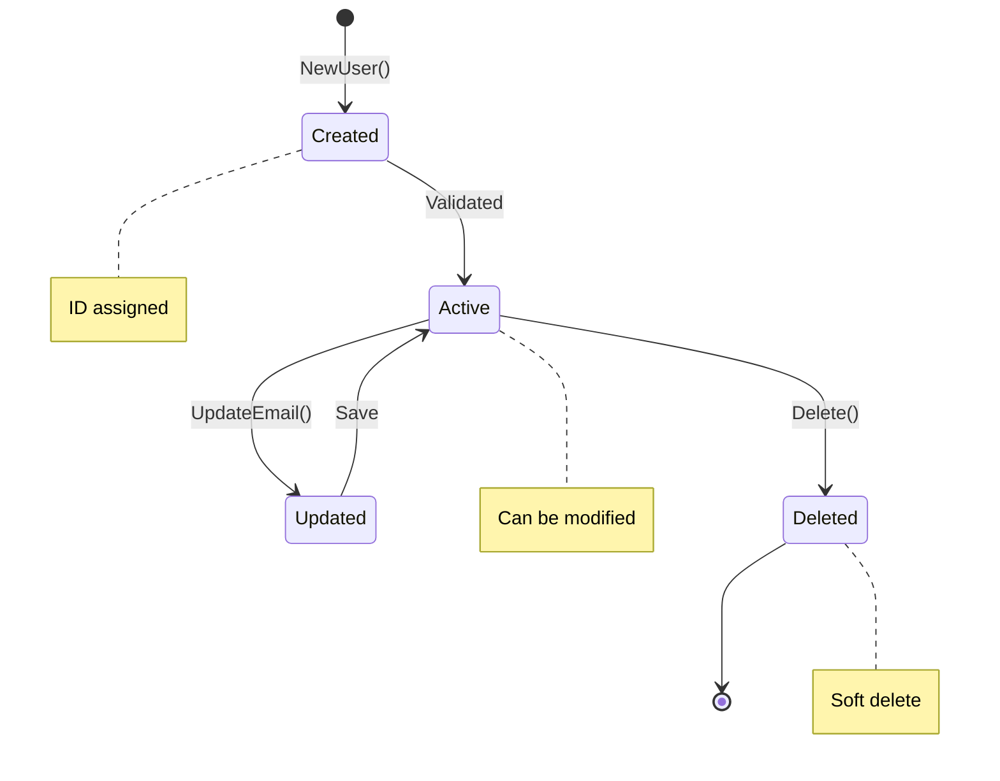

# Entities: Objects with Identity

Entities are objects with **identity** and **behavior**:

## Entity Lifecycle



```go
package entities

// Domain errors
var (
    ErrInvalidEmail = errors.New("invalid email format")
    ErrNameTooShort = errors.New("name must be at least 2 characters")
    ErrUserNotFound = errors.New("user not found")
)

// User is a domain entity
type User struct {
    ID        string
    Name      string
    Email     string
    CreatedAt time.Time
    UpdatedAt time.Time
}

// NewUser is a factory function - enforces business rules
func NewUser(name, email string) (*User, error) {
    if len(name) < 2 {
        return nil, ErrNameTooShort
    }
    if !isValidEmail(email) {
        return nil, ErrInvalidEmail
    }

    return &User{
        ID:        uuid.New().String(),
        Name:      name,
        Email:     email,
        CreatedAt: time.Now(),
        UpdatedAt: time.Now(),
    }, nil
}

// UpdateEmail changes the user's email with validation
func (u *User) UpdateEmail(email string) error {
    if !isValidEmail(email) {
        return ErrInvalidEmail
    }
    u.Email = email
    u.UpdatedAt = time.Now()
    return nil
}
```