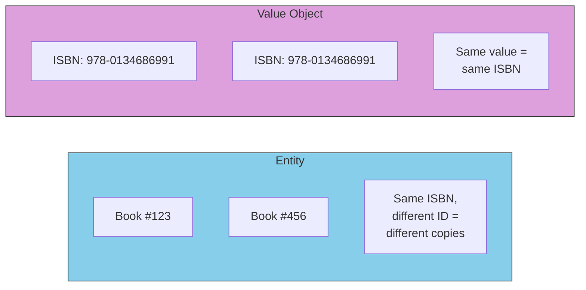

# Value Objects: Immutable Values

## Sam's Scenario

Sam was storing ISBNs as plain strings: `"978-0-13-468599-1"`. But without validation, users were entering invalid ISBNs like `"ABC123"` or `"12345"`. Alex suggested: "Make ISBN a value object. It validates itself on creation and becomes immutable - you'll never have an invalid ISBN in your system."

Similarly, Email addresses needed validation. Instead of checking `strings.Contains(email, "@")` everywhere, Sam learned to encapsulate validation in a value object.

## What are Value Objects?

Value objects don't have identity - they're defined entirely by their values:

## Entity vs Value Object



## BookShelf Value Objects

```go
package entities

import (
    "errors"
    "regexp"
    "strings"
)

// ISBN is a value object - immutable and self-validating
type ISBN struct {
    value string
}

var (
    ErrInvalidISBNFormat = errors.New("ISBN must be 10 or 13 digits")
    isbn13Regex = regexp.MustCompile(`^(978|979)\d{10}$`)
    isbn10Regex = regexp.MustCompile(`^\d{9}[\dX]$`)
)

// NewISBN creates a validated ISBN
func NewISBN(value string) (ISBN, error) {
    // Remove hyphens and spaces
    clean := strings.ReplaceAll(strings.ReplaceAll(value, "-", ""), " ", "")

    if !isbn13Regex.MatchString(clean) && !isbn10Regex.MatchString(clean) {
        return ISBN{}, ErrInvalidISBNFormat
    }

    return ISBN{value: clean}, nil
}

// Value returns the ISBN as a string
func (i ISBN) Value() string {
    return i.value
}

// IsValid checks if ISBN is valid
func (i ISBN) IsValid() bool {
    return i.value != ""
}

// Equals compares two ISBNs by value
func (i ISBN) Equals(other ISBN) bool {
    return i.value == other.value
}

// Email is a value object for email addresses
type Email struct {
    value string
}

var (
    ErrInvalidEmailFormat = errors.New("invalid email format")
    emailRegex = regexp.MustCompile(`^[a-zA-Z0-9._%+-]+@[a-zA-Z0-9.-]+\.[a-zA-Z]{2,}$`)
)

func NewEmail(value string) (Email, error) {
    if !emailRegex.MatchString(value) {
        return Email{}, ErrInvalidEmailFormat
    }
    return Email{value: strings.ToLower(value)}, nil
}

func (e Email) Value() string {
    return e.value
}

func (e Email) Equals(other Email) bool {
    return e.value == other.value
}
```

## Key Differences: Entity vs Value Object

| Entity | Value Object |
|--------|--------------|
| Has unique identity (ID) | Defined by its values |
| Mutable over time | Immutable |
| Compared by ID | Compared by value |
| Example: Book, User, Loan | Example: ISBN, Email |

## Sam's Insight

"This is brilliant!" Sam exclaimed. "Now I can't create an invalid ISBN anywhere in my system. And if two books have the same ISBN, I can compare them with `isbn1.Equals(isbn2)` instead of string comparison." Alex nodded: "Value objects make invalid states unrepresentable. That's domain-driven design at work."