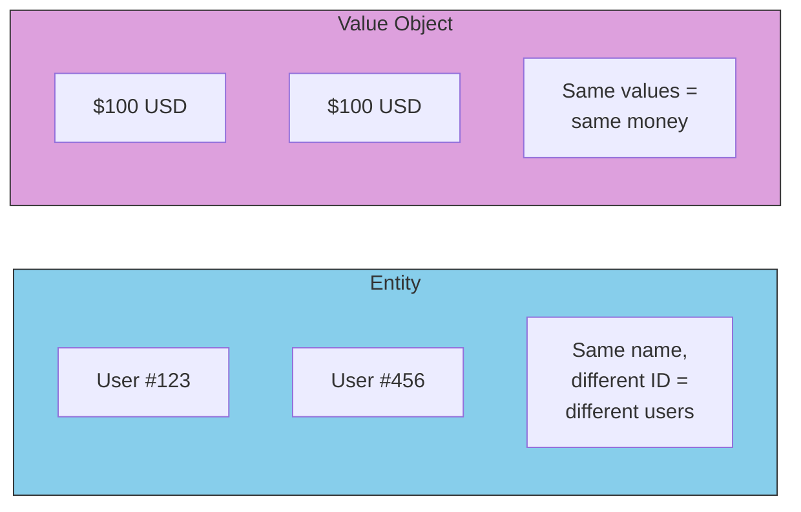

# Value Objects: Immutable Values

Value objects don't have identity - they're defined entirely by their values:

## Entity vs Value Object



```go
// Money is a value object
type Money struct {
    amount   int64  // cents to avoid floating point issues
    currency string
}

func NewMoney(amount int64, currency string) (Money, error) {
    if amount < 0 {
        return Money{}, errors.New("amount cannot be negative")
    }
    return Money{amount: amount, currency: currency}, nil
}

func (m Money) Add(other Money) (Money, error) {
    if m.currency != other.currency {
        return Money{}, errors.New("cannot add different currencies")
    }
    return Money{amount: m.amount + other.amount, currency: m.currency}, nil
}

// Value objects should be immutable
func (m Money) Amount() int64   { return m.amount }
func (m Money) Currency() string { return m.currency }
```

## Key Differences: Entity vs Value Object

| Entity | Value Object |
|--------|--------------|
| Has unique identity (ID) | Defined by its values |
| Mutable over time | Immutable |
| Compared by ID | Compared by value |
| Example: User, Order | Example: Money, Address |