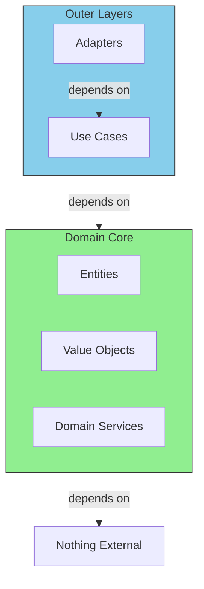

# The Golden Rules of the Domain

## Dependency Rule



## Rule 1: No Framework Dependencies

```go
// BAD: Domain depends on web framework
import "github.com/gin-gonic/gin"

func (u *User) HandleRequest(c *gin.Context) { ... }

// GOOD: Domain is pure Go
func (u *User) UpdateEmail(email string) error { ... }
```

## Rule 2: No Infrastructure Concerns

```go
// BAD: Domain knows about SQL
func (u *User) Save(db *sql.DB) error {
    db.Exec("INSERT INTO users...")
}

// GOOD: Domain doesn't know how it's persisted
// (Persistence is handled by repository adapters)
```

## Rule 3: Express Business Rules Clearly

```go
// BAD: Magic numbers, unclear rules
if len(password) < 8 {
    return err
}

// GOOD: Named constants, clear rules
const MinPasswordLength = 8

var ErrPasswordTooShort = fmt.Errorf(
    "password must be at least %d characters",
    MinPasswordLength,
)

func ValidatePassword(password string) error {
    if len(password) < MinPasswordLength {
        return ErrPasswordTooShort
    }
    return nil
}
```