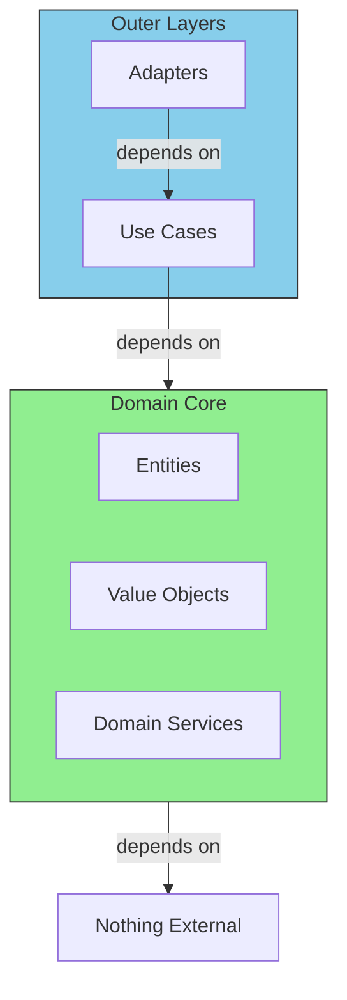

# The Golden Rules of the Domain

## Sam's Scenario

When Maya asked Sam to add a mobile app, Sam panicked. The entire BookShelf backend was tightly coupled to the Gin web framework. "How do I support both REST and GraphQL?" Alex reassured: "If your domain doesn't know about HTTP, switching adapters is trivial. Let's enforce the golden rules."

## Dependency Rule



## Rule 1: No Framework Dependencies

```go
// BAD: Domain depends on web framework
package entities

import "github.com/gin-gonic/gin"

func (b *Book) HandleRequest(c *gin.Context) { ... }

// GOOD: Domain is pure Go
package entities

func (b *Book) LoanTo(userID string, duration time.Duration) error { ... }
```

## Rule 2: No Infrastructure Concerns

```go
// BAD: Domain knows about database
package entities

import "database/sql"

func (b *Book) Save(db *sql.DB) error {
    db.Exec("INSERT INTO books...")
}

// GOOD: Domain doesn't know how it's persisted
// Repository adapters handle persistence
package entities

type Book struct {
    ID     string
    Title  string
    ISBN   ISBN
    // No database references!
}
```

## Rule 3: Express Business Rules Clearly

```go
// BAD: Magic numbers, unclear rules
func (b *Book) LoanTo(userID string) error {
    if b.Status == 1 {  // What does 1 mean?
        return errors.New("error")
    }
    // ...
}

// GOOD: Named constants, expressive errors
const (
    StatusAvailable BookStatus = "available"
    StatusOnLoan    BookStatus = "on_loan"
)

const (
    StandardLoanPeriod = 14 * 24 * time.Hour  // 14 days
    MaxRenewals        = 2
)

var ErrBookAlreadyOnLoan = errors.New("book is already on loan")

func (b *Book) LoanTo(userID string, loanPeriod time.Duration) error {
    if b.Status == StatusOnLoan {
        return ErrBookAlreadyOnLoan
    }
    // ...
}
```

## Sam's Insight

"Now my domain speaks library language, not database or HTTP language," Sam noted. Alex agreed: "Exactly. Your Book entity has no idea if it's being stored in Postgres, SQLite, or a JSON file. That's the power of the dependency rule."