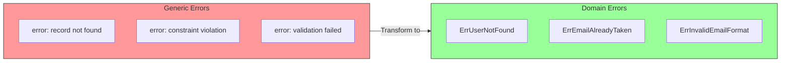
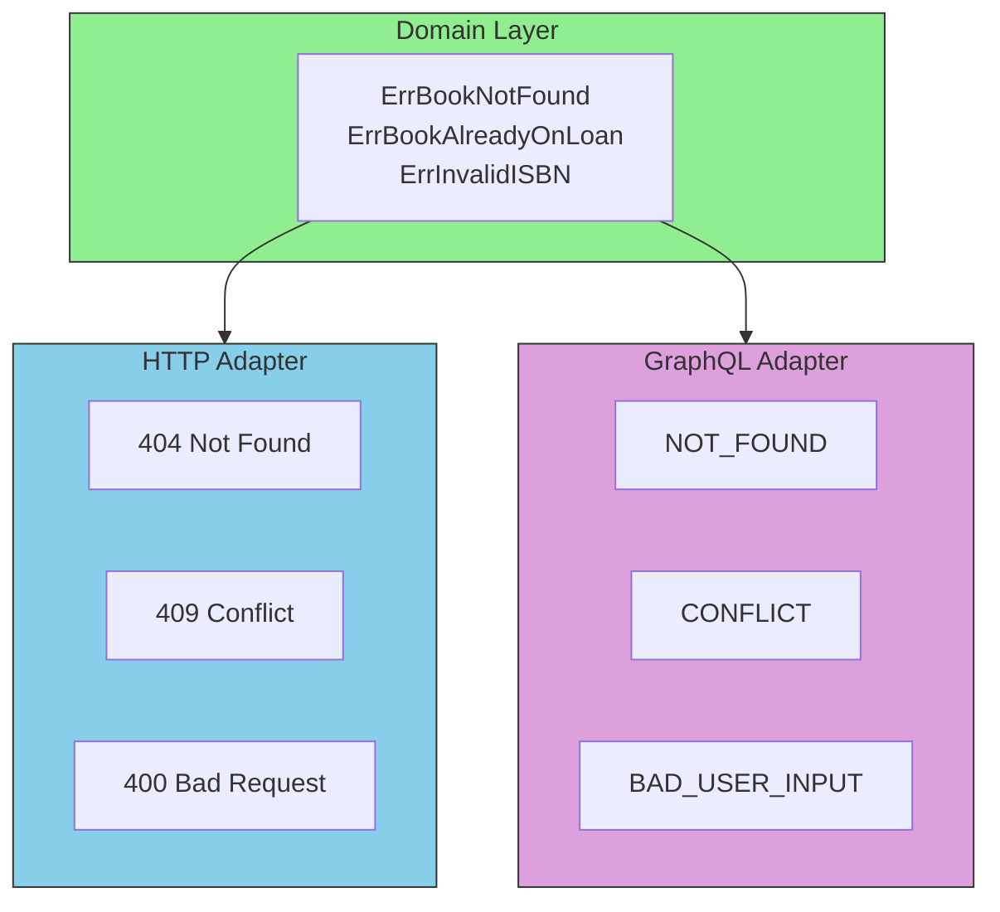

# Domain Errors

## Sam's Scenario

Sam's original error handling was a mess: `errors.New("error")`, `fmt.Errorf("something went wrong")`, and worst of all, returning HTTP 500 for business rule violations like "book already on loan." Alex explained: "Domain errors are your business vocabulary. They tell adapters exactly what went wrong, so they can respond appropriately."

## What are Domain Errors?

Domain errors are an essential part of your domain layer. They express business failures in a meaningful, typed way.

## Why Domain Errors Matter



## Defining Domain Errors for BookShelf

```go
package entities

import "errors"

// Domain errors - express business failures
var (
    // Book errors
    ErrBookNotFound       = errors.New("book not found")
    ErrBookAlreadyOnLoan  = errors.New("book is already on loan")
    ErrBookNotOnLoan      = errors.New("book is not currently on loan")
    ErrInvalidISBN        = errors.New("invalid ISBN format")
    ErrTitleTooShort      = errors.New("title must be at least 2 characters")
    ErrDuplicateISBN      = errors.New("book with this ISBN already exists")

    // User errors
    ErrUserNotFound       = errors.New("user not found")
    ErrInvalidEmail       = errors.New("invalid email format")
    ErrEmailAlreadyTaken  = errors.New("email address is already taken")

    // Loan errors
    ErrLoanNotFound       = errors.New("loan record not found")
    ErrUserNotEligible    = errors.New("user is not eligible to borrow")
    ErrTooManyActiveLoans = errors.New("user has too many active loans")
    ErrOverdueLoans       = errors.New("user has overdue loans")
    ErrAlreadyReturned    = errors.New("book has already been returned")
)
```

## Error Hierarchy with Wrapping

For more context, use error wrapping:

```go
package entities

import "fmt"

// Base domain errors
var (
    ErrNotFound   = errors.New("not found")
    ErrValidation = errors.New("validation error")
    ErrConflict   = errors.New("conflict")
)

// Specific errors wrap base errors
func NewBookNotFoundError(id string) error {
    return fmt.Errorf("book %s: %w", id, ErrNotFound)
}

func NewISBNTakenError(isbn string) error {
    return fmt.Errorf("ISBN %s: %w", isbn, ErrConflict)
}

// Usage in adapters - check error type
func (h *BookHandler) GetBook(w http.ResponseWriter, r *http.Request) {
    book, err := h.service.GetBook(ctx, id)
    if err != nil {
        if errors.Is(err, entities.ErrNotFound) {
            http.Error(w, err.Error(), http.StatusNotFound)
            return
        }
        http.Error(w, "internal error", http.StatusInternalServerError)
        return
    }
    // ...
}
```

## Error Translation in Adapters



```go
// Adapter translates domain errors to HTTP status codes
func domainErrorToHTTPStatus(err error) int {
    switch {
    case errors.Is(err, entities.ErrNotFound):
        return http.StatusNotFound
    case errors.Is(err, entities.ErrConflict):
        return http.StatusConflict
    case errors.Is(err, entities.ErrValidation):
        return http.StatusBadRequest
    default:
        return http.StatusInternalServerError
    }
}
```

## Validation Error with Details

```go
// ValidationError contains multiple field errors
type ValidationError struct {
    Errors map[string]string
}

func (e *ValidationError) Error() string {
    return "validation failed"
}

func (e *ValidationError) Add(field, message string) {
    if e.Errors == nil {
        e.Errors = make(map[string]string)
    }
    e.Errors[field] = message
}

func (e *ValidationError) HasErrors() bool {
    return len(e.Errors) > 0
}

// Usage in entity
func NewBook(title, author string, isbn ISBN) (*Book, error) {
    validation := &ValidationError{}

    if len(title) < 2 {
        validation.Add("title", "must be at least 2 characters")
    }
    if len(author) < 2 {
        validation.Add("author", "must be at least 2 characters")
    }
    if !isbn.IsValid() {
        validation.Add("isbn", "invalid ISBN format")
    }

    if validation.HasErrors() {
        return nil, validation
    }

    return &Book{
        Title:  title,
        Author: author,
        ISBN:   isbn,
        Status: StatusAvailable,
    }, nil
}
```

## Sam's Insight

"So when a book is already on loan, I return `ErrBookAlreadyOnLoan` from the domain, and my HTTP adapter translates that to a 409 Conflict," Sam explained. "And if Maya adds a GraphQL adapter, it'll translate the same error to `CONFLICT`. The domain doesn't care." Alex beamed: "Perfect! Now your errors are part of your ubiquitous language."

## Domain Error Best Practices

| Practice | Description |
|----------|-------------|
| **Use Sentinel Errors** | Define errors as package-level variables |
| **Wrap for Context** | Use `fmt.Errorf("context: %w", err)` |
| **Keep Domain Language** | `ErrOrderNotPaid` not `ErrDBConstraintViolation` |
| **Don't Expose Infrastructure** | Domain shouldn't know about SQL errors |
| **Translate at Boundaries** | Adapters convert to appropriate format |
