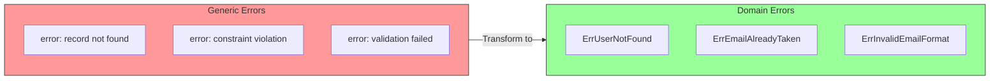
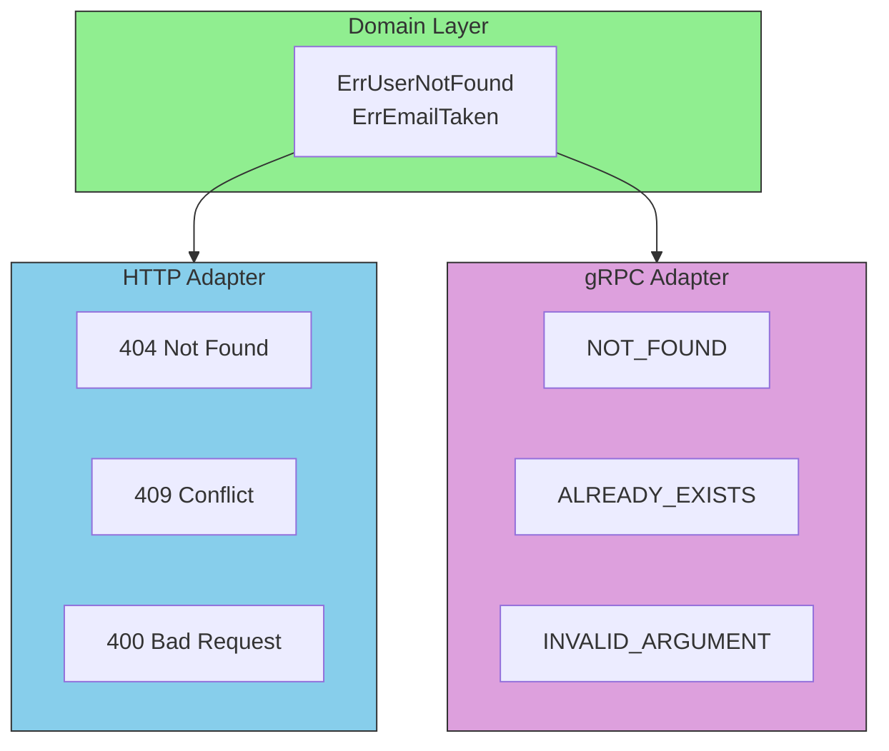

# Domain Errors

Domain errors are an essential part of your domain layer. They express business failures in a meaningful, typed way.

## Why Domain Errors Matter



## Defining Domain Errors

```go
package entities

import "errors"

// Domain errors - express business failures
var (
    // User errors
    ErrUserNotFound     = errors.New("user not found")
    ErrEmailAlreadyTaken = errors.New("email address is already taken")
    ErrInvalidEmail     = errors.New("invalid email format")
    ErrNameTooShort     = errors.New("name must be at least 2 characters")

    // Order errors
    ErrOrderNotFound      = errors.New("order not found")
    ErrInsufficientStock  = errors.New("insufficient stock for order")
    ErrOrderAlreadyPaid   = errors.New("order has already been paid")
    ErrOrderCancelled     = errors.New("order has been cancelled")

    // Payment errors
    ErrPaymentDeclined   = errors.New("payment was declined")
    ErrInvalidCardNumber = errors.New("invalid card number")
)
```

## Error Hierarchy with Wrapping

For more context, use error wrapping:

```go
package entities

import "fmt"

// Base domain errors
var (
    ErrNotFound   = errors.New("not found")
    ErrValidation = errors.New("validation error")
    ErrConflict   = errors.New("conflict")
)

// Specific errors wrap base errors
func NewUserNotFoundError(id string) error {
    return fmt.Errorf("user %s: %w", id, ErrNotFound)
}

func NewEmailTakenError(email string) error {
    return fmt.Errorf("email %s already taken: %w", email, ErrConflict)
}

// Usage in adapters - check error type
func (h *UserHandler) GetUser(w http.ResponseWriter, r *http.Request) {
    user, err := h.service.GetUser(ctx, id)
    if err != nil {
        if errors.Is(err, entities.ErrNotFound) {
            http.Error(w, err.Error(), http.StatusNotFound)
            return
        }
        http.Error(w, "internal error", http.StatusInternalServerError)
        return
    }
    // ...
}
```

## Error Translation in Adapters



```go
// Adapter translates domain errors to HTTP status codes
func domainErrorToHTTPStatus(err error) int {
    switch {
    case errors.Is(err, entities.ErrNotFound):
        return http.StatusNotFound
    case errors.Is(err, entities.ErrConflict):
        return http.StatusConflict
    case errors.Is(err, entities.ErrValidation):
        return http.StatusBadRequest
    default:
        return http.StatusInternalServerError
    }
}
```

## Validation Error with Details

```go
// ValidationError contains multiple field errors
type ValidationError struct {
    Errors map[string]string
}

func (e *ValidationError) Error() string {
    return "validation failed"
}

func (e *ValidationError) Add(field, message string) {
    if e.Errors == nil {
        e.Errors = make(map[string]string)
    }
    e.Errors[field] = message
}

func (e *ValidationError) HasErrors() bool {
    return len(e.Errors) > 0
}

// Usage in entity
func NewUser(name, email string) (*User, error) {
    validation := &ValidationError{}

    if len(name) < 2 {
        validation.Add("name", "must be at least 2 characters")
    }
    if !isValidEmail(email) {
        validation.Add("email", "invalid format")
    }

    if validation.HasErrors() {
        return nil, validation
    }

    return &User{Name: name, Email: email}, nil
}
```

## Domain Error Best Practices

| Practice | Description |
|----------|-------------|
| **Use Sentinel Errors** | Define errors as package-level variables |
| **Wrap for Context** | Use `fmt.Errorf("context: %w", err)` |
| **Keep Domain Language** | `ErrOrderNotPaid` not `ErrDBConstraintViolation` |
| **Don't Expose Infrastructure** | Domain shouldn't know about SQL errors |
| **Translate at Boundaries** | Adapters convert to appropriate format |
