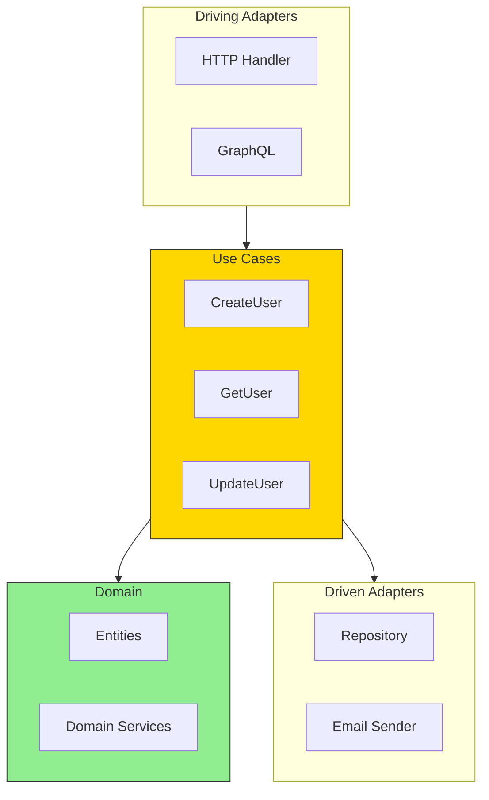

# Use Cases: Orchestrating Operations

Use cases (also called "application services" or "interactors") orchestrate the flow of data between ports and the domain.

## Use Case Position in Architecture

A use case represents a **single business operation**:
- "Create a new user account"
- "Place an order"
- "Transfer money between accounts"