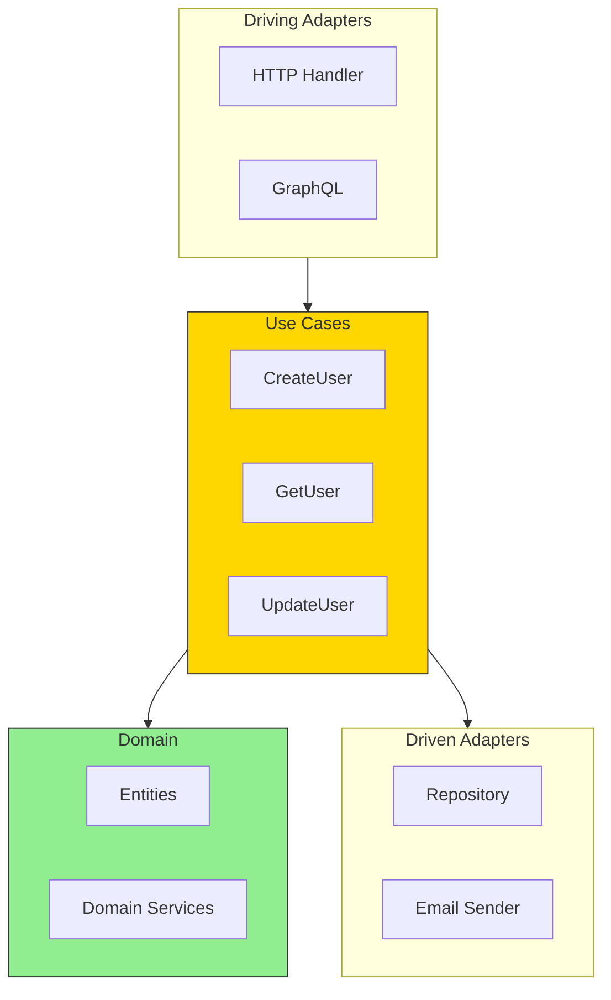

# Use Cases: Orchestrating Operations

## Sam's Challenge

"Okay, I have my domain entities with all the business rules," Sam showed Alex the Book, User, and Loan entities. "And I have my ports defined. But how do I actually make them work together?"

Alex smiled. "That's where **use cases** come in. Think of them as the orchestrators - they coordinate between your domain entities and the ports."

"So... a use case is like a single operation a user wants to perform?" Sam asked.

"Exactly! Like 'Borrow a Book' or 'Return a Book'. The use case coordinates everything:
1. It validates the request
2. It loads the necessary entities via ports (repositories)
3. It calls the domain logic
4. It saves the results via ports
5. It sends notifications if needed

The use case is the glue that holds everything together."

---

Use cases (also called "application services" or "interactors") orchestrate the flow of data between ports and the domain.

## Use Case Position in Architecture



A use case represents a **single business operation**:
- "Create a new user account"
- "Place an order"
- "Transfer money between accounts"

## BookShelf Use Cases

### BorrowBookUseCase

Let's see how Sam implements the "Borrow a Book" operation:

```go
package usecases

import (
    "context"
    "fmt"
    "github.com/bookshelf/domain"
)

// BorrowBookUseCase orchestrates the book borrowing operation
type BorrowBookUseCase struct {
    bookRepo     domain.BookRepository
    userRepo     domain.UserRepository
    loanRepo     domain.LoanRepository
    notification domain.NotificationService
}

// NewBorrowBookUseCase creates a new use case with its dependencies
func NewBorrowBookUseCase(
    bookRepo domain.BookRepository,
    userRepo domain.UserRepository,
    loanRepo domain.LoanRepository,
    notification domain.NotificationService,
) *BorrowBookUseCase {
    return &BorrowBookUseCase{
        bookRepo:     bookRepo,
        userRepo:     userRepo,
        loanRepo:     loanRepo,
        notification: notification,
    }
}

// Execute performs the book borrowing operation
func (uc *BorrowBookUseCase) Execute(ctx context.Context, userID, bookID string) (*domain.Loan, error) {
    // 1. Load the user
    user, err := uc.userRepo.FindByID(ctx, userID)
    if err != nil {
        return nil, fmt.Errorf("failed to find user: %w", err)
    }

    // 2. Check if user can borrow (domain rule)
    if err := user.CanBorrow(); err != nil {
        return nil, err
    }

    // 3. Load the book
    book, err := uc.bookRepo.FindByID(ctx, bookID)
    if err != nil {
        return nil, fmt.Errorf("failed to find book: %w", err)
    }

    // 4. Try to borrow the book (domain rule)
    if err := book.Borrow(); err != nil {
        return nil, err
    }

    // 5. Create the loan
    loan := domain.NewLoan(userID, bookID)
    if err := uc.loanRepo.Create(ctx, loan); err != nil {
        return nil, fmt.Errorf("failed to create loan: %w", err)
    }

    // 6. Update the book status
    if err := uc.bookRepo.Update(ctx, book); err != nil {
        return nil, fmt.Errorf("failed to update book: %w", err)
    }

    // 7. Update the user's active loan count
    user.BorrowBook()
    if err := uc.userRepo.Update(ctx, user); err != nil {
        return nil, fmt.Errorf("failed to update user: %w", err)
    }

    // 8. Send confirmation notification
    if err := uc.notification.SendBorrowConfirmation(ctx, user, book); err != nil {
        // Log the error but don't fail the operation
        // The loan was successful even if notification failed
        fmt.Printf("Warning: failed to send notification: %v\n", err)
    }

    return loan, nil
}
```

### ReturnBookUseCase

```go
package usecases

import (
    "context"
    "fmt"
    "github.com/bookshelf/domain"
)

// ReturnBookUseCase orchestrates the book return operation
type ReturnBookUseCase struct {
    bookRepo domain.BookRepository
    userRepo domain.UserRepository
    loanRepo domain.LoanRepository
}

// NewReturnBookUseCase creates a new use case with its dependencies
func NewReturnBookUseCase(
    bookRepo domain.BookRepository,
    userRepo domain.UserRepository,
    loanRepo domain.LoanRepository,
) *ReturnBookUseCase {
    return &ReturnBookUseCase{
        bookRepo: bookRepo,
        userRepo: userRepo,
        loanRepo: loanRepo,
    }
}

// Execute performs the book return operation
func (uc *ReturnBookUseCase) Execute(ctx context.Context, loanID string) (*domain.Loan, error) {
    // 1. Load the loan
    loan, err := uc.loanRepo.FindByID(ctx, loanID)
    if err != nil {
        return nil, fmt.Errorf("failed to find loan: %w", err)
    }

    // 2. Mark loan as returned (domain rule)
    if err := loan.Return(); err != nil {
        return nil, err
    }

    // 3. Calculate any late fees
    lateFee := loan.CalculateLateFee()
    if lateFee > 0 {
        // In a real system, you might charge the user here
        fmt.Printf("Late fee: $%.2f\n", lateFee)
    }

    // 4. Load the book
    book, err := uc.bookRepo.FindByID(ctx, loan.BookID)
    if err != nil {
        return nil, fmt.Errorf("failed to find book: %w", err)
    }

    // 5. Mark book as available
    book.Return()
    if err := uc.bookRepo.Update(ctx, book); err != nil {
        return nil, fmt.Errorf("failed to update book: %w", err)
    }

    // 6. Load the user
    user, err := uc.userRepo.FindByID(ctx, loan.UserID)
    if err != nil {
        return nil, fmt.Errorf("failed to find user: %w", err)
    }

    // 7. Update user's active loan count
    user.ReturnBook()
    if err := uc.userRepo.Update(ctx, user); err != nil {
        return nil, fmt.Errorf("failed to update user: %w", err)
    }

    // 8. Save the updated loan
    if err := uc.loanRepo.Update(ctx, loan); err != nil {
        return nil, fmt.Errorf("failed to update loan: %w", err)
    }

    return loan, nil
}
```

### SearchBooksUseCase

```go
package usecases

import (
    "context"
    "github.com/bookshelf/domain"
)

// SearchBooksUseCase orchestrates book searching
type SearchBooksUseCase struct {
    bookRepo domain.BookRepository
}

// NewSearchBooksUseCase creates a new use case
func NewSearchBooksUseCase(bookRepo domain.BookRepository) *SearchBooksUseCase {
    return &SearchBooksUseCase{bookRepo: bookRepo}
}

// Execute performs the search operation
func (uc *SearchBooksUseCase) Execute(ctx context.Context, query string) ([]*domain.Book, error) {
    // Simple use case - just delegate to repository
    return uc.bookRepo.Search(ctx, query)
}
```

## Use Case Testing

One of the biggest advantages of use cases is how easy they are to test:

```go
package usecases_test

import (
    "context"
    "testing"
    "github.com/bookshelf/domain"
    "github.com/bookshelf/usecases"
    "github.com/bookshelf/mocks"
)

func TestBorrowBookUseCase_Success(t *testing.T) {
    // Arrange: Set up mocks
    ctx := context.Background()

    user := &domain.User{
        ID:          "user-1",
        Email:       "sam@bookshelf.com",
        Name:        "Sam",
        ActiveLoans: 0,
        MaxLoans:    3,
    }

    book := &domain.Book{
        ID:        "book-1",
        Title:     "Clean Architecture",
        Author:    "Robert C. Martin",
        ISBN:      "9780134494166",
        Available: true,
    }

    userRepo := mocks.NewMockUserRepository()
    userRepo.AddUser(user)

    bookRepo := mocks.NewMockBookRepository()
    bookRepo.AddBook(book)

    loanRepo := mocks.NewMockLoanRepository()
    notification := mocks.NewMockNotificationService()

    // Act: Execute the use case
    useCase := usecases.NewBorrowBookUseCase(bookRepo, userRepo, loanRepo, notification)
    loan, err := useCase.Execute(ctx, "user-1", "book-1")

    // Assert: Verify the results
    if err != nil {
        t.Fatalf("Expected no error, got: %v", err)
    }

    if loan == nil {
        t.Fatal("Expected loan to be created")
    }

    // Verify book is no longer available
    updatedBook, _ := bookRepo.FindByID(ctx, "book-1")
    if updatedBook.Available {
        t.Error("Expected book to be unavailable")
    }

    // Verify user's active loan count increased
    updatedUser, _ := userRepo.FindByID(ctx, "user-1")
    if updatedUser.ActiveLoans != 1 {
        t.Errorf("Expected user to have 1 active loan, got %d", updatedUser.ActiveLoans)
    }

    // Verify notification was sent
    if !notification.WasCalled("SendBorrowConfirmation") {
        t.Error("Expected notification to be sent")
    }
}

func TestBorrowBookUseCase_UserMaxLoansReached(t *testing.T) {
    // Arrange: User already at max loans
    ctx := context.Background()

    user := &domain.User{
        ID:          "user-1",
        ActiveLoans: 3,
        MaxLoans:    3, // Already at max!
    }

    book := &domain.Book{
        ID:        "book-1",
        Available: true,
    }

    userRepo := mocks.NewMockUserRepository()
    userRepo.AddUser(user)

    bookRepo := mocks.NewMockBookRepository()
    bookRepo.AddBook(book)

    loanRepo := mocks.NewMockLoanRepository()
    notification := mocks.NewMockNotificationService()

    // Act
    useCase := usecases.NewBorrowBookUseCase(bookRepo, userRepo, loanRepo, notification)
    loan, err := useCase.Execute(ctx, "user-1", "book-1")

    // Assert: Should fail with max loans error
    if err != domain.ErrUserMaxLoansReached {
        t.Errorf("Expected ErrUserMaxLoansReached, got: %v", err)
    }

    if loan != nil {
        t.Error("Expected no loan to be created")
    }

    // Verify book is still available (transaction failed)
    updatedBook, _ := bookRepo.FindByID(ctx, "book-1")
    if !updatedBook.Available {
        t.Error("Expected book to remain available")
    }
}
```

## Sam's Progress

Sam created the BorrowBookUseCase and ReturnBookUseCase, then ran the tests. Everything passed.

"This is amazing!" Sam exclaimed. "Look at my test - I'm using in-memory mocks for all the repositories and notifications. No database, no HTTP server, and I can test the entire operation!"

Alex nodded. "And notice how the use case coordinates everything:
- It enforces the order of operations
- It handles errors at each step
- It uses domain rules from the entities
- It's completely independent of HTTP, GraphQL, or any other adapter"

Sam pulled up the old code. "Before, my HTTP handler was doing all of this - loading from the database, checking business rules, sending emails. It was a nightmare to test because I had to set up a real database and mock the email service."

"And now?" Alex prompted.

"Now my HTTP handler just calls the use case. The GraphQL resolver just calls the use case. The CLI just calls the use case. All the complexity is in one place, and it's easy to test!"

Sam added a new HTTP handler:

```go
func (h *HTTPBookHandler) BorrowBook(w http.ResponseWriter, r *http.Request) {
    var req struct {
        UserID string `json:"userId"`
        BookID string `json:"bookId"`
    }

    if err := json.NewDecoder(r.Body).Decode(&req); err != nil {
        http.Error(w, err.Error(), http.StatusBadRequest)
        return
    }

    // Just call the use case - that's it!
    loan, err := h.borrowBookUseCase.Execute(r.Context(), req.UserID, req.BookID)
    if err != nil {
        http.Error(w, err.Error(), http.StatusBadRequest)
        return
    }

    w.Header().Set("Content-Type", "application/json")
    w.WriteHeader(http.StatusCreated)
    json.NewEncoder(w).Encode(loan)
}
```

"Look how thin my adapter is now!" Sam said. "It just parses the request and calls the use case. All the complexity is in the use case where it can be tested properly."

Alex smiled. "Now you have a truly hexagonal architecture:
- Pure domain layer with business rules
- Use cases that orchestrate operations
- Ports that define contracts
- Adapters that can be swapped out

You can handle Maya's mobile requirement, Chen's Oracle requirement, and any future requirements without touching your core business logic."

Sam leaned back, satisfied. BookShelf was no longer a tangled mess - it was clean, testable, and ready to grow.