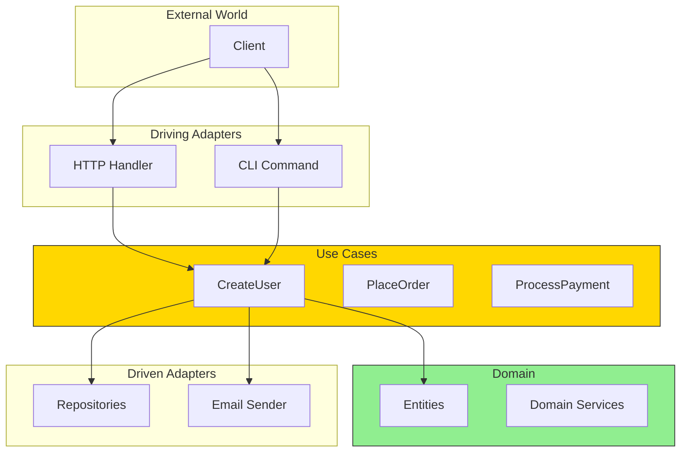
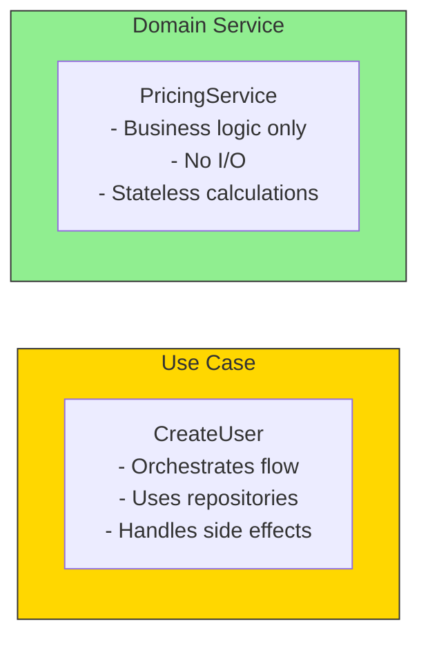
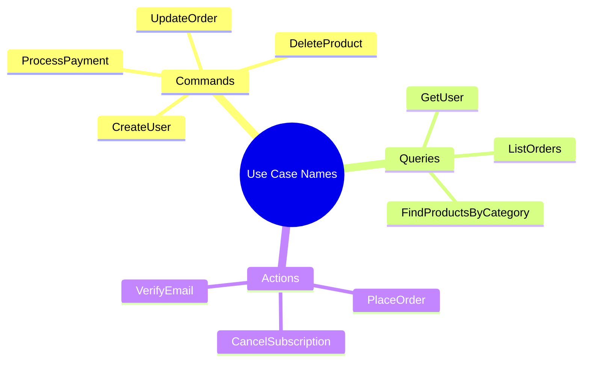

# What is a Use Case?

A use case represents a **single business operation** that your application can perform. It's the orchestrator that coordinates domain entities and external ports.

## Use Cases in Context



## What Use Cases Do

Use cases are the **application services** that:

1. **Receive input** from driving adapters
2. **Coordinate** domain entities and services
3. **Call** driven ports for persistence/communication
4. **Return results** or errors

```go
// A use case represents ONE business operation
type CreateUserUseCase struct {
    userRepo    repositories.UserRepository
    emailSender ports.EmailSender
    logger      *slog.Logger
}

func (uc *CreateUserUseCase) Execute(ctx context.Context, input CreateUserInput) (*entities.User, error) {
    // 1. Business logic coordination
    // 2. Domain entity creation
    // 3. Persistence via repository
    // 4. Side effects (email, events)
}
```

## Use Cases vs Domain Services



| Use Case | Domain Service |
|----------|----------------|
| Orchestrates operations | Contains business logic |
| Knows about ports/adapters | Knows only domain |
| Has side effects (save, send) | No I/O operations |
| Application layer | Domain layer |
| One per business operation | Reusable across use cases |

## Examples of Use Cases

```go
// User-related use cases
type CreateUser func(ctx context.Context, input CreateUserInput) (*User, error)
type UpdateUser func(ctx context.Context, id string, input UpdateUserInput) (*User, error)
type GetUser func(ctx context.Context, id string) (*User, error)
type DeleteUser func(ctx context.Context, id string) error

// Order-related use cases
type PlaceOrder func(ctx context.Context, input PlaceOrderInput) (*Order, error)
type CancelOrder func(ctx context.Context, id string) error
type GetOrderStatus func(ctx context.Context, id string) (OrderStatus, error)

// Payment-related use cases
type ProcessPayment func(ctx context.Context, input PaymentInput) (*Payment, error)
type RefundPayment func(ctx context.Context, paymentID string) error
```

## Use Case Naming Conventions



Use **verb + noun** format that describes the business operation:
- `CreateUser` not `UserCreation`
- `PlaceOrder` not `OrderPlacement`
- `ProcessPayment` not `PaymentProcessor`
