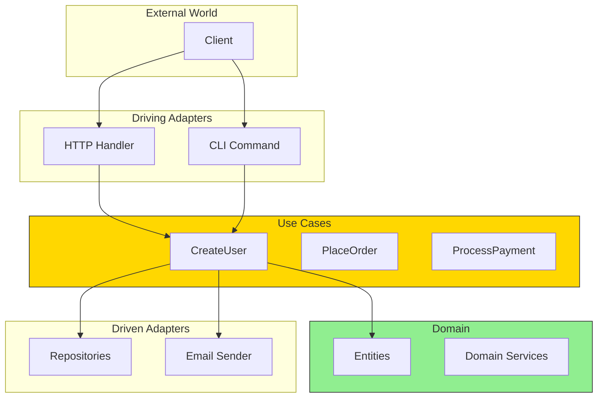
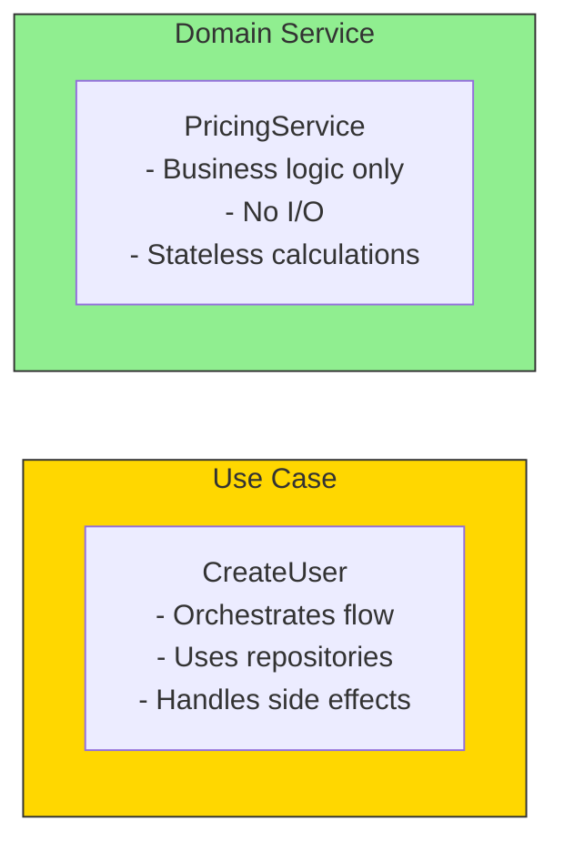
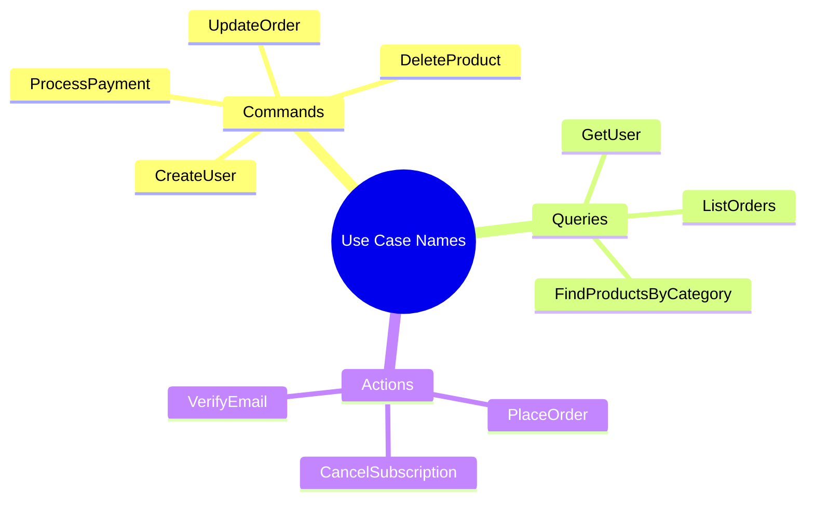

# What is a Use Case?

## Sam's Scenario

Sam's HTTP handlers were doing everything: validating input, creating Books, saving to the database, sending notifications. When Chen from Riverside Library asked for a CLI tool to import books from CSV files, Sam realized the handlers couldn't be reused. Alex explained: "Business logic belongs in use cases, not handlers. Then both your REST API and CLI can call the same `CreateBook` use case."

## What is a Use Case?

A use case represents a **single business operation** that your application can perform. It's the orchestrator that coordinates domain entities and external ports.

## Use Cases in Context



## What Use Cases Do

Use cases are the **application services** that:

1. **Receive input** from driving adapters
2. **Coordinate** domain entities and services
3. **Call** driven ports for persistence/communication
4. **Return results** or errors

```go
// A use case represents ONE business operation
type CreateBookUseCase struct {
    bookRepo    repositories.BookRepository
    emailSender ports.EmailSender
    logger      *slog.Logger
}

func (uc *CreateBookUseCase) Execute(ctx context.Context, input CreateBookInput) (*entities.Book, error) {
    // 1. Business logic coordination
    // 2. Domain entity creation (NewBook)
    // 3. Persistence via repository
    // 4. Side effects (notifications, events)
}
```

## Use Cases vs Domain Services



| Use Case | Domain Service |
|----------|----------------|
| Orchestrates operations | Contains business logic |
| Knows about ports/adapters | Knows only domain |
| Has side effects (save, send) | No I/O operations |
| Application layer | Domain layer |
| One per business operation | Reusable across use cases |

## BookShelf Use Cases

```go
// Book-related use cases
type CreateBook func(ctx context.Context, input CreateBookInput) (*Book, error)
type UpdateBook func(ctx context.Context, id string, input UpdateBookInput) (*Book, error)
type GetBook func(ctx context.Context, id string) (*Book, error)
type SearchBooks func(ctx context.Context, query SearchQuery) ([]*Book, error)

// Loan-related use cases
type LoanBook func(ctx context.Context, input LoanBookInput) (*Loan, error)
type ReturnBook func(ctx context.Context, bookID string) error
type GetOverdueBooks func(ctx context.Context) ([]*Book, error)
type CalculateLateFees func(ctx context.Context, bookID string) (float64, error)

// User-related use cases
type RegisterUser func(ctx context.Context, input RegisterUserInput) (*User, error)
type GetUserLoans func(ctx context.Context, userID string) ([]*Loan, error)
```

## Use Case Naming Conventions



Use **verb + noun** format that describes the business operation:
- `CreateBook` not `BookCreation`
- `LoanBook` not `BookLoaner`
- `ReturnBook` not `BookReturner`

## Sam's Insight

"Now I get it," Sam said. "My HTTP handler is just a thin adapter that calls `CreateBook`. My CLI tool will also call `CreateBook`. The use case doesn't care where the request came from." Alex smiled: "Exactly. That's hexagonal architecture - use cases at the center, adapters on the outside."
