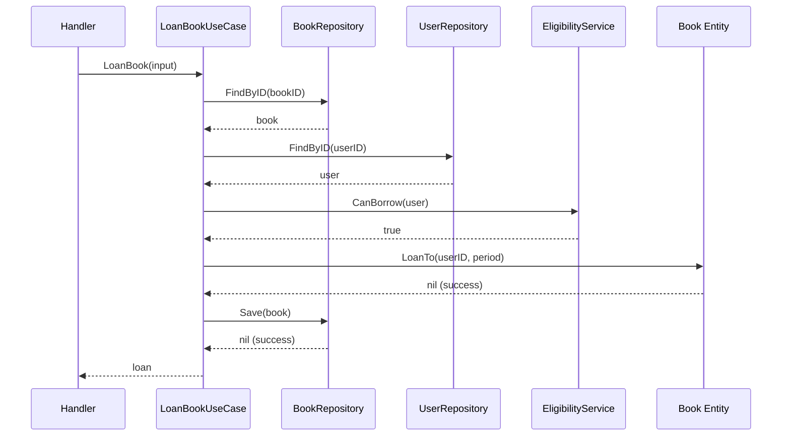

# Anatomy of a Use Case

## Sam's Scenario

Sam asked Alex: "What exactly goes inside a use case?" Alex walked through the `LoanBook` use case step by step: check if the book exists, verify it's available, check user eligibility, create the loan, save to repository, and send a notification. "Each step coordinates domain logic or external services," Alex explained.

## Use Case Flow



```go
package usecases

import (
    "context"
    "time"
    "myapp/internal/domain/entities"
    "myapp/internal/domain/repositories"
    "myapp/internal/domain/services"
)

// LoanBookUseCase handles book loan operations
type LoanBookUseCase struct {
    bookRepo           repositories.BookRepository
    userRepo           repositories.UserRepository
    eligibilityService *services.LoanEligibilityService
    logger             *slog.Logger
}

func NewLoanBookUseCase(
    bookRepo repositories.BookRepository,
    userRepo repositories.UserRepository,
    eligibility *services.LoanEligibilityService,
    logger *slog.Logger,
) *LoanBookUseCase {
    return &LoanBookUseCase{
        bookRepo:           bookRepo,
        userRepo:           userRepo,
        eligibilityService: eligibility,
        logger:             logger,
    }
}

type LoanBookInput struct {
    BookID     string
    UserID     string
    LoanPeriod time.Duration
}

func (uc *LoanBookUseCase) Execute(
    ctx context.Context,
    input LoanBookInput,
) (*entities.Book, error) {
    // 1. LOG: Operation started
    uc.logger.Info("loaning book", "bookID", input.BookID, "userID", input.UserID)

    // 2. FETCH: Get book entity
    book, err := uc.bookRepo.FindByID(ctx, input.BookID)
    if err != nil {
        return nil, err
    }

    // 3. FETCH: Get user
    user, err := uc.userRepo.FindByID(ctx, input.UserID)
    if err != nil {
        return nil, err
    }

    // 4. BUSINESS RULE: Check eligibility
    activeLoans := uc.userRepo.CountActiveLoans(ctx, user.ID)
    overdueLoans := uc.userRepo.CountOverdueLoans(ctx, user.ID)
    if !uc.eligibilityService.CanBorrow(activeLoans, overdueLoans) {
        return nil, entities.ErrUserNotEligible
    }

    // 5. DOMAIN LOGIC: Loan the book
    if err := book.LoanTo(input.UserID, input.LoanPeriod); err != nil {
        return nil, err
    }

    // 6. PERSIST: Save updated book
    if err := uc.bookRepo.Save(ctx, book); err != nil {
        return nil, err
    }

    return book, nil
}
```

## Sam's Insight

"I see the pattern now," Sam noted. "The use case orchestrates: fetch entities, check business rules using domain services, call entity methods, save via repository. It's like the conductor of an orchestra." Alex nodded: "Perfect analogy. Each musician (entity, service, repository) plays their part, and the use case conducts."