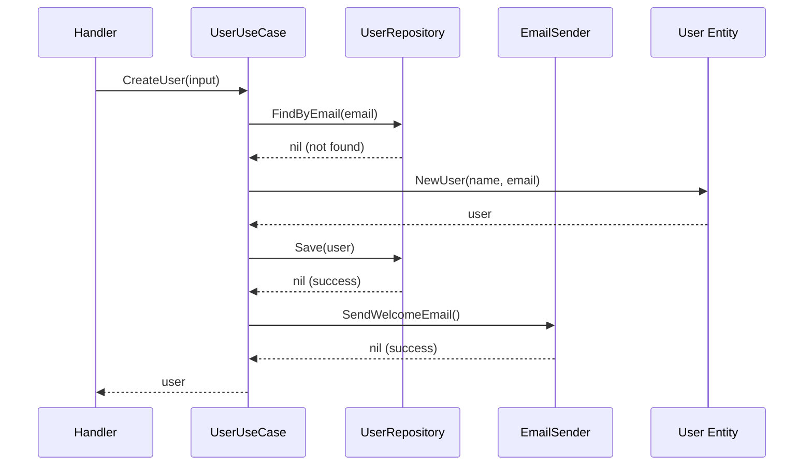

# Anatomy of a Use Case

## Use Case Flow



```go
package usecases

// UserUseCase implements the UserService driving port
type UserUseCase struct {
    userRepo    repositories.UserRepository  // driven port
    emailSender repositories.EmailSender     // driven port
    logger      *slog.Logger
}

func NewUserUseCase(
    userRepo repositories.UserRepository,
    emailSender repositories.EmailSender,
    logger *slog.Logger,
) *UserUseCase {
    return &UserUseCase{
        userRepo:    userRepo,
        emailSender: emailSender,
        logger:      logger,
    }
}

func (uc *UserUseCase) CreateUser(
    ctx context.Context,
    input ports.CreateUserInput,
) (*entities.User, error) {
    // 1. LOG: Operation started
    uc.logger.Info("creating user", "email", input.Email)

    // 2. CHECK: Business rule - email must be unique
    existing, _ := uc.userRepo.FindByEmail(ctx, input.Email)
    if existing != nil {
        return nil, entities.ErrEmailTaken
    }

    // 3. CREATE: Domain entity
    user, err := entities.NewUser(input.Name, input.Email)
    if err != nil {
        return nil, err
    }

    // 4. PERSIST: Save via repository
    if err := uc.userRepo.Save(ctx, user); err != nil {
        return nil, err
    }

    // 5. SIDE EFFECT: Send welcome email
    uc.emailSender.SendWelcomeEmail(ctx, user.Email, user.Name)

    return user, nil
}
```