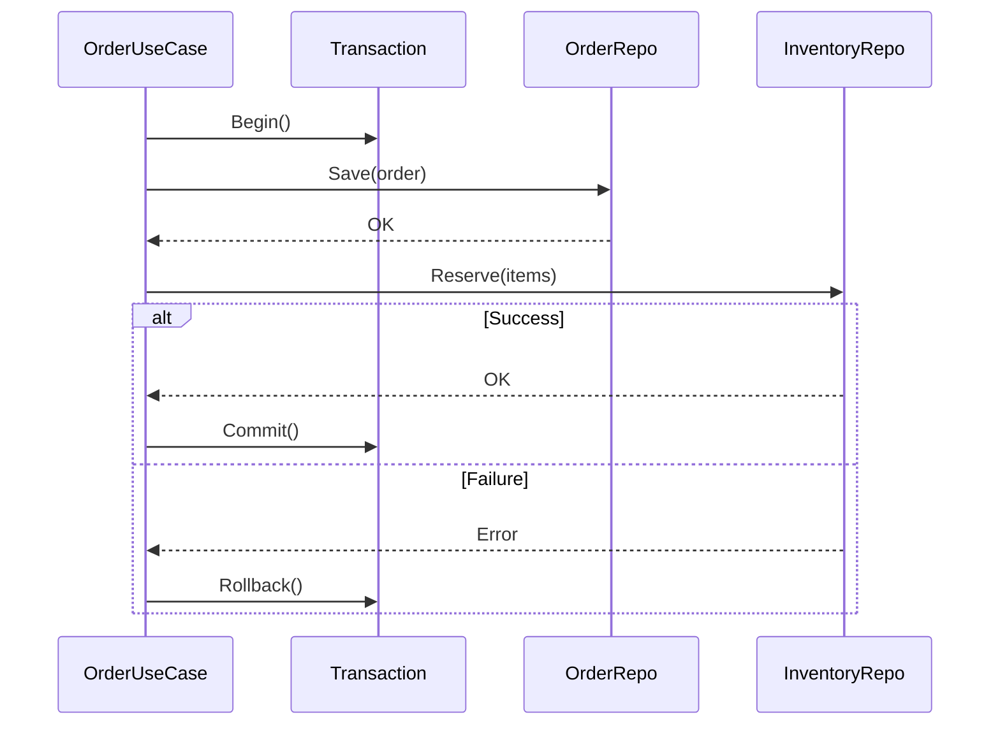

# Use Case Patterns

## Query Use Case (Simple Read)

```go
func (uc *UserUseCase) GetUser(
    ctx context.Context,
    id string,
) (*entities.User, error) {
    return uc.userRepo.FindByID(ctx, id)
}
```

## Command Use Case with Transaction



```go
func (uc *OrderUseCase) PlaceOrder(
    ctx context.Context,
    input ports.PlaceOrderInput,
) (*entities.Order, error) {
    // Start transaction
    tx, err := uc.txManager.Begin(ctx)
    if err != nil {
        return nil, err
    }
    defer tx.Rollback()

    // Create order
    order, err := entities.NewOrder(input.CustomerID, input.Items)
    if err != nil {
        return nil, err
    }

    // Reserve inventory
    for _, item := range order.Items {
        if err := uc.inventoryRepo.Reserve(ctx, tx, item.ProductID, item.Quantity); err != nil {
            return nil, err
        }
    }

    // Save and commit
    if err := uc.orderRepo.Save(ctx, tx, order); err != nil {
        return nil, err
    }

    return order, tx.Commit()
}
```

## Guidelines

| Do | Don't |
|-----|-------|
| Orchestrate domain objects | Implement business rules |
| Handle cross-cutting concerns | Know about HTTP, SQL |
| Coordinate multiple repositories | Contain presentation logic |