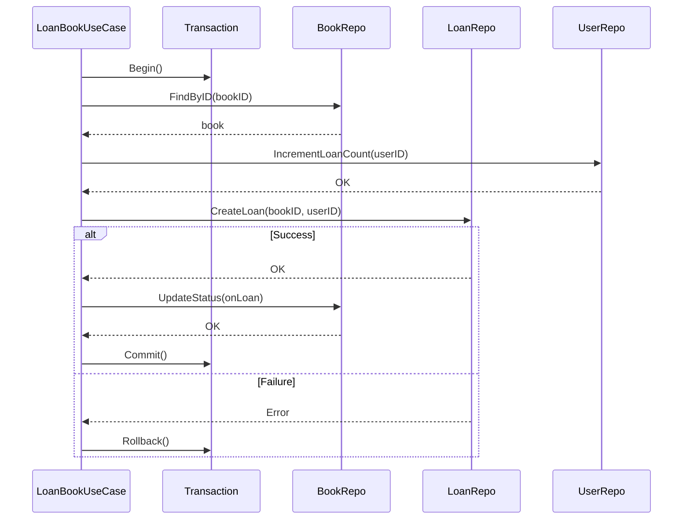

# Use Case Patterns

## Sam's Scenario

Sam needed patterns for different types of operations: simple reads (getting a book), complex transactions (loaning a book with inventory checks), and bulk operations (importing CSV files). Alex showed common use case patterns that BookShelf could follow.

## Query Use Case (Simple Read)

```go
// Simple read - just pass through to repository
func (uc *BookUseCase) GetBook(
    ctx context.Context,
    id string,
) (*entities.Book, error) {
    return uc.bookRepo.FindByID(ctx, id)
}

// Search with filters
func (uc *BookUseCase) SearchBooks(
    ctx context.Context,
    query string,
) ([]*entities.Book, error) {
    return uc.bookRepo.Search(ctx, query)
}
```

## Command Use Case with Transaction



```go
func (uc *LoanBookUseCase) Execute(
    ctx context.Context,
    input LoanBookInput,
) (*entities.Loan, error) {
    // Start transaction
    tx, err := uc.txManager.Begin(ctx)
    if err != nil {
        return nil, err
    }
    defer tx.Rollback()

    // Get book
    book, err := uc.bookRepo.FindByID(ctx, input.BookID)
    if err != nil {
        return nil, err
    }

    // Check eligibility
    user, err := uc.userRepo.FindByID(ctx, input.UserID)
    if err != nil {
        return nil, err
    }

    activeLoans := uc.userRepo.CountActiveLoans(ctx, user.ID)
    if activeLoans >= MaxActiveLoans {
        return nil, entities.ErrTooManyActiveLoans
    }

    // Create loan and update book
    if err := book.LoanTo(input.UserID, StandardLoanPeriod); err != nil {
        return nil, err
    }

    loan := entities.NewLoan(book.ID, user.ID, StandardLoanPeriod)
    if err := uc.loanRepo.Save(ctx, tx, loan); err != nil {
        return nil, err
    }

    if err := uc.bookRepo.Save(ctx, tx, book); err != nil {
        return nil, err
    }

    return loan, tx.Commit()
}
```

## Guidelines

| Do | Don't |
|-----|-------|
| Orchestrate domain objects | Implement business rules |
| Handle cross-cutting concerns | Know about HTTP, SQL |
| Coordinate multiple repositories | Contain presentation logic |

## Sam's Insight

"So for simple reads like 'get a book', the use case is almost a pass-through," Sam observed. "But for complex operations like loaning a book, the use case orchestrates multiple repositories and domain services within a transaction." Alex confirmed: "Exactly. Use cases are as simple or complex as the business operation requires."