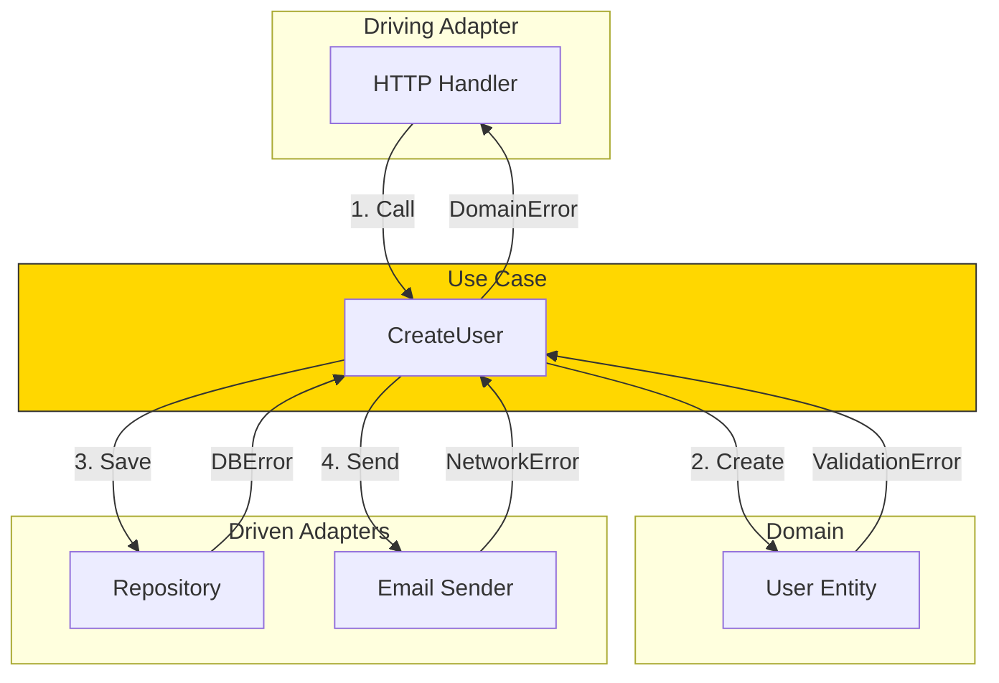
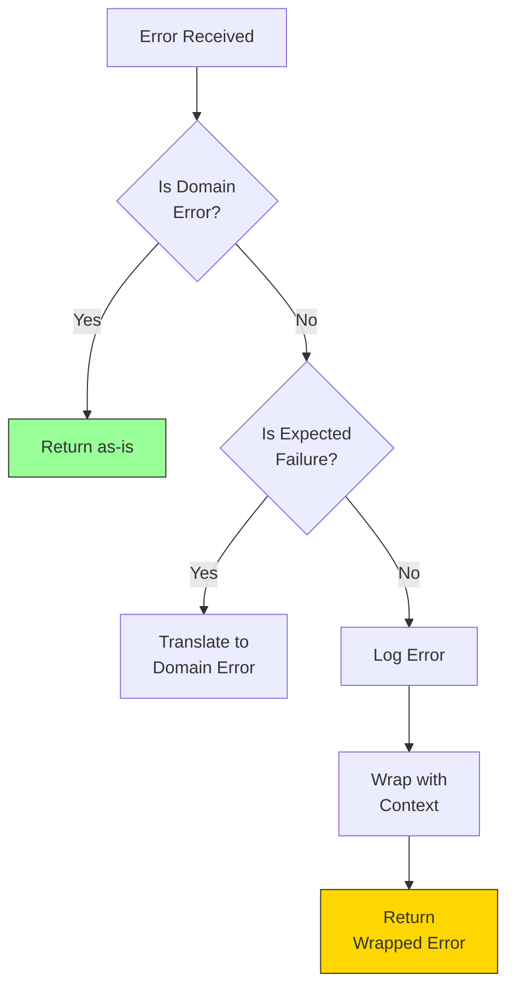

# Error Handling in Use Cases

Use cases must handle errors from both domain operations and driven ports, translating them appropriately.

## Error Flow in Hexagonal Architecture



## Handling Domain Errors

Domain errors come from entity creation and validation:

```go
func (uc *UserUseCase) CreateUser(ctx context.Context, input ports.CreateUserInput) (*entities.User, error) {
    // Domain validation error
    user, err := entities.NewUser(input.Name, input.Email)
    if err != nil {
        // Return domain error as-is - it's meaningful
        return nil, err  // e.g., ErrInvalidEmail, ErrNameTooShort
    }

    // ...
}
```

## Handling Repository Errors

```go
func (uc *UserUseCase) CreateUser(ctx context.Context, input ports.CreateUserInput) (*entities.User, error) {
    // Check for existing user
    existing, err := uc.userRepo.FindByEmail(ctx, input.Email)
    if err != nil && !errors.Is(err, entities.ErrUserNotFound) {
        // Unexpected error - log and wrap
        uc.logger.Error("failed to check email", "error", err)
        return nil, fmt.Errorf("failed to check email availability: %w", err)
    }
    if existing != nil {
        // Business rule violation
        return nil, entities.ErrEmailAlreadyTaken
    }

    // Create and save
    user, _ := entities.NewUser(input.Name, input.Email)

    if err := uc.userRepo.Save(ctx, user); err != nil {
        uc.logger.Error("failed to save user", "error", err)
        return nil, fmt.Errorf("failed to save user: %w", err)
    }

    return user, nil
}
```

## Error Handling Strategy



## Side Effect Error Handling

For non-critical side effects, decide if failure should abort the operation:

```go
func (uc *UserUseCase) CreateUser(ctx context.Context, input ports.CreateUserInput) (*entities.User, error) {
    user, _ := entities.NewUser(input.Name, input.Email)

    // Critical: must succeed
    if err := uc.userRepo.Save(ctx, user); err != nil {
        return nil, fmt.Errorf("failed to save user: %w", err)
    }

    // Non-critical: log and continue
    if err := uc.emailSender.SendWelcomeEmail(ctx, user.Email, user.Name); err != nil {
        uc.logger.Warn("failed to send welcome email",
            "userID", user.ID,
            "error", err,
        )
        // Don't return error - user was created successfully
    }

    return user, nil
}
```

## Error Handling Guidelines

| Error Type | Action | Example |
|------------|--------|---------|
| **Domain Error** | Return as-is | `ErrInvalidEmail` |
| **Not Found** | Return domain error | `ErrUserNotFound` |
| **Conflict** | Return domain error | `ErrEmailAlreadyTaken` |
| **Infrastructure** | Log and wrap | Database connection failed |
| **Non-critical** | Log and continue | Email send failed |

## Complete Example

```go
func (uc *OrderUseCase) PlaceOrder(ctx context.Context, input ports.PlaceOrderInput) (*entities.Order, error) {
    // 1. Validate customer exists
    customer, err := uc.customerRepo.FindByID(ctx, input.CustomerID)
    if err != nil {
        if errors.Is(err, entities.ErrNotFound) {
            return nil, entities.ErrCustomerNotFound
        }
        return nil, fmt.Errorf("failed to get customer: %w", err)
    }

    // 2. Create order (domain validation)
    order, err := entities.NewOrder(customer.ID, input.Items)
    if err != nil {
        return nil, err  // Domain error (ErrEmptyCart, etc.)
    }

    // 3. Check inventory (business rule)
    for _, item := range order.Items {
        available, err := uc.inventoryRepo.CheckStock(ctx, item.ProductID)
        if err != nil {
            return nil, fmt.Errorf("failed to check inventory: %w", err)
        }
        if available < item.Quantity {
            return nil, entities.ErrInsufficientStock
        }
    }

    // 4. Save order (critical)
    if err := uc.orderRepo.Save(ctx, order); err != nil {
        return nil, fmt.Errorf("failed to save order: %w", err)
    }

    // 5. Send confirmation (non-critical)
    go func() {
        if err := uc.emailSender.SendOrderConfirmation(ctx, customer.Email, order); err != nil {
            uc.logger.Warn("failed to send order confirmation", "orderID", order.ID, "error", err)
        }
    }()

    return order, nil
}
```
