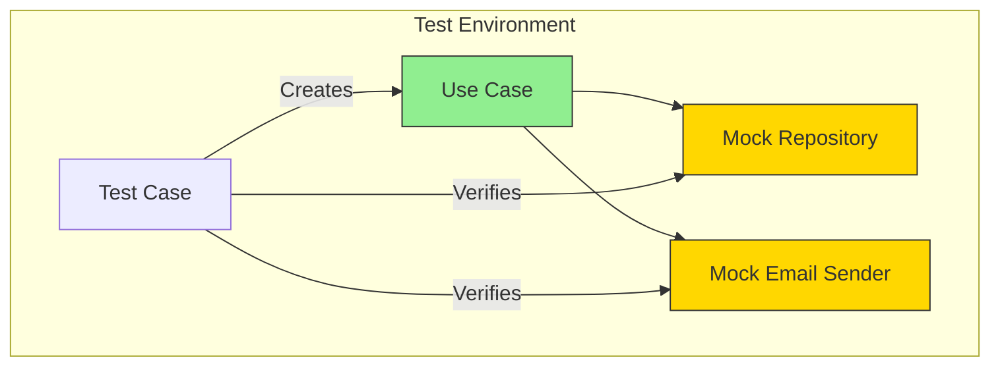
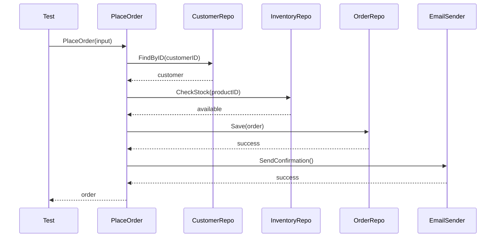

# Use Case Testing Strategies

## Sam's Scenario

Sam was struggling to test the `LoanBook` use case because it needed a real database and email server. Alex showed how mocking ports makes testing trivial: "With hexagonal architecture, you test use cases with mocks - no database, no network, just pure business logic validation."

## Why Use Case Testing is Easy

Testing use cases is where Hexagonal Architecture really shines. With proper port abstractions, you can test all business logic without any infrastructure.

## Testing Architecture



## Basic Use Case Test Structure

```go
func TestLoanBook_Success(t *testing.T) {
    // 1. ARRANGE: Create mocks and use case
    mockBookRepo := new(mocks.BookRepository)
    mockUserRepo := new(mocks.UserRepository)
    mockEligibility := services.NewLoanEligibilityService(5, 0)
    logger := slog.New(slog.NewTextHandler(io.Discard, nil))

    useCase := usecases.NewLoanBookUseCase(
        mockBookRepo,
        mockUserRepo,
        mockEligibility,
        logger,
    )

    // 2. SETUP TEST DATA
    isbn, _ := entities.NewISBN("9780134686991")
    book := &entities.Book{
        ID:     "book-123",
        Title:  "Clean Architecture",
        ISBN:   isbn,
        Status: entities.StatusAvailable,
    }
    user := &entities.User{ID: "user-456"}

    // 3. SETUP EXPECTATIONS
    mockBookRepo.On("FindByID", mock.Anything, "book-123").
        Return(book, nil)
    mockUserRepo.On("FindByID", mock.Anything, "user-456").
        Return(user, nil)
    mockUserRepo.On("CountActiveLoans", mock.Anything, "user-456").
        Return(2)
    mockUserRepo.On("CountOverdueLoans", mock.Anything, "user-456").
        Return(0)
    mockBookRepo.On("Save", mock.Anything, mock.AnythingOfType("*entities.Book")).
        Return(nil)

    // 4. ACT: Execute use case
    result, err := useCase.Execute(context.Background(), usecases.LoanBookInput{
        BookID:     "book-123",
        UserID:     "user-456",
        LoanPeriod: 14 * 24 * time.Hour,
    })

    // 5. ASSERT: Verify results
    assert.NoError(t, err)
    assert.NotNil(t, result)
    assert.Equal(t, entities.StatusOnLoan, result.Status)
    assert.Equal(t, "user-456", *result.BorrowedBy)

    // 6. VERIFY: Check mock expectations
    mockBookRepo.AssertExpectations(t)
    mockUserRepo.AssertExpectations(t)
}
```

## Testing Error Scenarios

```go
func TestLoanBook_BookAlreadyOnLoan(t *testing.T) {
    mockBookRepo := new(mocks.BookRepository)
    mockUserRepo := new(mocks.UserRepository)

    // Book is already on loan
    existingUserID := "other-user"
    book := &entities.Book{
        ID:         "book-123",
        Status:     entities.StatusOnLoan,
        BorrowedBy: &existingUserID,
    }

    mockBookRepo.On("FindByID", mock.Anything, "book-123").
        Return(book, nil)
    mockUserRepo.On("FindByID", mock.Anything, "user-456").
        Return(&entities.User{ID: "user-456"}, nil)
    mockUserRepo.On("CountActiveLoans", mock.Anything, "user-456").
        Return(2)
    mockUserRepo.On("CountOverdueLoans", mock.Anything, "user-456").
        Return(0)

    useCase := usecases.NewLoanBookUseCase(mockBookRepo, mockUserRepo, nil, nil)

    _, err := useCase.Execute(context.Background(), usecases.LoanBookInput{
        BookID:     "book-123",
        UserID:     "user-456",
        LoanPeriod: 14 * 24 * time.Hour,
    })

    assert.ErrorIs(t, err, entities.ErrBookAlreadyOnLoan)
}

func TestLoanBook_UserNotEligible(t *testing.T) {
    mockBookRepo := new(mocks.BookRepository)
    mockUserRepo := new(mocks.UserRepository)
    eligibility := services.NewLoanEligibilityService(5, 0) // Max 5 loans, 0 overdue

    book := &entities.Book{ID: "book-123", Status: entities.StatusAvailable}

    mockBookRepo.On("FindByID", mock.Anything, "book-123").
        Return(book, nil)
    mockUserRepo.On("FindByID", mock.Anything, "user-456").
        Return(&entities.User{ID: "user-456"}, nil)
    mockUserRepo.On("CountActiveLoans", mock.Anything, "user-456").
        Return(5)  // Already at max
    mockUserRepo.On("CountOverdueLoans", mock.Anything, "user-456").
        Return(0)

    useCase := usecases.NewLoanBookUseCase(mockBookRepo, mockUserRepo, eligibility, nil)

    _, err := useCase.Execute(context.Background(), usecases.LoanBookInput{
        BookID:     "book-123",
        UserID:     "user-456",
        LoanPeriod: 14 * 24 * time.Hour,
    })

    assert.ErrorIs(t, err, entities.ErrUserNotEligible)
}
```

## Table-Driven Tests

```go
func TestCreateUser_Validation(t *testing.T) {
    tests := []struct {
        name        string
        input       ports.CreateUserInput
        expectedErr error
    }{
        {
            name:        "empty name",
            input:       ports.CreateUserInput{Name: "", Email: "valid@email.com"},
            expectedErr: entities.ErrNameTooShort,
        },
        {
            name:        "short name",
            input:       ports.CreateUserInput{Name: "J", Email: "valid@email.com"},
            expectedErr: entities.ErrNameTooShort,
        },
        {
            name:        "invalid email",
            input:       ports.CreateUserInput{Name: "John", Email: "not-an-email"},
            expectedErr: entities.ErrInvalidEmail,
        },
    }

    for _, tt := range tests {
        t.Run(tt.name, func(t *testing.T) {
            mockRepo := new(mocks.UserRepository)
            mockRepo.On("FindByEmail", mock.Anything, mock.Anything).
                Return(nil, entities.ErrUserNotFound).Maybe()

            useCase := usecases.NewUserUseCase(mockRepo, nil, nil)

            _, err := useCase.CreateUser(context.Background(), tt.input)

            assert.ErrorIs(t, err, tt.expectedErr)
        })
    }
}
```

## Testing Complex Flows



```go
func TestPlaceOrder_Success(t *testing.T) {
    mockCustomer := new(mocks.CustomerRepository)
    mockInventory := new(mocks.InventoryRepository)
    mockOrder := new(mocks.OrderRepository)
    mockEmail := new(mocks.EmailSender)

    // Setup all mocks
    mockCustomer.On("FindByID", mock.Anything, "cust-123").
        Return(&entities.Customer{ID: "cust-123", Email: "cust@example.com"}, nil)
    mockInventory.On("CheckStock", mock.Anything, "prod-1").
        Return(100, nil)
    mockOrder.On("Save", mock.Anything, mock.AnythingOfType("*entities.Order")).
        Return(nil)
    mockEmail.On("SendOrderConfirmation", mock.Anything, mock.Anything, mock.Anything).
        Return(nil)

    useCase := usecases.NewOrderUseCase(mockCustomer, mockInventory, mockOrder, mockEmail)

    order, err := useCase.PlaceOrder(context.Background(), ports.PlaceOrderInput{
        CustomerID: "cust-123",
        Items: []ports.OrderItem{{ProductID: "prod-1", Quantity: 2}},
    })

    assert.NoError(t, err)
    assert.NotNil(t, order)
    mockOrder.AssertExpectations(t)
}
```

## Use Case Testing Best Practices

| Practice | Description |
|----------|-------------|
| **Test each path** | Happy path + all error scenarios |
| **Mock at port level** | Not at database level |
| **Verify interactions** | Check mocks were called correctly |
| **Table-driven tests** | For validation and edge cases |
| **Descriptive names** | `TestLoanBook_BookAlreadyOnLoan` |

## Sam's Insight

"This is amazing!" Sam exclaimed. "I can test the entire `LoanBook` workflow without touching a database. The mocks verify that I'm calling repositories correctly, and I can simulate errors easily." Alex smiled: "That's the hexagonal advantage - testability without infrastructure."
