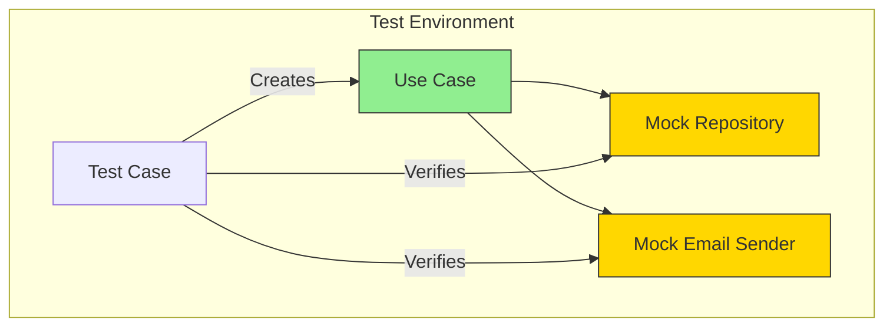
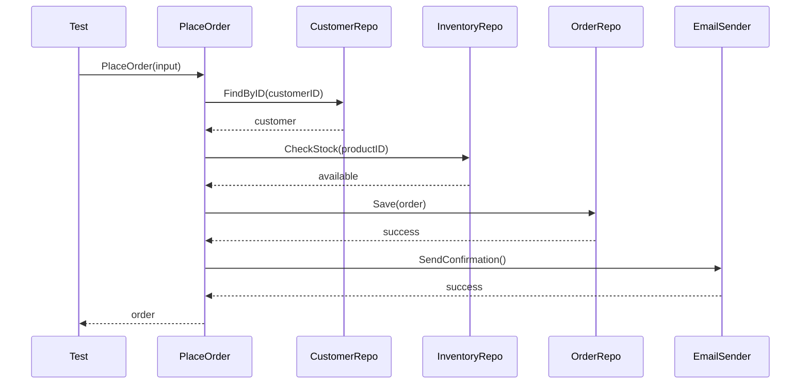

# Use Case Testing Strategies

Testing use cases is where Hexagonal Architecture really shines. With proper port abstractions, you can test all business logic without any infrastructure.

## Testing Architecture



## Basic Use Case Test Structure

```go
func TestCreateUser_Success(t *testing.T) {
    // 1. ARRANGE: Create mocks and use case
    mockRepo := new(mocks.UserRepository)
    mockEmail := new(mocks.EmailSender)
    logger := slog.New(slog.NewTextHandler(io.Discard, nil))

    useCase := usecases.NewUserUseCase(mockRepo, mockEmail, logger)

    // 2. SETUP EXPECTATIONS
    mockRepo.On("FindByEmail", mock.Anything, "john@example.com").
        Return(nil, entities.ErrUserNotFound)
    mockRepo.On("Save", mock.Anything, mock.AnythingOfType("*entities.User")).
        Return(nil)
    mockEmail.On("SendWelcomeEmail", mock.Anything, "john@example.com", "John").
        Return(nil)

    // 3. ACT: Execute use case
    user, err := useCase.CreateUser(context.Background(), ports.CreateUserInput{
        Name:  "John",
        Email: "john@example.com",
    })

    // 4. ASSERT: Verify results
    assert.NoError(t, err)
    assert.NotNil(t, user)
    assert.Equal(t, "John", user.Name)
    assert.Equal(t, "john@example.com", user.Email)

    // 5. VERIFY: Check mock expectations
    mockRepo.AssertExpectations(t)
    mockEmail.AssertExpectations(t)
}
```

## Testing Error Scenarios

```go
func TestCreateUser_EmailAlreadyTaken(t *testing.T) {
    mockRepo := new(mocks.UserRepository)
    useCase := usecases.NewUserUseCase(mockRepo, nil, nil)

    // Existing user found
    existingUser := &entities.User{Email: "taken@example.com"}
    mockRepo.On("FindByEmail", mock.Anything, "taken@example.com").
        Return(existingUser, nil)

    _, err := useCase.CreateUser(context.Background(), ports.CreateUserInput{
        Name:  "Jane",
        Email: "taken@example.com",
    })

    assert.ErrorIs(t, err, entities.ErrEmailAlreadyTaken)
}

func TestCreateUser_RepositorySaveError(t *testing.T) {
    mockRepo := new(mocks.UserRepository)
    mockEmail := new(mocks.EmailSender)

    mockRepo.On("FindByEmail", mock.Anything, mock.Anything).
        Return(nil, entities.ErrUserNotFound)
    mockRepo.On("Save", mock.Anything, mock.Anything).
        Return(errors.New("database connection lost"))

    useCase := usecases.NewUserUseCase(mockRepo, mockEmail, slog.Default())

    _, err := useCase.CreateUser(context.Background(), ports.CreateUserInput{
        Name:  "John",
        Email: "john@example.com",
    })

    assert.Error(t, err)
    assert.Contains(t, err.Error(), "failed to save user")
}
```

## Table-Driven Tests

```go
func TestCreateUser_Validation(t *testing.T) {
    tests := []struct {
        name        string
        input       ports.CreateUserInput
        expectedErr error
    }{
        {
            name:        "empty name",
            input:       ports.CreateUserInput{Name: "", Email: "valid@email.com"},
            expectedErr: entities.ErrNameTooShort,
        },
        {
            name:        "short name",
            input:       ports.CreateUserInput{Name: "J", Email: "valid@email.com"},
            expectedErr: entities.ErrNameTooShort,
        },
        {
            name:        "invalid email",
            input:       ports.CreateUserInput{Name: "John", Email: "not-an-email"},
            expectedErr: entities.ErrInvalidEmail,
        },
    }

    for _, tt := range tests {
        t.Run(tt.name, func(t *testing.T) {
            mockRepo := new(mocks.UserRepository)
            mockRepo.On("FindByEmail", mock.Anything, mock.Anything).
                Return(nil, entities.ErrUserNotFound).Maybe()

            useCase := usecases.NewUserUseCase(mockRepo, nil, nil)

            _, err := useCase.CreateUser(context.Background(), tt.input)

            assert.ErrorIs(t, err, tt.expectedErr)
        })
    }
}
```

## Testing Complex Flows



```go
func TestPlaceOrder_Success(t *testing.T) {
    mockCustomer := new(mocks.CustomerRepository)
    mockInventory := new(mocks.InventoryRepository)
    mockOrder := new(mocks.OrderRepository)
    mockEmail := new(mocks.EmailSender)

    // Setup all mocks
    mockCustomer.On("FindByID", mock.Anything, "cust-123").
        Return(&entities.Customer{ID: "cust-123", Email: "cust@example.com"}, nil)
    mockInventory.On("CheckStock", mock.Anything, "prod-1").
        Return(100, nil)
    mockOrder.On("Save", mock.Anything, mock.AnythingOfType("*entities.Order")).
        Return(nil)
    mockEmail.On("SendOrderConfirmation", mock.Anything, mock.Anything, mock.Anything).
        Return(nil)

    useCase := usecases.NewOrderUseCase(mockCustomer, mockInventory, mockOrder, mockEmail)

    order, err := useCase.PlaceOrder(context.Background(), ports.PlaceOrderInput{
        CustomerID: "cust-123",
        Items: []ports.OrderItem{{ProductID: "prod-1", Quantity: 2}},
    })

    assert.NoError(t, err)
    assert.NotNil(t, order)
    mockOrder.AssertExpectations(t)
}
```

## Use Case Testing Best Practices

| Practice | Description |
|----------|-------------|
| **Test each path** | Happy path + all error scenarios |
| **Mock at port level** | Not at database level |
| **Verify interactions** | Check mocks were called correctly |
| **Table-driven tests** | For validation and edge cases |
| **Descriptive names** | `TestCreateUser_EmailAlreadyTaken` |
