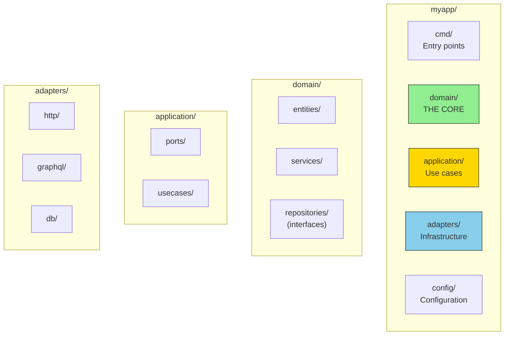

# Project Structure

A clear project structure makes hexagonal architecture visible and maintainable.

## The Recommended Layout

## Dependency Direction

Dependencies always point **inward**:
- Adapters → Application → Domain
- Never: Domain → Adapters