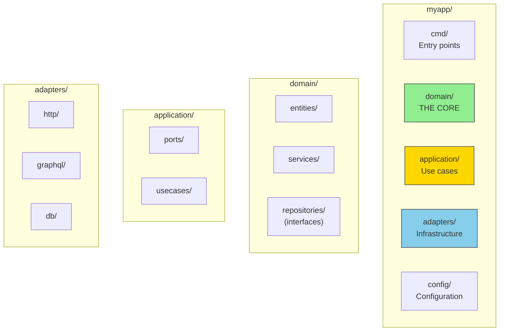

# Project Structure

## Sam's Challenge: The Great Reorganization

"My code works, but I can't find anything anymore," Sam admitted to Alex, scrolling through BookShelf's single `main.go` file that had grown to 1,200 lines during the hackathon weekend.

Alex smiled. "That's the problem with 'just make it work' code. Now let's make it maintainable. A clear project structure makes hexagonal architecture visible and easy to navigate."

Sam pulled up BookShelf's current mess:
```
bookshelf/
  main.go           (1,200 lines!)
  database.go       (mixed concerns)
  handlers.go       (business logic here?)
  utils.go          (everything else)
```

"Where does a new developer even start?" Alex asked. "Where's your domain? Where are your adapters?"

Sam stared at the screen. "It's... everywhere?"

"Exactly. Let's fix that."

## The Recommended Layout

A clear project structure makes hexagonal architecture visible and maintainable.

## The Recommended Layout



## Dependency Direction

Dependencies always point **inward**:
- Adapters → Application → Domain
- Never: Domain → Adapters

## BookShelf's New Structure

Sam spent the afternoon reorganizing BookShelf with Alex's guidance:

```
bookshelf/
  cmd/
    api/
      main.go                    # HTTP server entry point
  domain/
    book/
      book.go                    # Book entity
      isbn.go                    # ISBN value object
    loan/
      loan.go                    # Loan entity
      period.go                  # Loan period rules
    user/
      user.go                    # User entity
      membership.go              # Membership types
    services/
      catalog_service.go         # Book catalog logic
      lending_service.go         # Loan management rules
  application/
    ports/
      book_repository.go         # Port interface
      loan_repository.go         # Port interface
      notification_service.go    # Port interface
    usecases/
      borrow_book.go            # Use case
      return_book.go            # Use case
      search_catalog.go         # Use case
  adapters/
    http/
      book_handler.go           # REST endpoints
      loan_handler.go
      middleware.go
    postgres/
      book_repository.go        # Postgres implementation
      loan_repository.go
      migrations/
    email/
      smtp_notifier.go          # Email implementation
  config/
    config.go                   # Application config
```

### Moving the Book Entity

Before (in main.go):
```go
type Book struct {
    ID     int
    Title  string
    ISBN   string
    Author string
}
```

After (in domain/book/book.go):
```go
package book

import "errors"

type Book struct {
    id     ID
    title  string
    isbn   ISBN
    author string
    status Status
}

func NewBook(title, author string, isbn ISBN) (*Book, error) {
    if title == "" {
        return nil, errors.New("title is required")
    }
    if author == "" {
        return nil, errors.New("author is required")
    }

    return &Book{
        id:     NewID(),
        title:  title,
        isbn:   isbn,
        author: author,
        status: StatusAvailable,
    }, nil
}

func (b *Book) Borrow() error {
    if b.status != StatusAvailable {
        return errors.New("book is not available")
    }
    b.status = StatusBorrowed
    return nil
}
```

### Extracting the Port

Before (mixed with Postgres):
```go
// In database.go
func GetBook(id int) (*Book, error) {
    // SQL query here...
}
```

After (port in application/ports/book_repository.go):
```go
package ports

import "bookshelf/domain/book"

type BookRepository interface {
    FindByID(id book.ID) (*book.Book, error)
    FindByISBN(isbn book.ISBN) (*book.Book, error)
    Save(book *book.Book) error
    SearchByTitle(query string) ([]*book.Book, error)
}
```

Implementation (adapters/postgres/book_repository.go):
```go
package postgres

import (
    "database/sql"
    "bookshelf/domain/book"
    "bookshelf/application/ports"
)

type BookRepository struct {
    db *sql.DB
}

func NewBookRepository(db *sql.DB) ports.BookRepository {
    return &BookRepository{db: db}
}

func (r *BookRepository) FindByID(id book.ID) (*book.Book, error) {
    // Postgres-specific implementation
}
```

## Benefits Sam Discovered

After the reorganization, Sam noticed immediate improvements:

1. **Discoverability**: "Need book logic? Check `domain/book/`. Need to change the database? Check `adapters/postgres/`."

2. **Import Paths Tell the Story**:
```go
import (
    "bookshelf/domain/book"      // ← Domain entities
    "bookshelf/application/ports" // ← Port interfaces
    "bookshelf/adapters/postgres" // ← Infrastructure
)
```

3. **New Developer Onboarding**: Sam's friend looked at the structure and said, "Oh, I start in `domain/` to understand what the app does, then look at `adapters/` to see how it connects. Makes sense!"

4. **Testing Is Easier**: Each package has clear dependencies, making tests simpler to write.

## Common Pitfalls Sam Avoided

### Pitfall 1: Putting Everything in One Package
```go
// DON'T DO THIS
package bookshelf

type Book struct {...}
type BookRepository interface {...}
type PostgresBookRepository struct {...}
type BookHandler struct {...}
```

Why it's bad: No clear boundaries, circular dependencies likely.

### Pitfall 2: Organizing by Type Instead of Domain
```go
// DON'T DO THIS
models/
  book.go
  loan.go
  user.go
repositories/
  book_repo.go
  loan_repo.go
  user_repo.go
```

Why it's bad: Changes to "book" touch multiple directories. Domain concepts are scattered.

### Pitfall 3: Domain Importing Adapters
```go
// DON'T DO THIS
// In domain/book/book.go
import "bookshelf/adapters/postgres"  // ❌ WRONG DIRECTION
```

The dependency arrow must always point inward.

## File Size Guidelines

Alex gave Sam these rules of thumb:

- **Domain entities**: 100-300 lines each
- **Use cases**: 50-150 lines each
- **Adapters**: Can be larger (200-500 lines) since they handle infrastructure
- **If any file exceeds 500 lines**: Consider splitting it

Sam's original 1,200-line main.go became:
- `domain/book/book.go` (180 lines)
- `domain/loan/loan.go` (150 lines)
- `application/usecases/borrow_book.go` (85 lines)
- `adapters/http/book_handler.go` (120 lines)
- `adapters/postgres/book_repository.go` (200 lines)
- `cmd/api/main.go` (50 lines for wiring)

## Sam's Progress

**What Sam learned:**
- Structure reflects architecture - make the hexagon visible in folders
- Organize by domain concepts, not technical layers
- Keep files small and focused (under 500 lines)
- Import paths should reveal dependencies at a glance
- A clear structure makes onboarding new developers easy

**Sam's next challenge:** "The code is organized, but I have zero tests. How do I even start testing this?" Alex grinned. "Perfect segue to Chapter 6..."

**Confidence level:** ★★★☆☆ → ★★★★☆ (Structure is solid, testing is next!)