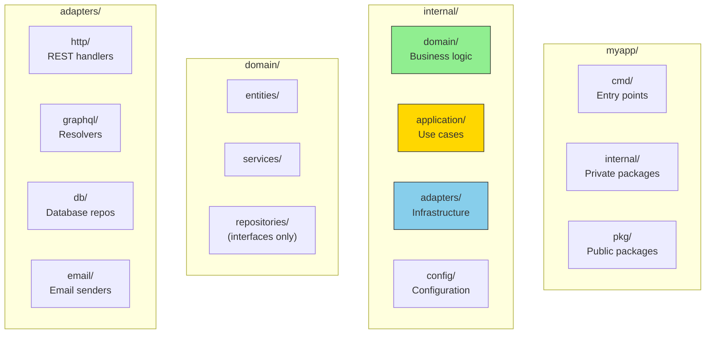
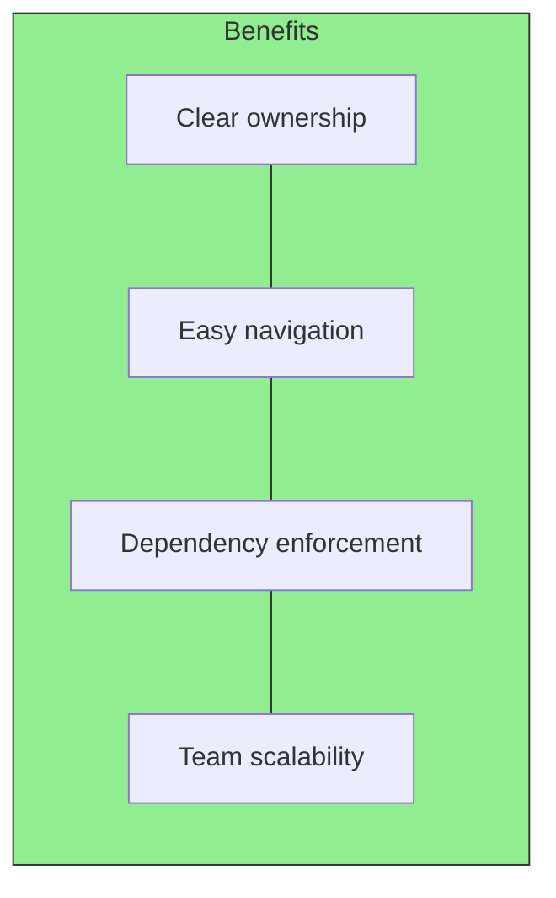

# The Recommended Layout

A well-organized project structure makes Hexagonal Architecture visible and maintainable. Here's the recommended layout for Go projects.

## Project Structure Overview



## Complete Directory Structure

```
myapp/
├── cmd/
│   ├── api/
│   │   └── main.go           # HTTP API entry point
│   └── cli/
│       └── main.go           # CLI tool entry point
├── internal/
│   ├── domain/
│   │   ├── entities/
│   │   │   ├── user.go
│   │   │   ├── order.go
│   │   │   └── errors.go
│   │   ├── services/
│   │   │   └── auth.go
│   │   └── repositories/
│   │       ├── user.go       # Interface only
│   │       └── order.go      # Interface only
│   ├── application/
│   │   ├── ports/
│   │   │   └── services.go   # Driving port interfaces
│   │   └── usecases/
│   │       ├── user.go
│   │       └── order.go
│   ├── adapters/
│   │   ├── http/
│   │   │   ├── router.go
│   │   │   ├── user_handler.go
│   │   │   └── middleware.go
│   │   ├── graphql/
│   │   │   ├── schema.go
│   │   │   └── resolvers.go
│   │   └── db/
│   │       ├── postgres/
│   │       │   └── user_repo.go
│   │       └── sqlite/
│   │           └── user_repo.go
│   └── config/
│       └── config.go
├── pkg/                       # Public shared packages
│   └── validator/
├── go.mod
└── go.sum
```

## Layer Responsibilities

| Layer | Location | Contains | Depends On |
|-------|----------|----------|------------|
| **Domain** | `internal/domain/` | Entities, domain services, repository interfaces | Nothing |
| **Application** | `internal/application/` | Use cases, driving port interfaces | Domain |
| **Adapters** | `internal/adapters/` | HTTP handlers, DB repos, API clients | Application, Domain |
| **Config** | `internal/config/` | Configuration loading, environment parsing | Nothing |
| **Entry Points** | `cmd/` | Main functions, dependency wiring | All layers |

## Why This Structure?



- **Clear ownership**: Each directory has a single responsibility
- **Easy navigation**: New developers find code quickly
- **Dependency enforcement**: `internal/` prevents external imports
- **Team scalability**: Teams can own different layers
