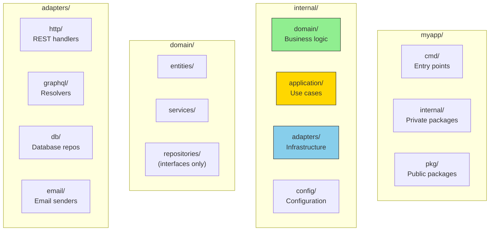
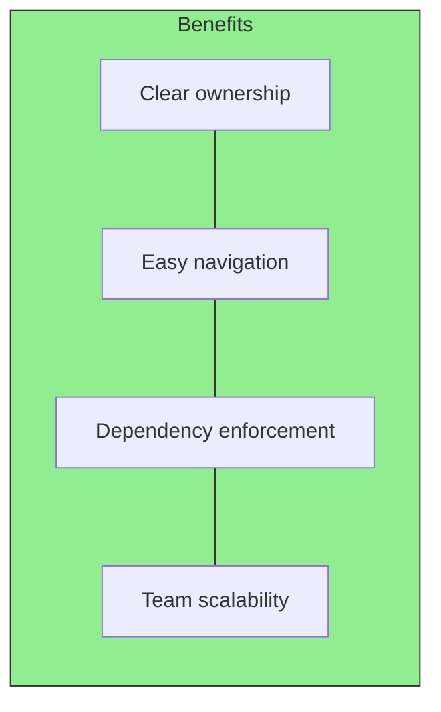

# The Recommended Layout

## Sam's Scenario

Sam's BookShelf codebase was a mess: `handlers.go` with 1000 lines, domain logic mixed with HTTP code, and no clear separation. When Chen asked for the on-premise version, Sam couldn't figure out where to start. Alex said: "Let's reorganize using the standard hexagonal layout. Your structure should reflect your architecture."

## Project Structure Overview

A well-organized project structure makes Hexagonal Architecture visible and maintainable. Here's the recommended layout for Go projects.

## Project Structure Overview



## BookShelf Directory Structure

```
bookshelf/
├── cmd/
│   ├── api/
│   │   └── main.go           # REST API entry point
│   ├── cli/
│   │   └── main.go           # CLI tool for bulk imports
│   └── graphql/
│       └── main.go           # GraphQL API (for mobile app)
├── internal/
│   ├── domain/
│   │   ├── entities/
│   │   │   ├── book.go       # Book entity
│   │   │   ├── user.go       # User entity
│   │   │   ├── loan.go       # Loan entity
│   │   │   ├── isbn.go       # ISBN value object
│   │   │   ├── email.go      # Email value object
│   │   │   └── errors.go     # Domain errors
│   │   ├── services/
│   │   │   ├── late_fee_calculator.go
│   │   │   └── loan_eligibility.go
│   │   └── repositories/
│   │       ├── book.go       # BookRepository interface
│   │       ├── user.go       # UserRepository interface
│   │       └── loan.go       # LoanRepository interface
│   ├── application/
│   │   ├── ports/
│   │   │   └── services.go   # Driving port interfaces
│   │   └── usecases/
│   │       ├── create_book.go
│   │       ├── loan_book.go
│   │       ├── return_book.go
│   │       └── search_books.go
│   ├── adapters/
│   │   ├── http/
│   │   │   ├── router.go
│   │   │   ├── book_handler.go
│   │   │   ├── loan_handler.go
│   │   │   └── middleware.go
│   │   ├── graphql/
│   │   │   ├── schema.graphql
│   │   │   └── resolvers.go
│   │   ├── cli/
│   │   │   └── import_csv.go
│   │   └── db/
│   │       ├── postgres/
│   │       │   ├── book_repo.go
│   │       │   ├── user_repo.go
│   │       │   └── loan_repo.go
│   │       └── sqlite/
│   │           ├── book_repo.go
│   │           ├── user_repo.go
│   │           └── loan_repo.go
│   └── config/
│       └── config.go
├── pkg/                       # Public shared packages
│   └── validator/
├── go.mod
└── go.sum
```

## Layer Responsibilities

| Layer | Location | Contains | Depends On |
|-------|----------|----------|------------|
| **Domain** | `internal/domain/` | Entities, domain services, repository interfaces | Nothing |
| **Application** | `internal/application/` | Use cases, driving port interfaces | Domain |
| **Adapters** | `internal/adapters/` | HTTP handlers, DB repos, API clients | Application, Domain |
| **Config** | `internal/config/` | Configuration loading, environment parsing | Nothing |
| **Entry Points** | `cmd/` | Main functions, dependency wiring | All layers |

## Why This Structure?



- **Clear ownership**: Each directory has a single responsibility
- **Easy navigation**: New developers find code quickly
- **Dependency enforcement**: `internal/` prevents external imports
- **Team scalability**: Teams can own different layers

## Sam's Insight

"Now I see it!" Sam exclaimed. "The domain layer (`entities`, `services`, `repositories`) has no idea about HTTP or databases. The adapters (`http`, `graphql`, `db`) implement the ports. And `cmd` is where I wire everything together." Alex nodded: "Your directory structure is your architecture diagram."
