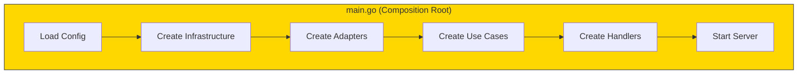

# The cmd Directory

## Sam's Scenario

Sam asked: "Where do I create instances of my repositories and use cases?" Alex explained: "In `main.go` - the composition root. This is the only place that knows about all concrete implementations. It's like the conductor's podium where you assemble the entire orchestra."

## The Composition Root

The cmd directory contains your application entry points - where everything gets wired together.

## Composition Root



```go
// cmd/api/main.go
package main

import (
    "log/slog"
    "os"
    "bookshelf/internal/adapters/db/sqlite"
    "bookshelf/internal/adapters/http"
    "bookshelf/internal/application/usecases"
    "bookshelf/internal/config"
    "bookshelf/internal/domain/services"
)

func main() {
    // 1. Load configuration
    cfg := config.Load()

    // 2. Setup infrastructure
    db := setupDatabase(cfg)
    logger := setupLogger(cfg)

    // 3. Create driven adapters (repositories)
    bookRepo := sqlite.NewBookRepository(db)
    userRepo := sqlite.NewUserRepository(db)
    loanRepo := sqlite.NewLoanRepository(db)

    // 4. Create domain services
    lateFeeCalc := services.NewLateFeeCalculator(0.50, 25.00, 3)
    eligibility := services.NewLoanEligibilityService(5, 0)

    // 5. Create use cases
    createBookUC := usecases.NewCreateBookUseCase(bookRepo, logger)
    loanBookUC := usecases.NewLoanBookUseCase(bookRepo, userRepo, eligibility, logger)
    returnBookUC := usecases.NewReturnBookUseCase(bookRepo, loanRepo, lateFeeCalc, logger)
    searchBooksUC := usecases.NewSearchBooksUseCase(bookRepo)

    // 6. Create driving adapters (handlers)
    bookHandler := http.NewBookHandler(createBookUC, searchBooksUC)
    loanHandler := http.NewLoanHandler(loanBookUC, returnBookUC)

    // 7. Start server
    router := http.NewRouter(bookHandler, loanHandler)
    logger.Info("BookShelf API starting", "port", cfg.Server.Port)
    router.ListenAndServe(cfg.Server.Port)
}

func setupDatabase(cfg *config.Config) *sql.DB {
    db, err := sql.Open(cfg.Database.Driver, cfg.Database.DSN())
    if err != nil {
        slog.Error("failed to connect to database", "error", err)
        os.Exit(1)
    }
    return db
}

func setupLogger(cfg *config.Config) *slog.Logger {
    return slog.New(slog.NewJSONHandler(os.Stdout, nil))
}
```

The main function is the **composition root** - the only place that knows about all concrete implementations.

## Sam's Insight

"So `main.go` is where I choose SQLite vs Postgres, or REST vs GraphQL," Sam noted. "Everything else is just interfaces and abstractions." Alex confirmed: "Exactly. If Chen wants on-premise with Postgres, you just swap the adapter in main.go. No business logic changes."