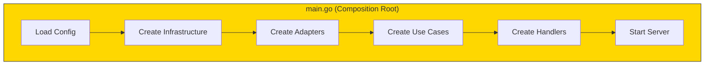

# The cmd Directory

The cmd directory contains your application entry points - where everything gets wired together.

## Composition Root



```go
// cmd/api/main.go
package main

func main() {
    // Load configuration
    cfg := config.Load()

    // Create infrastructure
    db := setupDatabase(cfg)
    logger := setupLogger(cfg)

    // Create adapters (driven)
    userRepo := sqlite.NewUserRepository(db)
    emailSender := sendgrid.NewEmailSender(cfg.SendGridKey)

    // Create domain services
    authService := services.NewAuthService(cfg.JWTSecret)

    // Create use cases
    userUseCase := usecases.NewUserUseCase(userRepo, emailSender, logger)

    // Create adapters (driving)
    userHandler := http.NewUserHandler(userUseCase)

    // Start server
    router := http.NewRouter(userHandler, authService)
    router.ListenAndServe(":8080")
}
```

The main function is the **composition root** - the only place that knows about all concrete implementations.