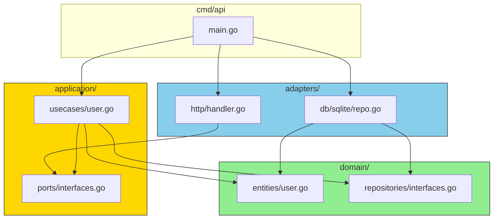

# Package Organization

## Sam's Scenario

Sam was confused about imports: "Can a use case import from the HTTP adapter?" Alex shook his head: "Never. Dependencies flow inward. Let me show you the allowed import paths."

## Package Dependencies



## Domain Package

```go
// domain/entities/book.go
package entities

type Book struct {
    ID     string
    Title  string
    ISBN   ISBN
    Status BookStatus
}

func NewBook(title, author string, isbn ISBN) (*Book, error) { ... }

// domain/repositories/book_repository.go
package repositories

import "bookshelf/internal/domain/entities"

type BookRepository interface {
    Save(ctx context.Context, book *entities.Book) error
    FindByID(ctx context.Context, id string) (*entities.Book, error)
    FindByISBN(ctx context.Context, isbn entities.ISBN) (*entities.Book, error)
}
```

## Application Package

```go
// application/ports/book_service.go
package ports

import "bookshelf/internal/domain/entities"

type BookService interface {
    CreateBook(ctx context.Context, input CreateBookInput) (*entities.Book, error)
    SearchBooks(ctx context.Context, query string) ([]*entities.Book, error)
}

// application/usecases/create_book.go
package usecases

import (
    "bookshelf/internal/domain/entities"
    "bookshelf/internal/domain/repositories"
)

type CreateBookUseCase struct {
    bookRepo repositories.BookRepository
    logger   *slog.Logger
}

func (uc *CreateBookUseCase) Execute(...) (*entities.Book, error) { ... }
```

## Adapters Package

```go
// adapters/http/book_handler.go
package http

import (
    "bookshelf/internal/application/usecases"
    "net/http"
)

type BookHandler struct {
    createBookUC *usecases.CreateBookUseCase
    searchBooksUC *usecases.SearchBooksUseCase
}

func (h *BookHandler) CreateBook(w http.ResponseWriter, r *http.Request) { ... }

// adapters/db/sqlite/book_repository.go
package sqlite

import (
    "bookshelf/internal/domain/entities"
    "bookshelf/internal/domain/repositories"
    "database/sql"
)

type BookRepository struct {
    db *sql.DB
}

// Ensure interface compliance
var _ repositories.BookRepository = (*BookRepository)(nil)

func (r *BookRepository) Save(ctx context.Context, book *entities.Book) error { ... }
```

## Sam's Insight

"I see the pattern now," Sam said. "Adapters import from application and domain. Application imports from domain. Domain imports from nothing. It's a one-way street pointing inward." Alex smiled: "Perfect. Now Go's compiler enforces your architecture."