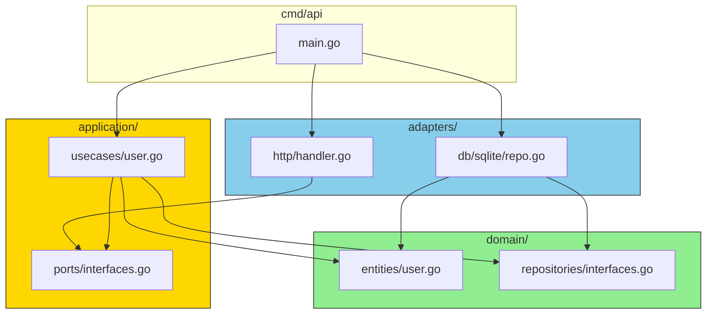

# Package Organization

## Package Dependencies



## Domain Package

```go
// domain/entities/user.go
package entities

type User struct { ... }
func NewUser(name, email string) (*User, error) { ... }

// domain/repositories/user_repository.go
package repositories

type UserRepository interface {
    Save(ctx context.Context, user *entities.User) error
    FindByID(ctx context.Context, id string) (*entities.User, error)
}
```

## Application Package

```go
// application/ports/user_service.go
package ports

type UserService interface {
    CreateUser(ctx context.Context, input CreateUserInput) (*entities.User, error)
}

// application/usecases/user_usecase.go
package usecases

type UserUseCase struct { ... }
func (uc *UserUseCase) CreateUser(...) (*entities.User, error) { ... }
```

## Adapters Package

```go
// adapters/http/user_handler.go
package http

type UserHandler struct { ... }
func (h *UserHandler) CreateUser(w http.ResponseWriter, r *http.Request) { ... }

// adapters/db/sqlite/user_repository.go
package sqlite

type UserRepository struct { ... }
func (r *UserRepository) Save(ctx context.Context, user *entities.User) error { ... }
```