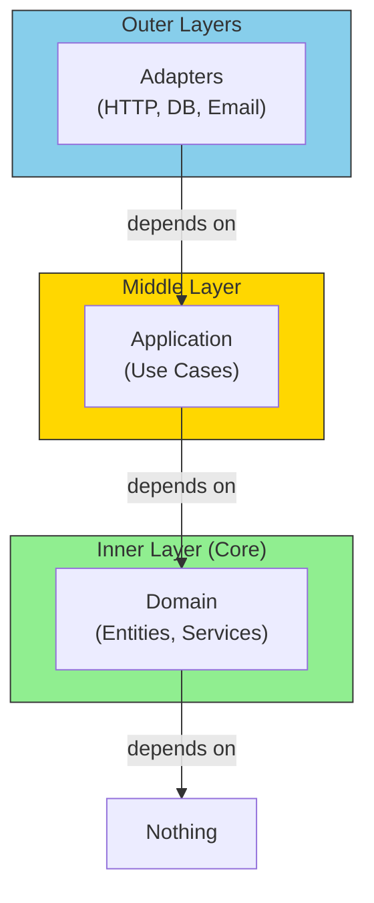
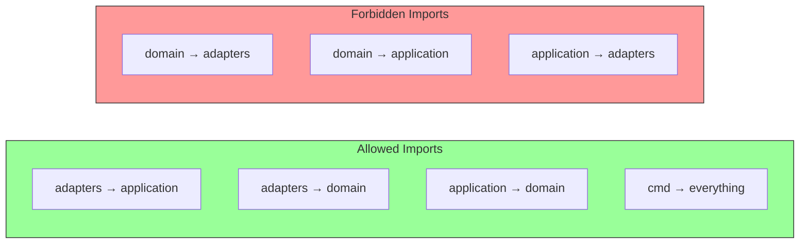
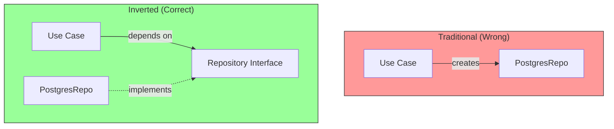

# Dependency Direction

## Sam's Scenario

When Sam tried to import the HTTP handler in a use case to send a notification, Alex stopped him: "Wait! That breaks the dependency rule. Use cases can't depend on adapters. You need an abstraction - a port." This lesson explains the sacred dependency rule.

## The Dependency Rule

The **Dependency Rule** is the most important principle in Hexagonal Architecture: dependencies always point **inward**, toward the domain.

## The Dependency Rule



## What This Means for BookShelf

```go
// ❌ WRONG: Domain imports adapter
package entities

import "database/sql"  // Domain knows about infrastructure!

type Book struct {
    ID string
    db *sql.DB  // Book entity holds database reference - BAD!
}

func (b *Book) Save() error {
    b.db.Exec("INSERT INTO books...")  // Domain does SQL - VERY BAD!
}

// ✅ CORRECT: Adapter imports domain
package sqlite

import (
    "bookshelf/internal/domain/entities"  // Adapter knows domain
    "database/sql"
)

type BookRepository struct {
    db *sql.DB  // Infrastructure stays in adapter
}

func (r *BookRepository) Save(ctx context.Context, book *entities.Book) error {
    // Adapter translates domain entity to SQL
    _, err := r.db.ExecContext(ctx,
        "INSERT INTO books (id, title, author, isbn) VALUES (?, ?, ?, ?)",
        book.ID, book.Title, book.Author, book.ISBN.Value(),
    )
    return err
}
```

## Import Rules



## Enforcing with Go Package Structure

```go
// internal/domain/entities/book.go
package entities

// NO imports from adapters or application!
// Only standard library and domain packages

type Book struct {
    ID     string
    Title  string
    Author string
    ISBN   ISBN
    Status BookStatus
}

// internal/domain/repositories/book.go
package repositories

import "bookshelf/internal/domain/entities"

// Interface defined in domain - implemented by adapters
type BookRepository interface {
    Save(ctx context.Context, book *entities.Book) error
    FindByID(ctx context.Context, id string) (*entities.Book, error)
    FindByISBN(ctx context.Context, isbn entities.ISBN) (*entities.Book, error)
}

// internal/adapters/db/postgres/book_repo.go
package postgres

import (
    "bookshelf/internal/domain/entities"
    "bookshelf/internal/domain/repositories"
    "github.com/jackc/pgx/v5/pgxpool"  // Infrastructure dependency OK here
)

// Adapter implements domain interface
type BookRepository struct {
    db *pgxpool.Pool
}

// Compile-time check: ensure interface is implemented
var _ repositories.BookRepository = (*BookRepository)(nil)

func (r *BookRepository) Save(ctx context.Context, book *entities.Book) error {
    // Infrastructure concerns only in adapters
    query := `INSERT INTO books (id, title, author, isbn, status)
              VALUES ($1, $2, $3, $4, $5)`
    _, err := r.db.Exec(ctx, query,
        book.ID, book.Title, book.Author, book.ISBN.Value(), book.Status)
    return err
}
```

## Dependency Inversion in Practice



The use case depends on the **interface** (abstraction), not the concrete implementation.

## Linting Dependencies

You can use tools like `go-arch` or custom scripts to enforce:

```go
// scripts/check-deps.go
// Fails if domain imports from adapters

forbiddenImports := map[string][]string{
    "internal/domain": {
        "internal/adapters",
        "internal/application",
        "database/sql",
        "net/http",
    },
    "internal/application": {
        "internal/adapters",
    },
}
```

## Summary

| Layer | Can Import | Cannot Import |
|-------|-----------|---------------|
| **Domain** | Standard library only | Adapters, Application, Infrastructure |
| **Application** | Domain | Adapters, Infrastructure |
| **Adapters** | Application, Domain, Infrastructure | - |
| **Cmd** | All layers | - |

## Sam's Insight

"So the Book entity can't import `database/sql`, the use case can't import the HTTP handler, and everything points toward the domain," Sam summarized. "The adapters know about the domain, but the domain is blissfully unaware of adapters." Alex beamed: "Perfect! Now your architecture is compiler-enforced."
