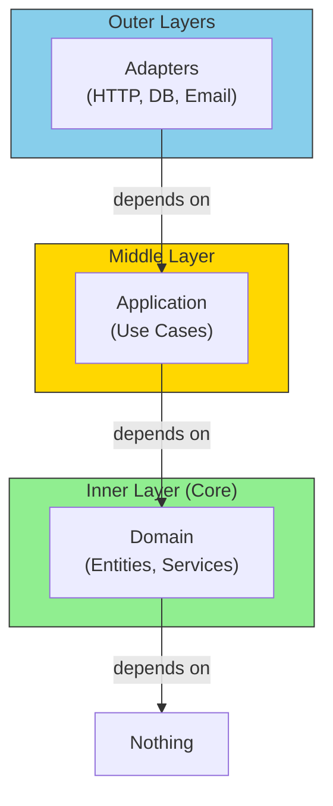
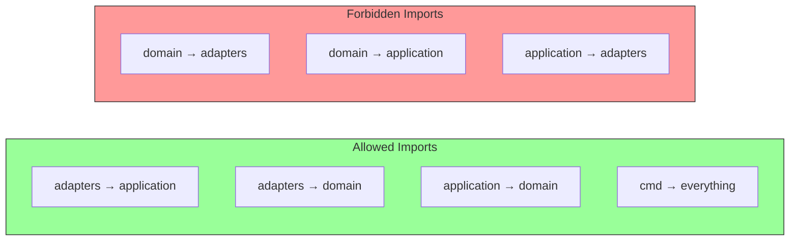
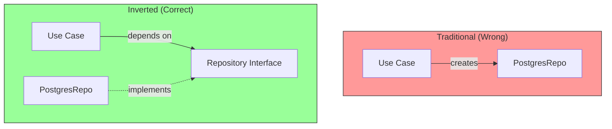

# Dependency Direction

The **Dependency Rule** is the most important principle in Hexagonal Architecture: dependencies always point **inward**, toward the domain.

## The Dependency Rule



## What This Means in Code

```go
// ❌ WRONG: Domain imports adapter
package entities

import "database/sql"  // Domain knows about infrastructure!

type User struct {
    db *sql.DB  // Domain holds infrastructure reference
}

// ✅ CORRECT: Adapter imports domain
package postgres

import "myapp/internal/domain/entities"  // Adapter knows domain

type UserRepository struct {
    db *sql.DB
}

func (r *UserRepository) Save(ctx context.Context, user *entities.User) error {
    // Adapter translates domain to infrastructure
}
```

## Import Rules



## Enforcing with Go Package Structure

```go
// internal/domain/entities/user.go
package entities

// NO imports from adapters or application!
// Only standard library and domain packages

type User struct {
    ID    string
    Name  string
    Email string
}

// internal/domain/repositories/user.go
package repositories

import "myapp/internal/domain/entities"

// Interface defined in domain - implemented by adapters
type UserRepository interface {
    Save(ctx context.Context, user *entities.User) error
    FindByID(ctx context.Context, id string) (*entities.User, error)
}

// internal/adapters/db/postgres/user_repo.go
package postgres

import (
    "myapp/internal/domain/entities"
    "myapp/internal/domain/repositories"
    "github.com/jackc/pgx/v5/pgxpool"  // Infrastructure dependency
)

// Adapter implements domain interface
type UserRepository struct {
    db *pgxpool.Pool
}

// Compile-time check: ensure interface is implemented
var _ repositories.UserRepository = (*UserRepository)(nil)
```

## Dependency Inversion in Practice



The use case depends on the **interface** (abstraction), not the concrete implementation.

## Linting Dependencies

You can use tools like `go-arch` or custom scripts to enforce:

```go
// scripts/check-deps.go
// Fails if domain imports from adapters

forbiddenImports := map[string][]string{
    "internal/domain": {
        "internal/adapters",
        "internal/application",
        "database/sql",
        "net/http",
    },
    "internal/application": {
        "internal/adapters",
    },
}
```

## Summary

| Layer | Can Import | Cannot Import |
|-------|-----------|---------------|
| **Domain** | Standard library only | Adapters, Application, Infrastructure |
| **Application** | Domain | Adapters, Infrastructure |
| **Adapters** | Application, Domain, Infrastructure | - |
| **Cmd** | All layers | - |
