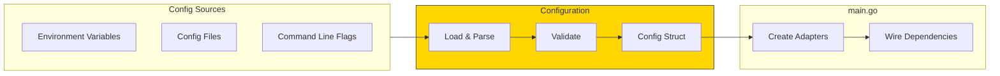
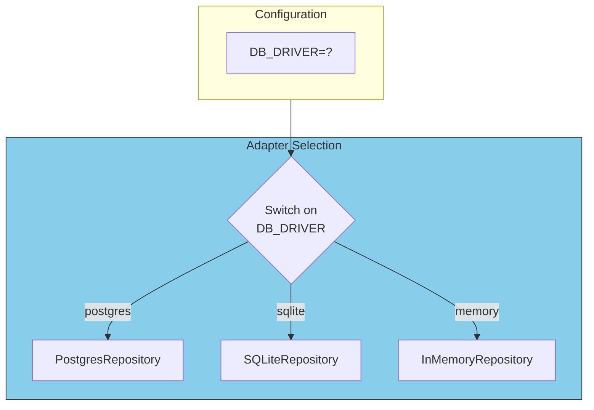

# Configuration Management

## Sam's Scenario

Maya needed the mobile app to use the cloud database, but Chen's on-premise deployment needed local SQLite. Sam asked: "How do I support both?" Alex explained: "Configuration! Use environment variables to choose adapters at startup. Same code, different config."

## Configuration Strategy

Configuration determines which adapters to use and how to connect them. It's the bridge between your environment and your application.

## Configuration Flow



## BookShelf Configuration Struct

```go
// internal/config/config.go
package config

import "time"

type Config struct {
    Environment string          `env:"APP_ENV" default:"development"`
    Server      ServerConfig
    Database    DatabaseConfig
    Library     LibraryConfig
}

type ServerConfig struct {
    Host         string        `env:"SERVER_HOST" default:"0.0.0.0"`
    Port         int           `env:"SERVER_PORT" default:"8080"`
    ReadTimeout  time.Duration `env:"SERVER_READ_TIMEOUT" default:"30s"`
    WriteTimeout time.Duration `env:"SERVER_WRITE_TIMEOUT" default:"30s"`
}

type DatabaseConfig struct {
    Driver   string `env:"DB_DRIVER" default:"sqlite"`
    Host     string `env:"DB_HOST" default:"localhost"`
    Port     int    `env:"DB_PORT" default:"5432"`
    User     string `env:"DB_USER"`
    Password string `env:"DB_PASSWORD"`
    Name     string `env:"DB_NAME" default:"bookshelf.db"`
    SSLMode  string `env:"DB_SSLMODE" default:"disable"`
}

type LibraryConfig struct {
    MaxActiveLoans  int     `env:"LIBRARY_MAX_ACTIVE_LOANS" default:"5"`
    MaxOverdueLoans int     `env:"LIBRARY_MAX_OVERDUE_LOANS" default:"0"`
    LateFeePerDay   float64 `env:"LIBRARY_LATE_FEE_PER_DAY" default:"0.50"`
    MaxLateFee      float64 `env:"LIBRARY_MAX_LATE_FEE" default:"25.00"`
    GraceDays       int     `env:"LIBRARY_GRACE_DAYS" default:"3"`
    LoanPeriodDays  int     `env:"LIBRARY_LOAN_PERIOD_DAYS" default:"14"`
}

func (d *DatabaseConfig) DSN() string {
    if d.Driver == "sqlite" {
        return d.Name
    }
    // Postgres DSN
    return fmt.Sprintf("host=%s port=%d user=%s password=%s dbname=%s sslmode=%s",
        d.Host, d.Port, d.User, d.Password, d.Name, d.SSLMode)
}
```

## Loading Configuration

```go
// internal/config/loader.go
package config

import (
    "github.com/caarlos0/env/v9"
)

func Load() (*Config, error) {
    cfg := &Config{}

    if err := env.Parse(cfg); err != nil {
        return nil, fmt.Errorf("failed to parse config: %w", err)
    }

    if err := cfg.Validate(); err != nil {
        return nil, fmt.Errorf("invalid config: %w", err)
    }

    return cfg, nil
}

func (c *Config) Validate() error {
    if c.Auth.JWTSecret == "" {
        return errors.New("JWT_SECRET is required")
    }
    if c.Environment == "production" && c.Database.Driver == "sqlite" {
        return errors.New("SQLite not recommended for production")
    }
    return nil
}
```

## Environment-Based Adapter Selection



```go
// cmd/api/main.go
func createBookRepository(cfg *config.Config) (repositories.BookRepository, error) {
    switch cfg.Database.Driver {
    case "postgres":
        pool, err := pgxpool.New(context.Background(), cfg.Database.DSN())
        if err != nil {
            return nil, err
        }
        return postgres.NewBookRepository(pool), nil

    case "sqlite":
        db, err := sql.Open("sqlite3", cfg.Database.DSN())
        if err != nil {
            return nil, err
        }
        return sqlite.NewBookRepository(db), nil

    case "memory":
        return memory.NewBookRepository(), nil  // For testing

    default:
        return nil, fmt.Errorf("unknown database driver: %s", cfg.Database.Driver)
    }
}

// Example environment files:

// .env.development (Sam's local dev)
// DB_DRIVER=sqlite
// DB_NAME=bookshelf_dev.db
// LIBRARY_MAX_ACTIVE_LOANS=10

// .env.production (Maya's cloud deployment)
// DB_DRIVER=postgres
// DB_HOST=prod-db.example.com
// DB_PORT=5432
// DB_USER=bookshelf_prod
// DB_PASSWORD=<secret>
// DB_NAME=bookshelf
// DB_SSLMODE=require

// .env.onpremise (Chen's Riverside Library)
// DB_DRIVER=postgres
// DB_HOST=localhost
// DB_PORT=5432
// DB_USER=library_admin
// DB_NAME=riverside_books
// LIBRARY_MAX_ACTIVE_LOANS=5
// LIBRARY_LATE_FEE_PER_DAY=1.00
```

## Configuration Best Practices

| Practice | Description |
|----------|-------------|
| **Environment variables** | Primary source for production secrets |
| **Defaults** | Sensible defaults for development |
| **Validation** | Fail fast on invalid config |
| **Type safety** | Use structs, not string maps |
| **Secret management** | Never commit secrets; use vault in production |
| **Environment-specific** | Different adapters for dev/test/prod |

## Sam's Insight

"So Maya's mobile app uses Postgres in the cloud with these env vars, Chen's on-premise uses local Postgres with different values, and my dev environment uses SQLite," Sam explained. "Same codebase, just different configuration!" Alex nodded: "And if you add GraphQL for the mobile app, that's just another cmd entry point with the same use cases."
