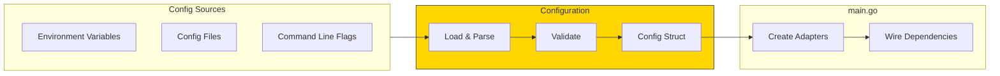
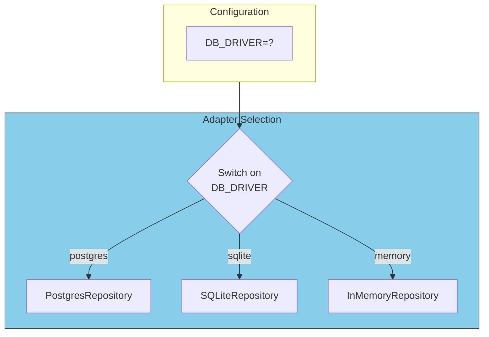

# Configuration Management

Configuration determines which adapters to use and how to connect them. It's the bridge between your environment and your application.

## Configuration Flow



## Configuration Struct

```go
// internal/config/config.go
package config

type Config struct {
    Environment string          `env:"APP_ENV" default:"development"`
    Server      ServerConfig
    Database    DatabaseConfig
    Email       EmailConfig
    Auth        AuthConfig
}

type ServerConfig struct {
    Host         string        `env:"SERVER_HOST" default:"0.0.0.0"`
    Port         int           `env:"SERVER_PORT" default:"8080"`
    ReadTimeout  time.Duration `env:"SERVER_READ_TIMEOUT" default:"30s"`
    WriteTimeout time.Duration `env:"SERVER_WRITE_TIMEOUT" default:"30s"`
}

type DatabaseConfig struct {
    Driver   string `env:"DB_DRIVER" default:"sqlite"`
    Host     string `env:"DB_HOST" default:"localhost"`
    Port     int    `env:"DB_PORT" default:"5432"`
    User     string `env:"DB_USER"`
    Password string `env:"DB_PASSWORD"`
    Name     string `env:"DB_NAME" default:"app"`
    SSLMode  string `env:"DB_SSLMODE" default:"disable"`
}

type EmailConfig struct {
    Provider string `env:"EMAIL_PROVIDER" default:"console"`
    APIKey   string `env:"EMAIL_API_KEY"`
    From     string `env:"EMAIL_FROM" default:"noreply@example.com"`
}

type AuthConfig struct {
    JWTSecret     string        `env:"JWT_SECRET" required:"true"`
    TokenDuration time.Duration `env:"TOKEN_DURATION" default:"24h"`
}
```

## Loading Configuration

```go
// internal/config/loader.go
package config

import (
    "github.com/caarlos0/env/v9"
)

func Load() (*Config, error) {
    cfg := &Config{}

    if err := env.Parse(cfg); err != nil {
        return nil, fmt.Errorf("failed to parse config: %w", err)
    }

    if err := cfg.Validate(); err != nil {
        return nil, fmt.Errorf("invalid config: %w", err)
    }

    return cfg, nil
}

func (c *Config) Validate() error {
    if c.Auth.JWTSecret == "" {
        return errors.New("JWT_SECRET is required")
    }
    if c.Environment == "production" && c.Database.Driver == "sqlite" {
        return errors.New("SQLite not recommended for production")
    }
    return nil
}
```

## Environment-Based Adapter Selection



```go
// cmd/api/main.go
func createUserRepository(cfg *config.Config) (repositories.UserRepository, error) {
    switch cfg.Database.Driver {
    case "postgres":
        pool, err := pgxpool.New(context.Background(), cfg.Database.DSN())
        if err != nil {
            return nil, err
        }
        return postgres.NewUserRepository(pool), nil

    case "sqlite":
        db, err := sql.Open("sqlite3", cfg.Database.Name)
        if err != nil {
            return nil, err
        }
        return sqlite.NewUserRepository(db), nil

    case "memory":
        return memory.NewUserRepository(), nil

    default:
        return nil, fmt.Errorf("unknown database driver: %s", cfg.Database.Driver)
    }
}

func createEmailSender(cfg *config.Config) (ports.EmailSender, error) {
    switch cfg.Email.Provider {
    case "sendgrid":
        return sendgrid.NewEmailSender(cfg.Email.APIKey, cfg.Email.From), nil
    case "ses":
        return ses.NewEmailSender(cfg.Email.From), nil
    case "console":
        return console.NewEmailSender(), nil  // Logs emails to console
    default:
        return nil, fmt.Errorf("unknown email provider: %s", cfg.Email.Provider)
    }
}
```

## Configuration Best Practices

| Practice | Description |
|----------|-------------|
| **Environment variables** | Primary source for production secrets |
| **Defaults** | Sensible defaults for development |
| **Validation** | Fail fast on invalid config |
| **Type safety** | Use structs, not string maps |
| **Secret management** | Never commit secrets; use vault in production |
| **Environment-specific** | Different adapters for dev/test/prod |
