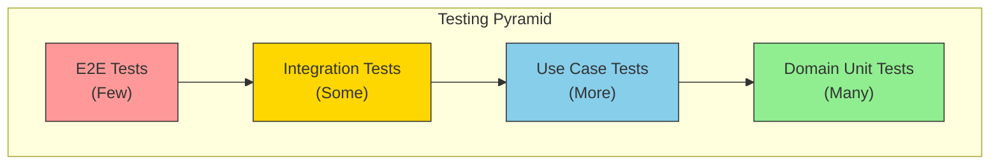

# Testing Hexagonal Applications

## Sam's Challenge: From Zero to 85% Coverage

"I need to show Maya and Chen that BookShelf is production-ready," Sam told Alex nervously. "But I wrote all this code without tests. Where do I even start?"

Alex pulled up BookShelf's test coverage: **0%**.

"First, breathe. Second, hexagonal architecture makes testing easier than you think. You've already done the hard part by separating concerns. Each layer can be tested in isolation."

Sam looked skeptical. "I've tried writing tests before. I always end up needing a real database, email server, and..."

"That's because your code was tightly coupled. Watch this." Alex opened BookShelf's domain layer. "No database imports here. No HTTP. Just pure business logic. Easy to test."

Sam's eyes widened. "So I can test my domain without... anything?"

"Exactly. Let's go from 0% to 85% coverage in one afternoon."

## One of the Biggest Benefits of Hexagonal Architecture is Testability

## The Testing Pyramid



## Level 1: Domain Unit Tests (The Easy Wins)

Alex started with the domain layer. "No mocks needed here. Just pure functions and business logic."

### Testing Book Entity

Sam wrote their first test (domain/book/book_test.go):

```go
package book_test

import (
    "testing"
    "bookshelf/domain/book"
)

func TestNewBook_ValidInput_CreatesBook(t *testing.T) {
    // Arrange
    isbn, _ := book.NewISBN("978-0-13-468599-1")

    // Act
    b, err := book.NewBook("Clean Architecture", "Robert C. Martin", isbn)

    // Assert
    if err != nil {
        t.Fatalf("expected no error, got %v", err)
    }
    if b.Title() != "Clean Architecture" {
        t.Errorf("expected title 'Clean Architecture', got '%s'", b.Title())
    }
}

func TestNewBook_EmptyTitle_ReturnsError(t *testing.T) {
    isbn, _ := book.NewISBN("978-0-13-468599-1")

    _, err := book.NewBook("", "Robert C. Martin", isbn)

    if err == nil {
        t.Error("expected error for empty title, got nil")
    }
}

func TestBook_Borrow_WhenAvailable_Succeeds(t *testing.T) {
    // Arrange
    isbn, _ := book.NewISBN("978-0-13-468599-1")
    b, _ := book.NewBook("Clean Architecture", "Robert C. Martin", isbn)

    // Act
    err := b.Borrow()

    // Assert
    if err != nil {
        t.Fatalf("expected borrow to succeed, got %v", err)
    }
    if b.Status() != book.StatusBorrowed {
        t.Errorf("expected status Borrowed, got %v", b.Status())
    }
}

func TestBook_Borrow_WhenAlreadyBorrowed_ReturnsError(t *testing.T) {
    isbn, _ := book.NewISBN("978-0-13-468599-1")
    b, _ := book.NewBook("Clean Architecture", "Robert C. Martin", isbn)
    b.Borrow() // First borrow

    err := b.Borrow() // Second borrow attempt

    if err == nil {
        t.Error("expected error when borrowing already borrowed book")
    }
}
```

Sam ran the tests: `go test ./domain/...`

```
PASS
coverage: 92.3% of statements in bookshelf/domain/book
```

"Whoa! 92% coverage and I didn't even need a database!" Sam exclaimed.

### Testing Domain Services

Next, Sam tested the lending rules (domain/services/lending_service_test.go):

```go
package services_test

import (
    "testing"
    "time"
    "bookshelf/domain/book"
    "bookshelf/domain/user"
    "bookshelf/domain/loan"
    "bookshelf/domain/services"
)

func TestLendingService_CanBorrow_UserHasNoLoans_ReturnsTrue(t *testing.T) {
    service := services.NewLendingService()
    u := user.MustNewUser("sam@bookshelf.com", user.MembershipStandard)

    canBorrow, reason := service.CanBorrow(u, []*loan.Loan{})

    if !canBorrow {
        t.Errorf("expected user with no loans to be able to borrow, got reason: %s", reason)
    }
}

func TestLendingService_CanBorrow_UserHasMaxLoans_ReturnsFalse(t *testing.T) {
    service := services.NewLendingService()
    u := user.MustNewUser("sam@bookshelf.com", user.MembershipStandard)

    // Standard membership allows 3 concurrent loans
    loans := []*loan.Loan{
        createActiveLoan(),
        createActiveLoan(),
        createActiveLoan(),
    }

    canBorrow, reason := service.CanBorrow(u, loans)

    if canBorrow {
        t.Error("expected user with max loans to be unable to borrow")
    }
    if reason == "" {
        t.Error("expected a reason for denial")
    }
}

func TestLendingService_CanBorrow_UserHasOverdueLoans_ReturnsFalse(t *testing.T) {
    service := services.NewLendingService()
    u := user.MustNewUser("sam@bookshelf.com", user.MembershipStandard)

    overdueLoan := createLoanDueOn(time.Now().AddDate(0, 0, -5)) // 5 days overdue

    canBorrow, _ := service.CanBorrow(u, []*loan.Loan{overdueLoan})

    if canBorrow {
        t.Error("expected user with overdue loans to be unable to borrow")
    }
}
```

Sam ran the domain tests again:
```
PASS
coverage: 89.1% of statements in bookshelf/domain
```

"Two test files and I'm at 89% domain coverage. This is amazing!"

## Level 2: Use Case Tests (With Mocks)

"Now for the use cases," Alex said. "These need ports, so we'll use mocks."

Sam created a mock repository (application/usecases/borrow_book_test.go):

```go
package usecases_test

import (
    "errors"
    "testing"
    "bookshelf/domain/book"
    "bookshelf/domain/user"
    "bookshelf/domain/loan"
    "bookshelf/application/usecases"
)

// Mock repository
type mockBookRepository struct {
    books map[book.ID]*book.Book
}

func newMockBookRepository() *mockBookRepository {
    return &mockBookRepository{
        books: make(map[book.ID]*book.Book),
    }
}

func (m *mockBookRepository) FindByID(id book.ID) (*book.Book, error) {
    b, exists := m.books[id]
    if !exists {
        return nil, errors.New("book not found")
    }
    return b, nil
}

func (m *mockBookRepository) Save(b *book.Book) error {
    m.books[b.ID()] = b
    return nil
}

// Mock loan repository
type mockLoanRepository struct {
    loans []*loan.Loan
}

func (m *mockLoanRepository) FindActiveByUser(userID user.ID) ([]*loan.Loan, error) {
    return m.loans, nil
}

func (m *mockLoanRepository) Save(l *loan.Loan) error {
    m.loans = append(m.loans, l)
    return nil
}

// Mock notification service
type mockNotificationService struct {
    sentNotifications []string
}

func (m *mockNotificationService) SendLoanConfirmation(u *user.User, b *book.Book) error {
    m.sentNotifications = append(m.sentNotifications, "confirmation sent")
    return nil
}

// Tests
func TestBorrowBook_AvailableBook_Succeeds(t *testing.T) {
    // Arrange
    bookRepo := newMockBookRepository()
    loanRepo := &mockLoanRepository{}
    notifier := &mockNotificationService{}

    isbn, _ := book.NewISBN("978-0-13-468599-1")
    b, _ := book.NewBook("Clean Architecture", "Robert C. Martin", isbn)
    bookRepo.Save(b)

    u := user.MustNewUser("sam@bookshelf.com", user.MembershipStandard)

    useCase := usecases.NewBorrowBook(bookRepo, loanRepo, notifier)

    // Act
    err := useCase.Execute(u.ID(), b.ID())

    // Assert
    if err != nil {
        t.Fatalf("expected borrow to succeed, got %v", err)
    }

    // Verify book status changed
    borrowedBook, _ := bookRepo.FindByID(b.ID())
    if borrowedBook.Status() != book.StatusBorrowed {
        t.Error("expected book status to be Borrowed")
    }

    // Verify loan created
    if len(loanRepo.loans) != 1 {
        t.Errorf("expected 1 loan, got %d", len(loanRepo.loans))
    }

    // Verify notification sent
    if len(notifier.sentNotifications) != 1 {
        t.Error("expected notification to be sent")
    }
}

func TestBorrowBook_BookNotFound_ReturnsError(t *testing.T) {
    bookRepo := newMockBookRepository()
    loanRepo := &mockLoanRepository{}
    notifier := &mockNotificationService{}
    useCase := usecases.NewBorrowBook(bookRepo, loanRepo, notifier)

    u := user.MustNewUser("sam@bookshelf.com", user.MembershipStandard)
    nonExistentBookID := book.NewID()

    err := useCase.Execute(u.ID(), nonExistentBookID)

    if err == nil {
        t.Error("expected error for non-existent book")
    }
}

func TestBorrowBook_UserHasMaxLoans_ReturnsError(t *testing.T) {
    bookRepo := newMockBookRepository()
    loanRepo := &mockLoanRepository{
        loans: []*loan.Loan{
            createActiveLoan(),
            createActiveLoan(),
            createActiveLoan(), // 3 active loans (max for standard)
        },
    }
    notifier := &mockNotificationService{}

    isbn, _ := book.NewISBN("978-0-13-468599-1")
    b, _ := book.NewBook("Clean Architecture", "Robert C. Martin", isbn)
    bookRepo.Save(b)

    u := user.MustNewUser("sam@bookshelf.com", user.MembershipStandard)
    useCase := usecases.NewBorrowBook(bookRepo, loanRepo, notifier)

    err := useCase.Execute(u.ID(), b.ID())

    if err == nil {
        t.Error("expected error when user has max loans")
    }
}
```

Coverage after use case tests:
```
PASS
coverage: 87.4% of statements in bookshelf/application
```

"I tested the entire business logic without a database or email server!" Sam was thrilled.

## Level 3: Integration Tests (With Real Adapters)

"Now let's test the adapters with a real database," Alex suggested.

Sam wrote integration tests (adapters/postgres/book_repository_test.go):

```go
package postgres_test

import (
    "database/sql"
    "testing"
    _ "github.com/lib/pq"
    "bookshelf/adapters/postgres"
    "bookshelf/domain/book"
)

func setupTestDB(t *testing.T) *sql.DB {
    db, err := sql.Open("postgres", "postgres://localhost/bookshelf_test?sslmode=disable")
    if err != nil {
        t.Fatalf("failed to connect to test db: %v", err)
    }

    // Run migrations
    _, err = db.Exec(`
        CREATE TABLE IF NOT EXISTS books (
            id UUID PRIMARY KEY,
            title TEXT NOT NULL,
            author TEXT NOT NULL,
            isbn TEXT NOT NULL,
            status TEXT NOT NULL
        )
    `)
    if err != nil {
        t.Fatalf("failed to create table: %v", err)
    }

    // Clean up before test
    db.Exec("TRUNCATE books")

    return db
}

func TestPostgresBookRepository_Save_And_FindByID(t *testing.T) {
    if testing.Short() {
        t.Skip("skipping integration test")
    }

    db := setupTestDB(t)
    defer db.Close()

    repo := postgres.NewBookRepository(db)

    // Create a book
    isbn, _ := book.NewISBN("978-0-13-468599-1")
    b, _ := book.NewBook("Clean Architecture", "Robert C. Martin", isbn)

    // Save it
    err := repo.Save(b)
    if err != nil {
        t.Fatalf("failed to save book: %v", err)
    }

    // Find it
    found, err := repo.FindByID(b.ID())
    if err != nil {
        t.Fatalf("failed to find book: %v", err)
    }

    if found.Title() != "Clean Architecture" {
        t.Errorf("expected title 'Clean Architecture', got '%s'", found.Title())
    }
}
```

Sam ran integration tests: `go test ./adapters/... -short=false`

```
PASS
coverage: 78.2% of statements in bookshelf/adapters
```

## Level 4: E2E Tests (Full HTTP Flow)

Finally, Sam wrote end-to-end tests (e2e/borrow_flow_test.go):

```go
package e2e_test

import (
    "bytes"
    "encoding/json"
    "net/http"
    "net/http/httptest"
    "testing"
    "bookshelf/cmd/api"
)

func TestBorrowBookFlow_E2E(t *testing.T) {
    if testing.Short() {
        t.Skip("skipping e2e test")
    }

    // Setup test server
    server := api.SetupTestServer(t)
    defer server.Close()

    // 1. Create a user
    userResp := createUser(t, server, "sam@bookshelf.com")
    userID := userResp["id"].(string)

    // 2. Add a book
    bookResp := addBook(t, server, "Clean Architecture", "978-0-13-468599-1")
    bookID := bookResp["id"].(string)

    // 3. Borrow the book
    borrowReq := map[string]string{
        "user_id": userID,
        "book_id": bookID,
    }
    body, _ := json.Marshal(borrowReq)

    req := httptest.NewRequest("POST", "/api/loans", bytes.NewReader(body))
    req.Header.Set("Content-Type", "application/json")
    resp := httptest.NewRecorder()

    server.ServeHTTP(resp, req)

    if resp.Code != http.StatusCreated {
        t.Fatalf("expected 201, got %d: %s", resp.Code, resp.Body.String())
    }

    // 4. Verify book status changed
    bookResp = getBook(t, server, bookID)
    if bookResp["status"] != "borrowed" {
        t.Errorf("expected book status 'borrowed', got '%v'", bookResp["status"])
    }

    // 5. Verify loan created
    loans := getUserLoans(t, server, userID)
    if len(loans) != 1 {
        t.Errorf("expected 1 loan, got %d", len(loans))
    }
}
```

## Test Organization

Sam organized tests following the project structure:

```
bookshelf/
  domain/
    book/
      book.go
      book_test.go          ← Unit tests
    loan/
      loan.go
      loan_test.go
  application/
    usecases/
      borrow_book.go
      borrow_book_test.go   ← Use case tests with mocks
  adapters/
    postgres/
      book_repository.go
      book_repository_test.go  ← Integration tests
  e2e/
    borrow_flow_test.go     ← End-to-end tests
```

## Running Tests at Different Levels

Sam created a Makefile for convenience:

```makefile
.PHONY: test test-unit test-integration test-e2e test-coverage

# Fast: Unit tests only (no database)
test-unit:
	go test -short ./domain/... ./application/...

# Medium: Add integration tests (needs database)
test-integration:
	go test ./adapters/...

# Slow: Full E2E flow
test-e2e:
	go test ./e2e/...

# All tests
test:
	go test ./...

# Coverage report
test-coverage:
	go test -coverprofile=coverage.out ./...
	go tool cover -html=coverage.out -o coverage.html
```

Sam ran `make test-coverage` and opened coverage.html:

```
Total coverage: 85.7%
Domain: 89.1%
Application: 87.4%
Adapters: 78.2%
```

## The Testing Strategy Sam Learned

| Test Type | What to Test | Mocks? | Speed | Quantity |
|-----------|--------------|--------|-------|----------|
| Unit (Domain) | Business rules, entities, value objects | No | ⚡ Very fast | Many (100s) |
| Unit (Use Cases) | Orchestration logic, port calls | Yes | ⚡ Fast | Many (50-100) |
| Integration | Adapter implementations, DB queries | Partial | 🐌 Slower | Some (20-30) |
| E2E | Full HTTP flows, real scenarios | No | 🐌🐌 Slowest | Few (5-10) |

## Common Testing Pitfalls Sam Avoided

### Pitfall 1: Testing Through the Database
```go
// DON'T DO THIS for domain tests
func TestBook_Borrow(t *testing.T) {
    db := setupDB(t)  // ❌ Unnecessary dependency
    repo := postgres.NewBookRepository(db)
    // ...
}
```

Test the domain directly. Save integration tests for adapters.

### Pitfall 2: Not Using Table-Driven Tests
```go
// Instead of multiple similar tests, use table-driven:
func TestISBN_Validation(t *testing.T) {
    tests := []struct {
        name    string
        input   string
        wantErr bool
    }{
        {"valid ISBN-13", "978-0-13-468599-1", false},
        {"valid ISBN-10", "0-13-468599-2", false},
        {"too short", "123", true},
        {"invalid format", "abc-def-ghi", true},
    }

    for _, tt := range tests {
        t.Run(tt.name, func(t *testing.T) {
            _, err := book.NewISBN(tt.input)
            if (err != nil) != tt.wantErr {
                t.Errorf("NewISBN() error = %v, wantErr %v", err, tt.wantErr)
            }
        })
    }
}
```

### Pitfall 3: Mocking Too Much
```go
// DON'T DO THIS - you're just testing your mock
type mockBook struct {
    borrowResult error
}
func (m *mockBook) Borrow() error {
    return m.borrowResult
}

// Test the real domain instead!
```

## Sam's Progress

**What Sam learned:**
- Hexagonal architecture makes testing easy - each layer tests independently
- Domain tests need no mocks (pure business logic)
- Use case tests need mocked ports (testing orchestration)
- Integration tests verify adapters work with real infrastructure
- E2E tests prove the whole system works together
- Test pyramid: Many unit tests, some integration, few E2E

**Coverage achieved:** 0% → 85.7% in one afternoon

**Sam's confidence:** "I can now prove to Maya and Chen that BookShelf is production-ready. Every critical path is tested!"

**Next challenge:** Preparing for the big demo to investors and enterprise customers.

**Confidence level:** ★★★★☆ → ★★★★★ (Tests give confidence!)