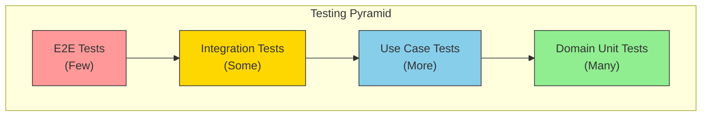

# Testing Hexagonal Applications

One of the biggest benefits of Hexagonal Architecture is **testability**. Each layer can be tested in isolation.

## The Testing Pyramid

```mermaid
flowchart TB
    subgraph Pyramid["Testing Pyramid"]
        E2E["E2E Tests<br/>(Few)"]
        Integration["Integration Tests<br/>(Some)"]
        UseCase["Use Case Tests<br/>(More)"]
        Unit["Domain Unit Tests<br/>(Many)"]
    end

    E2E --> Integration
    Integration --> UseCase
    UseCase --> Unit

    style E2E fill:#f99,stroke:#333
    style Integration fill:#FFD700,stroke:#333
    style UseCase fill:#87CEEB,stroke:#333
    style Unit fill:#90EE90,stroke:#333
```