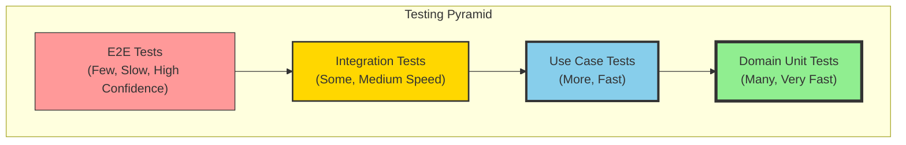
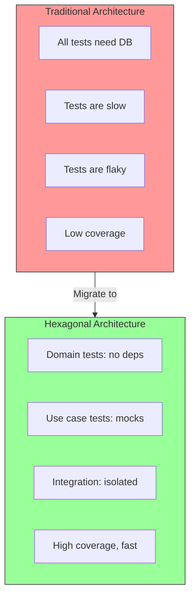
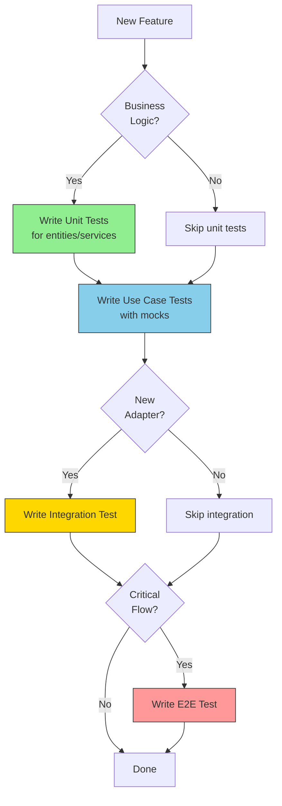

# The Testing Pyramid

The testing pyramid is a strategy for organizing tests by scope and speed. Hexagonal Architecture makes each level easier to implement.

## The Pyramid



## Test Types in Hexagonal Architecture

| Level | What It Tests | Dependencies | Speed | Count |
|-------|---------------|--------------|-------|-------|
| **Unit** | Domain entities & services | None | ~1ms | Many |
| **Use Case** | Business logic orchestration | Mocks | ~10ms | More |
| **Integration** | Adapters + infrastructure | Real DB/services | ~100ms | Some |
| **E2E** | Full system flow | Everything | ~1s+ | Few |

## How Hex Arch Enables the Pyramid



## Real-World Test Distribution

A well-structured project might have:

```
tests/
├── unit/           (70% of tests)
│   ├── entities/
│   │   ├── user_test.go
│   │   └── order_test.go
│   └── services/
│       └── pricing_test.go
├── usecase/        (20% of tests)
│   ├── create_user_test.go
│   └── place_order_test.go
├── integration/    (8% of tests)
│   ├── postgres_repo_test.go
│   └── email_sender_test.go
└── e2e/            (2% of tests)
    └── api_test.go
```

## Test Execution Times

```mermaid
gantt
    title Test Execution Comparison
    dateFormat X
    axisFormat %L ms

    section Unit Tests
    100 entity tests    :0, 100

    section Use Case Tests
    50 use case tests   :0, 500

    section Integration
    20 adapter tests    :0, 2000

    section E2E
    5 full flow tests   :0, 5000
```



## The Confidence Trade-off

| More Unit Tests | More E2E Tests |
|-----------------|----------------|
| Fast feedback | High confidence |
| Easy to write | Catch integration issues |
| Catch logic bugs | Slow execution |
| Miss integration issues | Hard to debug |

The pyramid gives you the best of both: **high confidence with fast feedback**.

## When to Write Each Type


