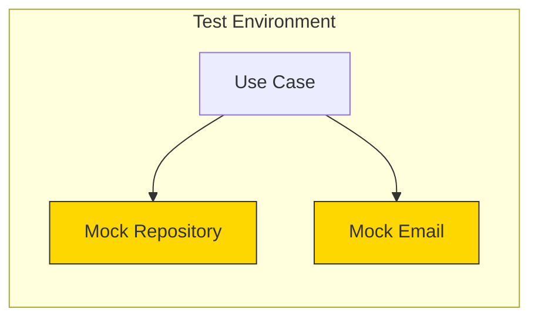

# Testing Use Cases

## Sam's Scenario

Now that Sam had domain tests working, he needed to test his BorrowBook use case. This use case orchestrated several operations: checking if the user could borrow, verifying the book was available, creating a loan, and sending a confirmation notification.

"How do I test this without a real database and email service?" Sam asked Alex.

"That's where mocks come in," Alex replied. "Your use case depends on port interfaces, so you can create mock implementations for testing. Let me show you how to test BorrowBook with mock repositories."

## Testing Orchestration Logic

Use case tests use mock adapters to verify orchestration logic.

## Test Structure



```go
func TestBorrowBook_Success(t *testing.T) {
    // Arrange
    mockBookRepo := &mocks.BookRepository{}
    mockUserRepo := &mocks.UserRepository{}
    mockLoanRepo := &mocks.LoanRepository{}
    mockNotifier := &mocks.NotificationSender{}
    logger := slog.New(slog.NewTextHandler(io.Discard, nil))

    book := &entities.Book{ID: "book-123", Title: "Clean Code", Available: true}
    user := &entities.User{ID: "user-456", ActiveLoans: 2}

    mockBookRepo.On("FindByID", mock.Anything, "book-123").Return(book, nil)
    mockUserRepo.On("FindByID", mock.Anything, "user-456").Return(user, nil)
    mockLoanRepo.On("Save", mock.Anything, mock.AnythingOfType("*entities.Loan")).Return(nil)
    mockNotifier.On("SendLoanConfirmation", mock.Anything, "user-456", "book-123").Return(nil)

    useCase := usecases.NewBorrowBookUseCase(mockBookRepo, mockUserRepo, mockLoanRepo, mockNotifier, logger)

    // Act
    loan, err := useCase.Execute(context.Background(), ports.BorrowBookInput{
        BookID: "book-123",
        UserID: "user-456",
    })

    // Assert
    assert.NoError(t, err)
    assert.Equal(t, "book-123", loan.BookID)
    assert.Equal(t, "user-456", loan.UserID)
    mockBookRepo.AssertExpectations(t)
    mockUserRepo.AssertExpectations(t)
    mockLoanRepo.AssertExpectations(t)
    mockNotifier.AssertExpectations(t)
}

func TestBorrowBook_UserAtLimit(t *testing.T) {
    mockUserRepo := &mocks.UserRepository{}
    user := &entities.User{ID: "user-456", ActiveLoans: 3} // At limit

    mockUserRepo.On("FindByID", mock.Anything, "user-456").Return(user, nil)

    useCase := usecases.NewBorrowBookUseCase(nil, mockUserRepo, nil, nil, nil)

    _, err := useCase.Execute(context.Background(), ports.BorrowBookInput{
        UserID: "user-456",
        BookID: "book-123",
    })

    assert.ErrorIs(t, err, entities.ErrBorrowLimitReached)
}

func TestBorrowBook_BookNotAvailable(t *testing.T) {
    mockBookRepo := &mocks.BookRepository{}
    mockUserRepo := &mocks.UserRepository{}

    book := &entities.Book{ID: "book-123", Available: false}
    user := &entities.User{ID: "user-456", ActiveLoans: 1}

    mockBookRepo.On("FindByID", mock.Anything, "book-123").Return(book, nil)
    mockUserRepo.On("FindByID", mock.Anything, "user-456").Return(user, nil)

    useCase := usecases.NewBorrowBookUseCase(mockBookRepo, mockUserRepo, nil, nil, nil)

    _, err := useCase.Execute(context.Background(), ports.BorrowBookInput{
        UserID: "user-456",
        BookID: "book-123",
    })

    assert.ErrorIs(t, err, entities.ErrBookNotAvailable)
}
```

## Sam's Insight

"This is brilliant!" Sam said after writing his first use case tests. "I can test every scenario - user at borrowing limit, book not available, notification failures - all without touching a database or sending real emails. And the tests run in 10 milliseconds!"

Alex nodded. "Exactly. Use case tests verify your orchestration logic. They ensure you're calling the right repositories in the right order and handling errors properly. This is where you catch most business logic bugs."