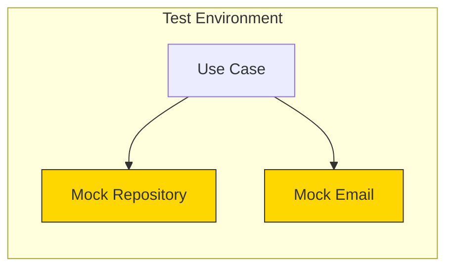

# Testing Use Cases

Use case tests use mock adapters to verify orchestration logic.

## Test Structure



```go
func TestCreateUser_Success(t *testing.T) {
    // Arrange
    mockRepo := &mocks.UserRepository{}
    mockEmail := &mocks.EmailSender{}
    logger := slog.New(slog.NewTextHandler(io.Discard, nil))

    mockRepo.On("FindByEmail", mock.Anything, "john@example.com").
        Return(nil, entities.ErrUserNotFound)
    mockRepo.On("Save", mock.Anything, mock.AnythingOfType("*entities.User")).
        Return(nil)
    mockEmail.On("SendWelcomeEmail", mock.Anything, "john@example.com", "John").
        Return(nil)

    useCase := usecases.NewUserUseCase(mockRepo, mockEmail, logger)

    // Act
    user, err := useCase.CreateUser(context.Background(), ports.CreateUserInput{
        Name:  "John",
        Email: "john@example.com",
    })

    // Assert
    assert.NoError(t, err)
    assert.Equal(t, "John", user.Name)
    mockRepo.AssertExpectations(t)
    mockEmail.AssertExpectations(t)
}

func TestCreateUser_EmailTaken(t *testing.T) {
    mockRepo := &mocks.UserRepository{}
    existingUser := &entities.User{Email: "john@example.com"}

    mockRepo.On("FindByEmail", mock.Anything, "john@example.com").
        Return(existingUser, nil)

    useCase := usecases.NewUserUseCase(mockRepo, nil, nil)

    _, err := useCase.CreateUser(context.Background(), ports.CreateUserInput{
        Email: "john@example.com",
    })

    assert.ErrorIs(t, err, entities.ErrEmailTaken)
}
```