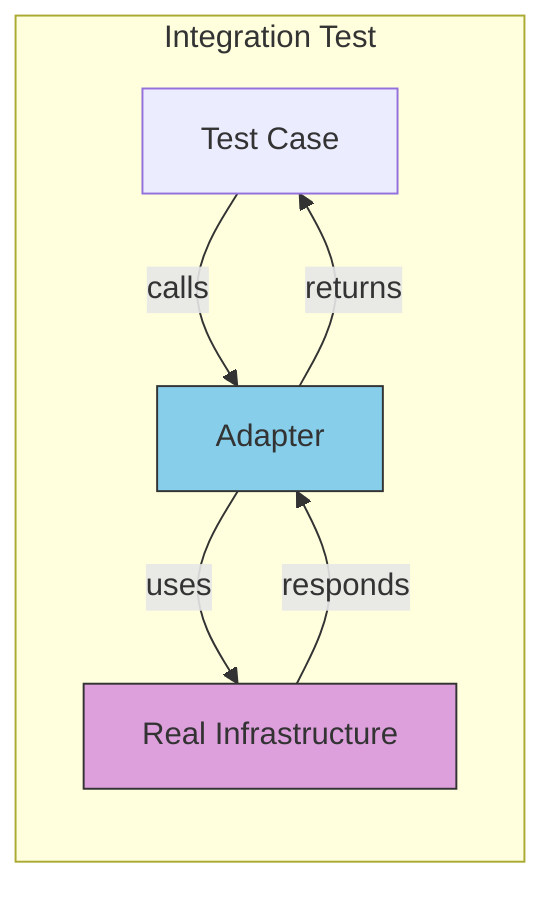
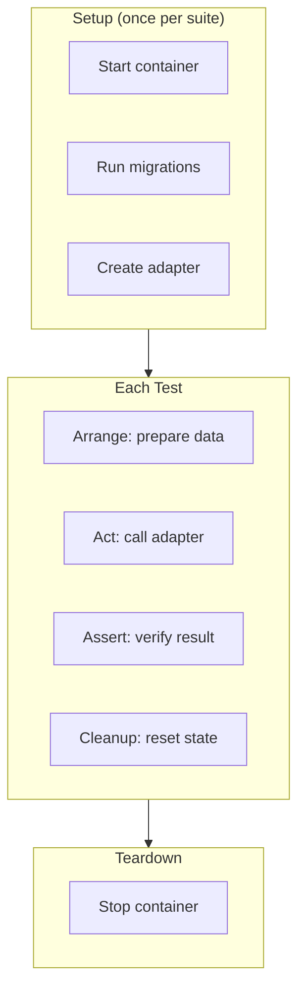

# Testing Adapters

## Sam's Scenario

Sam's PostgreSQL repository adapter was working in development, but he wasn't confident it would handle edge cases correctly. What if a book's ISBN was too long for the database column? What if two users tried to borrow the same book simultaneously?

"You need integration tests for your adapters," Alex explained. "These tests use a real database to verify that your SQL queries work correctly, data mapping is accurate, and errors are handled properly. Let me show you how to test your BookRepository adapter using test containers."

## Testing Infrastructure Integration

Adapter tests verify that your concrete implementations correctly interact with external systems. These are integration tests that require real infrastructure.

## What Adapter Tests Verify



Adapter tests verify:
- SQL queries work correctly
- Data mapping is accurate
- Error handling matches expectations
- Transactions behave properly

## Database Repository Tests

```go
func TestPostgresBookRepository(t *testing.T) {
    // Setup: Use testcontainers or test database
    pool := setupTestDB(t)
    repo := postgres.NewBookRepository(pool)

    t.Run("Save and FindByID", func(t *testing.T) {
        book, _ := entities.NewBook("Clean Code", "Robert Martin", "9780132350884")

        // Save
        err := repo.Save(context.Background(), book)
        require.NoError(t, err)

        // Find
        found, err := repo.FindByID(context.Background(), book.ID)
        require.NoError(t, err)
        assert.Equal(t, book.ID, found.ID)
        assert.Equal(t, book.Title, found.Title)
        assert.Equal(t, book.ISBN, found.ISBN)
    })

    t.Run("FindByISBN returns ErrNotFound for missing book", func(t *testing.T) {
        _, err := repo.FindByISBN(context.Background(), "9999999999999")
        assert.ErrorIs(t, err, entities.ErrBookNotFound)
    })

    t.Run("Save returns error for duplicate ISBN", func(t *testing.T) {
        book1, _ := entities.NewBook("Book 1", "Author 1", "9780132350884")
        book2, _ := entities.NewBook("Book 2", "Author 2", "9780132350884")

        _ = repo.Save(context.Background(), book1)
        err := repo.Save(context.Background(), book2)

        assert.Error(t, err) // Unique constraint violation
    })

    t.Run("MarkAsUnavailable updates availability", func(t *testing.T) {
        book, _ := entities.NewBook("Test Book", "Test Author", "9781234567890")
        repo.Save(context.Background(), book)

        err := repo.MarkAsUnavailable(context.Background(), book.ID)
        require.NoError(t, err)

        found, _ := repo.FindByID(context.Background(), book.ID)
        assert.False(t, found.Available)
    })
}
```

## Using Test Containers

```go
import (
    "github.com/testcontainers/testcontainers-go"
    "github.com/testcontainers/testcontainers-go/modules/postgres"
)

func setupTestDB(t *testing.T) *pgxpool.Pool {
    ctx := context.Background()

    // Start PostgreSQL container
    container, err := postgres.RunContainer(ctx,
        testcontainers.WithImage("postgres:15"),
        postgres.WithDatabase("testdb"),
        postgres.WithUsername("test"),
        postgres.WithPassword("test"),
    )
    require.NoError(t, err)

    t.Cleanup(func() {
        container.Terminate(ctx)
    })

    // Get connection string
    connStr, err := container.ConnectionString(ctx, "sslmode=disable")
    require.NoError(t, err)

    // Connect and run migrations
    pool, err := pgxpool.New(ctx, connStr)
    require.NoError(t, err)

    runMigrations(pool)

    return pool
}
```

## Testing External API Adapters

```go
func TestStripePaymentGateway(t *testing.T) {
    // Use Stripe test mode
    gateway := stripe.NewPaymentGateway(os.Getenv("STRIPE_TEST_KEY"))

    t.Run("Charge succeeds with valid test card", func(t *testing.T) {
        payment, err := gateway.Charge(context.Background(),
            entities.Money{Amount: 1000, Currency: "USD"},
            "tok_visa",  // Stripe test token
        )

        require.NoError(t, err)
        assert.NotEmpty(t, payment.ID)
        assert.Equal(t, "succeeded", payment.Status)
    })

    t.Run("Charge fails with declined card", func(t *testing.T) {
        _, err := gateway.Charge(context.Background(),
            entities.Money{Amount: 1000, Currency: "USD"},
            "tok_chargeDeclined",  // Stripe test token for declined
        )

        assert.ErrorIs(t, err, entities.ErrPaymentDeclined)
    })
}
```

## Testing Notification Adapters

For notification adapters, you often use test mode or capture messages:

```go
func TestEmailNotificationSender(t *testing.T) {
    // Use email service sandbox mode
    sender := email.NewNotificationSender(email.Config{
        APIKey:      os.Getenv("EMAIL_TEST_KEY"),
        SandboxMode: true,  // Doesn't actually send
    })

    t.Run("SendLoanConfirmation succeeds", func(t *testing.T) {
        err := sender.SendLoanConfirmation(context.Background(),
            "user-123",
            "book-456",
        )
        assert.NoError(t, err)
    })

    t.Run("SendOverdueNotice includes correct details", func(t *testing.T) {
        err := sender.SendOverdueNotice(context.Background(),
            "user-123",
            "book-456",
            5, // days overdue
        )
        assert.NoError(t, err)
    })
}
```

## Sam's Insight

After setting up integration tests with test containers, Sam discovered a bug he hadn't caught before: his repository wasn't properly handling concurrent borrows of the same book. The integration test revealed the race condition when two users tried to borrow simultaneously.

"Without these tests, that bug would have made it to production," Sam said. "Integration tests are slower - they take 100ms instead of 1ms - but they're worth it for catching these real-world issues."

Alex agreed. "Exactly. You don't need many integration tests, but the ones you have should cover critical paths and edge cases that only appear when you interact with real infrastructure."

## Adapter Test Best Practices

| Practice | Description |
|----------|-------------|
| **Isolate tests** | Each test should clean up after itself |
| **Use test containers** | Real databases in Docker for CI |
| **Test error cases** | Verify adapters translate errors correctly |
| **Use provider test modes** | Stripe test keys, SendGrid sandbox |
| **Run separately** | Integration tests may need `go test -tags=integration` |

## Adapter Test Structure


