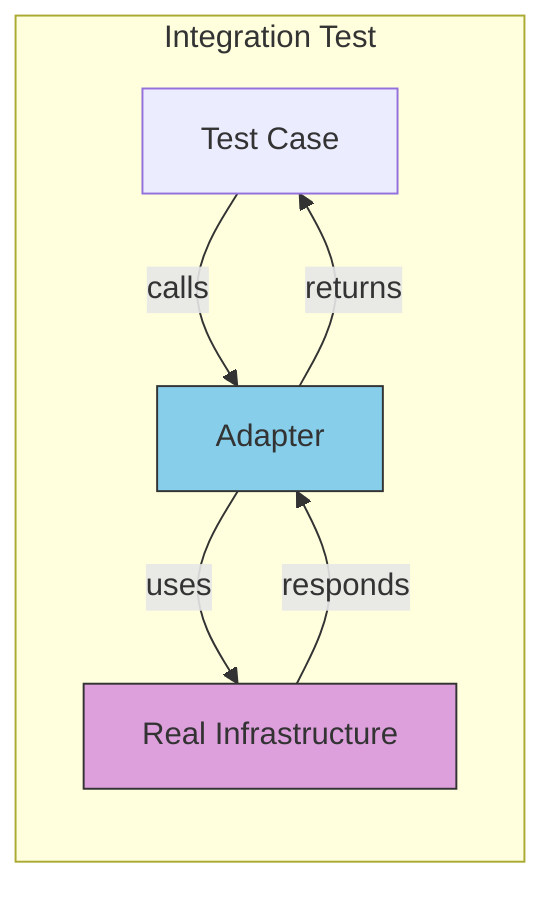
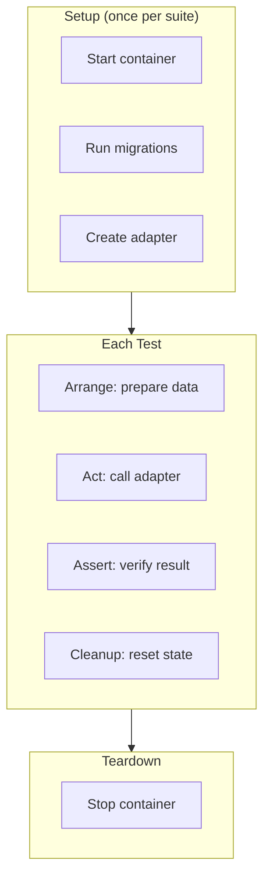

# Testing Adapters

Adapter tests verify that your concrete implementations correctly interact with external systems. These are integration tests that require real infrastructure.

## What Adapter Tests Verify



Adapter tests verify:
- SQL queries work correctly
- Data mapping is accurate
- Error handling matches expectations
- Transactions behave properly

## Database Repository Tests

```go
func TestPostgresUserRepository(t *testing.T) {
    // Setup: Use testcontainers or test database
    pool := setupTestDB(t)
    repo := postgres.NewUserRepository(pool)

    t.Run("Save and FindByID", func(t *testing.T) {
        user, _ := entities.NewUser("Test User", "test@example.com")

        // Save
        err := repo.Save(context.Background(), user)
        require.NoError(t, err)

        // Find
        found, err := repo.FindByID(context.Background(), user.ID)
        require.NoError(t, err)
        assert.Equal(t, user.ID, found.ID)
        assert.Equal(t, user.Email, found.Email)
    })

    t.Run("FindByEmail returns ErrNotFound for missing user", func(t *testing.T) {
        _, err := repo.FindByEmail(context.Background(), "nonexistent@example.com")
        assert.ErrorIs(t, err, entities.ErrUserNotFound)
    })

    t.Run("Save returns error for duplicate email", func(t *testing.T) {
        user1, _ := entities.NewUser("User 1", "dupe@example.com")
        user2, _ := entities.NewUser("User 2", "dupe@example.com")

        _ = repo.Save(context.Background(), user1)
        err := repo.Save(context.Background(), user2)

        assert.Error(t, err)
    })
}
```

## Using Test Containers

```go
import (
    "github.com/testcontainers/testcontainers-go"
    "github.com/testcontainers/testcontainers-go/modules/postgres"
)

func setupTestDB(t *testing.T) *pgxpool.Pool {
    ctx := context.Background()

    // Start PostgreSQL container
    container, err := postgres.RunContainer(ctx,
        testcontainers.WithImage("postgres:15"),
        postgres.WithDatabase("testdb"),
        postgres.WithUsername("test"),
        postgres.WithPassword("test"),
    )
    require.NoError(t, err)

    t.Cleanup(func() {
        container.Terminate(ctx)
    })

    // Get connection string
    connStr, err := container.ConnectionString(ctx, "sslmode=disable")
    require.NoError(t, err)

    // Connect and run migrations
    pool, err := pgxpool.New(ctx, connStr)
    require.NoError(t, err)

    runMigrations(pool)

    return pool
}
```

## Testing External API Adapters

```go
func TestStripePaymentGateway(t *testing.T) {
    // Use Stripe test mode
    gateway := stripe.NewPaymentGateway(os.Getenv("STRIPE_TEST_KEY"))

    t.Run("Charge succeeds with valid test card", func(t *testing.T) {
        payment, err := gateway.Charge(context.Background(),
            entities.Money{Amount: 1000, Currency: "USD"},
            "tok_visa",  // Stripe test token
        )

        require.NoError(t, err)
        assert.NotEmpty(t, payment.ID)
        assert.Equal(t, "succeeded", payment.Status)
    })

    t.Run("Charge fails with declined card", func(t *testing.T) {
        _, err := gateway.Charge(context.Background(),
            entities.Money{Amount: 1000, Currency: "USD"},
            "tok_chargeDeclined",  // Stripe test token for declined
        )

        assert.ErrorIs(t, err, entities.ErrPaymentDeclined)
    })
}
```

## Testing Email Adapters

For email adapters, you often use test mode or capture emails:

```go
func TestSendGridEmailSender(t *testing.T) {
    // Use SendGrid sandbox mode
    sender := sendgrid.NewEmailSender(sendgrid.Config{
        APIKey:      os.Getenv("SENDGRID_TEST_KEY"),
        SandboxMode: true,  // Doesn't actually send
    })

    t.Run("SendWelcomeEmail succeeds", func(t *testing.T) {
        err := sender.SendWelcomeEmail(context.Background(),
            "test@example.com",
            "Test User",
        )
        assert.NoError(t, err)
    })
}
```

## Adapter Test Best Practices

| Practice | Description |
|----------|-------------|
| **Isolate tests** | Each test should clean up after itself |
| **Use test containers** | Real databases in Docker for CI |
| **Test error cases** | Verify adapters translate errors correctly |
| **Use provider test modes** | Stripe test keys, SendGrid sandbox |
| **Run separately** | Integration tests may need `go test -tags=integration` |

## Adapter Test Structure


