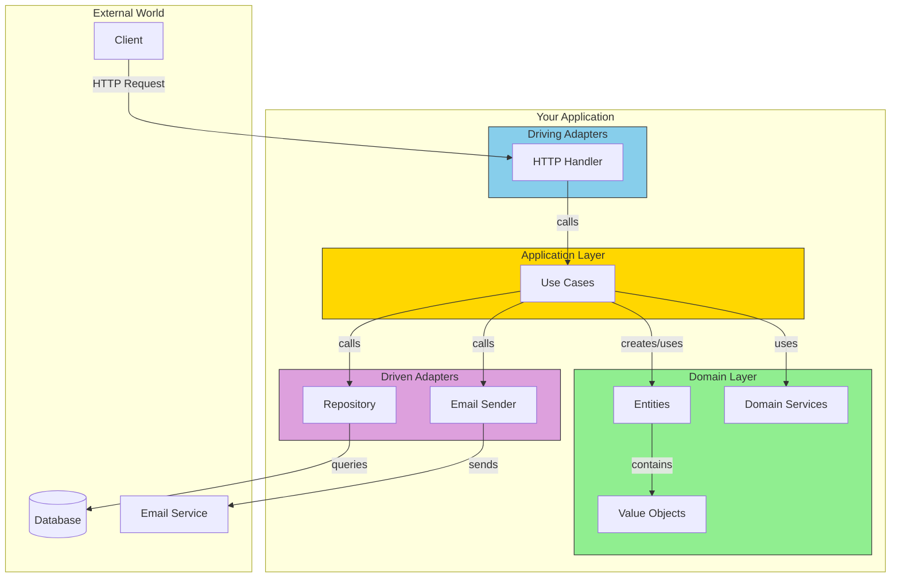

# Putting It All Together

## Sam's Challenge: The Big Demo

Three months after that weekend hackathon, Sam sat in a coffee shop with two laptops, preparing for the biggest day yet.

On the left screen: Maya, the angel investor, joining via video call from San Francisco. "Show me the mobile integration," she'd said.

On the right screen: Chen, from Riverside Library, dialing in from their IT office. "We need to see the on-premise deployment," he'd requested.

Sam took a deep breath. BookShelf had come a long way from that messy 1,200-line main.go file. Now it was a clean hexagonal architecture with 85% test coverage. But could it handle these wildly different requirements?

Alex sent an encouraging text: "You've built it right. Now show them why architecture matters."

Let's review what we've learned and see how all the pieces fit together.

## The Complete Picture



## Benefits Recap

| Benefit | How Hex Arch Achieves It |
|---------|--------------------------|
| Testability | Domain has no dependencies, use mocks for adapters |
| Flexibility | Swap adapters without changing business logic |
| Maintainability | Clear boundaries, each layer has one job |
| Framework Independence | Domain doesn't know about frameworks |

## When to Use Hexagonal Architecture

**Good fit:**
- Long-lived applications
- Complex business logic
- Multiple interfaces (web, mobile, CLI)
- Team larger than 2-3 developers

**Overkill for:**
- Simple CRUD applications
- Prototypes or throwaway code
- Very small teams or solo projects

## Next Steps

1. Start with the domain - what are your core entities?
2. Define your ports - what does your app do? What does it need?
3. Implement adapters - connect to the real world
4. Wire it together in main.go

## BookShelf: The Complete Implementation

Sam walked Maya and Chen through BookShelf's architecture, showing how all the pieces worked together.

### The Domain Layer (The Heart)

"Everything starts here," Sam explained, showing the book lending rules.

```go
// domain/book/book.go
package book

type Book struct {
    id     ID
    title  string
    isbn   ISBN
    author string
    status Status
}

func (b *Book) Borrow() error {
    if b.status != StatusAvailable {
        return ErrBookNotAvailable
    }
    b.status = StatusBorrowed
    return nil
}

func (b *Book) Return() error {
    if b.status != StatusBorrowed {
        return ErrBookNotBorrowed
    }
    b.status = StatusAvailable
    return nil
}
```

```go
// domain/services/lending_service.go
package services

type LendingService struct {
    maxLoansPerUser map[user.MembershipType]int
}

func (s *LendingService) CanBorrow(u *user.User, activeLoans []*loan.Loan) (bool, string) {
    maxLoans := s.maxLoansPerUser[u.Membership()]

    if len(activeLoans) >= maxLoans {
        return false, "maximum concurrent loans reached"
    }

    for _, l := range activeLoans {
        if l.IsOverdue() {
            return false, "cannot borrow with overdue loans"
        }
    }

    return true, ""
}
```

"Notice," Sam pointed out, "no database code. No HTTP. Just business rules. This is the same code whether you access it via REST API, GraphQL, mobile app, or command-line tool."

### The Application Layer (Use Cases)

"This layer orchestrates the domain," Sam continued.

```go
// application/usecases/borrow_book.go
package usecases

type BorrowBook struct {
    bookRepo    ports.BookRepository
    loanRepo    ports.LoanRepository
    userRepo    ports.UserRepository
    notifier    ports.NotificationService
    lendingService *services.LendingService
}

func (uc *BorrowBook) Execute(userID user.ID, bookID book.ID) error {
    // Fetch user
    u, err := uc.userRepo.FindByID(userID)
    if err != nil {
        return fmt.Errorf("user not found: %w", err)
    }

    // Fetch book
    b, err := uc.bookRepo.FindByID(bookID)
    if err != nil {
        return fmt.Errorf("book not found: %w", err)
    }

    // Check if user can borrow
    activeLoans, _ := uc.loanRepo.FindActiveByUser(userID)
    canBorrow, reason := uc.lendingService.CanBorrow(u, activeLoans)
    if !canBorrow {
        return fmt.Errorf("cannot borrow: %s", reason)
    }

    // Borrow the book (domain logic)
    if err := b.Borrow(); err != nil {
        return err
    }

    // Create loan
    l := loan.NewLoan(u.ID(), b.ID())

    // Persist changes
    if err := uc.bookRepo.Save(b); err != nil {
        return err
    }
    if err := uc.loanRepo.Save(l); err != nil {
        return err
    }

    // Send notification
    uc.notifier.SendLoanConfirmation(u, b)

    return nil
}
```

"The use case doesn't care HOW books are stored or HOW notifications are sent. It just calls the ports."

### The Adapters (Connecting to the World)

"This is where your different requirements come in," Sam told Maya and Chen.

#### HTTP Adapter (For Maya's Mobile App)

```go
// adapters/http/book_handler.go
package http

type BookHandler struct {
    borrowBook *usecases.BorrowBook
}

func (h *BookHandler) BorrowBook(w http.ResponseWriter, r *http.Request) {
    var req struct {
        UserID string `json:"user_id"`
        BookID string `json:"book_id"`
    }

    if err := json.NewDecoder(r.Body).Decode(&req); err != nil {
        http.Error(w, "invalid request", http.StatusBadRequest)
        return
    }

    userID := user.IDFromString(req.UserID)
    bookID := book.IDFromString(req.BookID)

    if err := h.borrowBook.Execute(userID, bookID); err != nil {
        http.Error(w, err.Error(), http.StatusBadRequest)
        return
    }

    w.WriteHeader(http.StatusCreated)
    json.NewEncoder(w).Encode(map[string]string{
        "message": "Book borrowed successfully",
    })
}
```

Maya smiled. "So my mobile app just makes REST calls to this?"

"Exactly," Sam confirmed. "And if you want GraphQL instead, I just add another adapter. The domain stays the same."

#### PostgreSQL Adapter (For Chen's On-Premise Deployment)

```go
// adapters/postgres/book_repository.go
package postgres

type BookRepository struct {
    db *sql.DB
}

func (r *BookRepository) FindByID(id book.ID) (*book.Book, error) {
    var title, author, isbn, status string
    var idStr string

    err := r.db.QueryRow(`
        SELECT id, title, author, isbn, status
        FROM books WHERE id = $1
    `, id.String()).Scan(&idStr, &title, &author, &isbn, &status)

    if err == sql.ErrNoRows {
        return nil, ErrBookNotFound
    }
    if err != nil {
        return nil, err
    }

    return book.Reconstruct(
        book.IDFromString(idStr),
        title,
        author,
        book.MustNewISBN(isbn),
        book.StatusFromString(status),
    ), nil
}
```

"But we use MySQL," Chen interjected.

Sam grinned. "No problem. I just create a MySQL adapter that implements the same BookRepository interface. The use cases and domain don't change at all."

#### Email Notification Adapter

```go
// adapters/email/smtp_notifier.go
package email

type SMTPNotifier struct {
    smtpHost string
    smtpPort int
    from     string
}

func (n *SMTPNotifier) SendLoanConfirmation(u *user.User, b *book.Book) error {
    subject := "Book Borrowed Successfully"
    body := fmt.Sprintf(
        "Hi %s,\n\nYou have successfully borrowed '%s'.\nDue date: %s\n",
        u.Name(),
        b.Title(),
        time.Now().AddDate(0, 0, 14).Format("2006-01-02"),
    )

    return n.sendEmail(u.Email(), subject, body)
}
```

### Wiring It All Together

"And here's where everything connects," Sam showed them main.go.

```go
// cmd/api/main.go
package main

import (
    "database/sql"
    "log"
    "net/http"

    "bookshelf/adapters/email"
    "bookshelf/adapters/http"
    "bookshelf/adapters/postgres"
    "bookshelf/application/usecases"
    "bookshelf/domain/services"

    _ "github.com/lib/pq"
)

func main() {
    // Configuration
    dbURL := os.Getenv("DATABASE_URL")
    smtpHost := os.Getenv("SMTP_HOST")

    // Infrastructure setup
    db, err := sql.Open("postgres", dbURL)
    if err != nil {
        log.Fatal(err)
    }
    defer db.Close()

    // Adapters (Driven - infrastructure)
    bookRepo := postgres.NewBookRepository(db)
    loanRepo := postgres.NewLoanRepository(db)
    userRepo := postgres.NewUserRepository(db)
    notifier := email.NewSMTPNotifier(smtpHost, 587, "noreply@bookshelf.com")

    // Domain services
    lendingService := services.NewLendingService()

    // Use cases
    borrowBook := usecases.NewBorrowBook(
        bookRepo,
        loanRepo,
        userRepo,
        notifier,
        lendingService,
    )
    returnBook := usecases.NewReturnBook(bookRepo, loanRepo, notifier)
    searchCatalog := usecases.NewSearchCatalog(bookRepo)

    // Adapters (Driving - API)
    bookHandler := httphandler.NewBookHandler(borrowBook, returnBook, searchCatalog)

    // HTTP routes
    mux := http.NewServeMux()
    mux.HandleFunc("POST /api/loans", bookHandler.BorrowBook)
    mux.HandleFunc("DELETE /api/loans/{id}", bookHandler.ReturnBook)
    mux.HandleFunc("GET /api/books", bookHandler.SearchBooks)

    // Start server
    log.Println("BookShelf API starting on :8080")
    log.Fatal(http.ListenAndServe(":8080", mux))
}
```

### The Demo Scenarios

**For Maya (Mobile Integration):**

Sam showed the REST API working with a mobile app simulator:

```bash
# Borrow a book
curl -X POST http://localhost:8080/api/loans \
  -H "Content-Type: application/json" \
  -d '{"user_id": "user-123", "book_id": "book-456"}'

# Response: 201 Created
{
  "message": "Book borrowed successfully",
  "due_date": "2024-02-14"
}
```

"And if you want GraphQL, I can add that adapter in a day," Sam added.

**For Chen (On-Premise Deployment):**

Sam showed the Docker Compose setup for Riverside Library's servers:

```yaml
# docker-compose.yml
version: '3.8'
services:
  bookshelf-api:
    build: .
    environment:
      DATABASE_URL: postgres://user:pass@db:5432/bookshelf
      SMTP_HOST: mail.riverside-library.org
    ports:
      - "8080:8080"
    depends_on:
      - db

  db:
    image: postgres:15
    volumes:
      - ./data:/var/lib/postgresql/data
    environment:
      POSTGRES_DB: bookshelf
      POSTGRES_USER: user
      POSTGRES_PASSWORD: pass
```

"Your IT team can deploy this on your own servers. All data stays on-premise," Sam explained.

Chen nodded approvingly. "And if we need to add LDAP authentication?"

"Just another adapter," Sam said confidently. "The domain and use cases don't change."

### The Testing Story

Sam pulled up the test coverage to prove reliability:

```bash
$ make test-coverage

Domain:      89.1% coverage  ✓
Application: 87.4% coverage  ✓
Adapters:    78.2% coverage  ✓
Total:       85.7% coverage  ✓
```

"Every critical path is tested. The domain tests run in milliseconds. The full suite runs in under 2 seconds."

## The Decision

Maya leaned forward. "I'm impressed. Most weekend hackathons would've painted themselves into a corner by now. The mobile integration is exactly what I need. I'm in."

Chen smiled. "We've evaluated three other library systems. None of them could handle our on-premise requirement this cleanly. When can Riverside Library start the pilot?"

Sam exhaled. "I'll send you both the deployment guides this week."

After the call, Alex sent another text: "Well?"

Sam replied: "Both committed! Maya's investing, Chen's doing a 6-month pilot."

Alex: "Told you architecture matters. Now go celebrate!"

## What Made BookShelf Successful

Sam reflected on the journey:

1. **Clear Domain Model**: Books, Loans, Users made sense to everyone
2. **Testable**: 85% coverage gave confidence to deploy
3. **Flexible**: REST API for mobile, on-premise for enterprise - same core code
4. **Maintainable**: New developers could understand the structure in an hour
5. **Swappable Adapters**: Maya wants GraphQL? Chen needs MySQL? No problem.

## The Complete Flow (In Code)

Here's how a book borrow request flows through BookShelf:

```
1. HTTP Request arrives
   ↓
2. BookHandler.BorrowBook() extracts user_id and book_id
   ↓
3. BorrowBook.Execute() use case is called
   ↓
4. Use case fetches User and Book via repository ports
   ↓
5. LendingService.CanBorrow() checks domain rules
   ↓
6. Book.Borrow() changes book status (domain logic)
   ↓
7. Loan entity is created
   ↓
8. Use case saves via repository ports
   ↓
9. NotificationService sends confirmation
   ↓
10. HTTP Response returns success
```

At every step, dependencies point inward. The domain never knows about HTTP, Postgres, or SMTP.

## Benefits Recap

| Benefit | How Hex Arch Achieves It | BookShelf Example |
|---------|--------------------------|-------------------|
| Testability | Domain has no dependencies, use mocks for adapters | 89% domain coverage without database |
| Flexibility | Swap adapters without changing business logic | REST for Maya, can add GraphQL later |
| Maintainability | Clear boundaries, each layer has one job | New developer onboarded in 1 hour |
| Framework Independence | Domain doesn't know about frameworks | Same domain for web, mobile, CLI |
| Multiple Interfaces | Add adapters without touching core | On-premise for Chen, cloud for Maya |

## When to Use Hexagonal Architecture

**Good fit (BookShelf's situation):**
- Long-lived applications (multi-year roadmap)
- Complex business logic (lending rules, memberships)
- Multiple interfaces (web, mobile, on-premise)
- Team larger than 2-3 developers
- Need for high test coverage

**Overkill for:**
- Simple CRUD applications (basic blog)
- Prototypes or throwaway code
- Very small teams or solo projects (unless you're planning to scale)
- Internal tools with no complex logic

## Sam's Progress

**What Sam learned:**
- Hexagonal architecture lets you serve multiple customers with one codebase
- The domain is the heart - protect it from infrastructure changes
- Ports define what you need, adapters provide implementations
- Good architecture makes demos easy (swap adapters live!)
- Tests give confidence to deploy for real customers

**Business outcome:**
- Angel investment secured from Maya
- Enterprise pilot with Riverside Library
- Architecture supports both cloud and on-premise
- Team can scale (hiring first developer next month)

**What's next:** As BookShelf grows, Sam needs to add logging, caching, and monitoring. Time to learn real-world patterns...

**Confidence level:** ★★★★★ (Ready for production!)

Happy architecting!