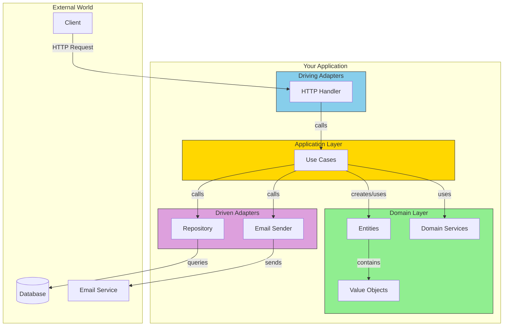

# Putting It All Together

Let's review what we've learned and see how all the pieces fit together.

## The Complete Picture

## Benefits Recap

| Benefit | How Hex Arch Achieves It |
|---------|--------------------------|
| Testability | Domain has no dependencies, use mocks for adapters |
| Flexibility | Swap adapters without changing business logic |
| Maintainability | Clear boundaries, each layer has one job |
| Framework Independence | Domain doesn't know about frameworks |

## When to Use Hexagonal Architecture

**Good fit:**
- Long-lived applications
- Complex business logic
- Multiple interfaces (web, mobile, CLI)
- Team larger than 2-3 developers

**Overkill for:**
- Simple CRUD applications
- Prototypes or throwaway code
- Very small teams or solo projects

## Next Steps

1. Start with the domain - what are your core entities?
2. Define your ports - what does your app do? What does it need?
3. Implement adapters - connect to the real world
4. Wire it together in main.go

Happy architecting!