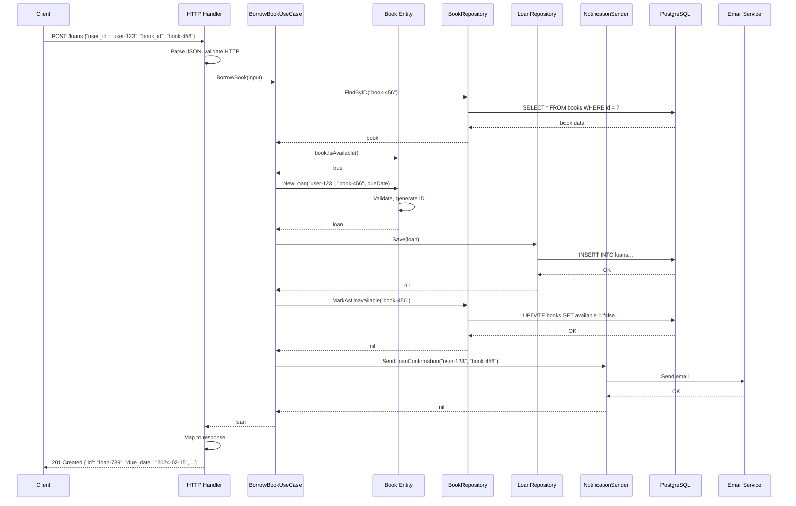
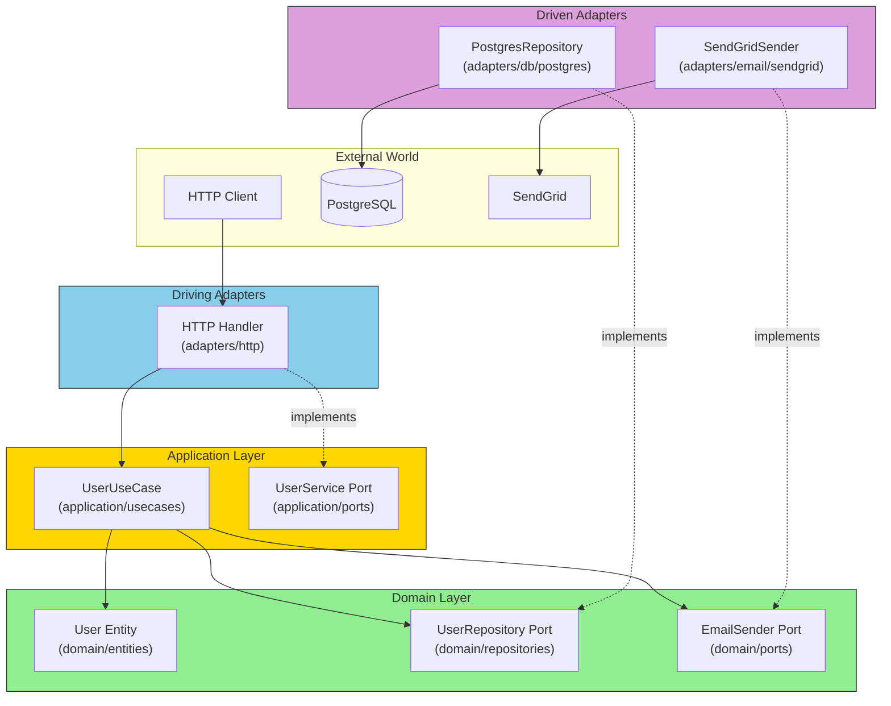

# The Complete Picture

## Sam's Scenario

After weeks of refactoring BookShelf with Alex's guidance, Sam wanted to understand how everything fit together. "Let's trace a complete request," Alex suggested. "When a user borrows a book through your API, how does the request flow through all the layers?"

Sam pulled up his architecture diagram. "It starts with an HTTP request, goes through my handler adapter, calls the BorrowBook use case, which uses the domain entities and calls repository ports, which are implemented by my PostgreSQL adapters."

"Exactly!" Alex said. "Let's walk through it step by step so you can see how hexagonal architecture orchestrates all these components."

## Tracing a Request Through BookShelf

Let's trace a complete request through a Hexagonal Architecture application to see how all the pieces work together.

## End-to-End Request Flow



## The Architecture Diagram



## Dependency Wiring (main.go)

```go
func main() {
    // 1. Load configuration
    cfg, err := config.Load()
    if err != nil {
        log.Fatal(err)
    }

    // 2. Create infrastructure
    db, err := pgxpool.New(context.Background(), cfg.Database.URL)
    if err != nil {
        log.Fatal(err)
    }
    defer db.Close()

    logger := slog.New(slog.NewJSONHandler(os.Stdout, nil))

    // 3. Create driven adapters (outbound)
    userRepo := postgres.NewUserRepository(db)
    emailSender := sendgrid.NewEmailSender(cfg.Email.APIKey, cfg.Email.From)

    // 4. Create domain services
    authService := services.NewAuthService(cfg.Auth.JWTSecret)

    // 5. Create use cases
    userUseCase := usecases.NewUserUseCase(userRepo, emailSender, logger)

    // 6. Create driving adapters (inbound)
    userHandler := http.NewUserHandler(userUseCase, authService)

    // 7. Create router and start server
    router := http.NewRouter(userHandler)

    log.Printf("Server starting on %s", cfg.Server.Addr())
    if err := router.ListenAndServe(cfg.Server.Addr()); err != nil {
        log.Fatal(err)
    }
}
```

## How Each Layer Communicates

| From | To | Via | Direction |
|------|-----|-----|-----------|
| HTTP Handler | Use Case | Driving Port interface | Inbound |
| Use Case | Entity | Direct import | Internal |
| Use Case | Repository | Driven Port interface | Outbound |
| Repository | Database | Database driver | External |

## The Key Insight

The domain and use cases have **no idea**:
- That HTTP is being used (could be CLI, GraphQL, gRPC)
- That PostgreSQL stores the data (could be MongoDB, SQLite)
- That email notifications are sent (could be SMS, push notifications)

This ignorance is the source of the architecture's power.

## Sam's Insight

"I get it now!" Sam exclaimed. "My BorrowBook use case doesn't know about HTTP status codes, SQL queries, or email APIs. It just knows about books, users, loans, and ports. When Maya asks for a mobile app, I just add a new driving adapter. When Chen needs on-premise deployment, I swap the PostgreSQL adapter for a different database adapter. The core business logic stays the same!"

Alex nodded. "That's hexagonal architecture in action. The center holds your valuable business logic, and the edges are swappable adapters. You've built a system that can evolve without rewriting the core."
