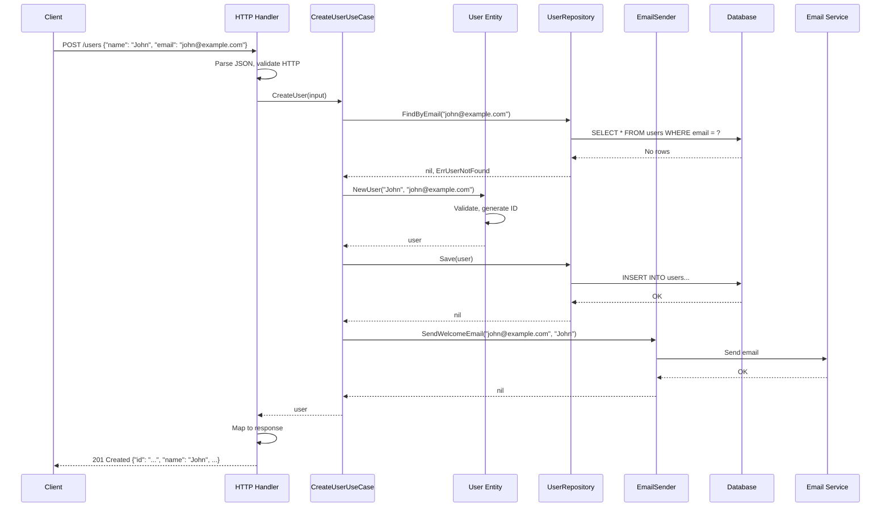
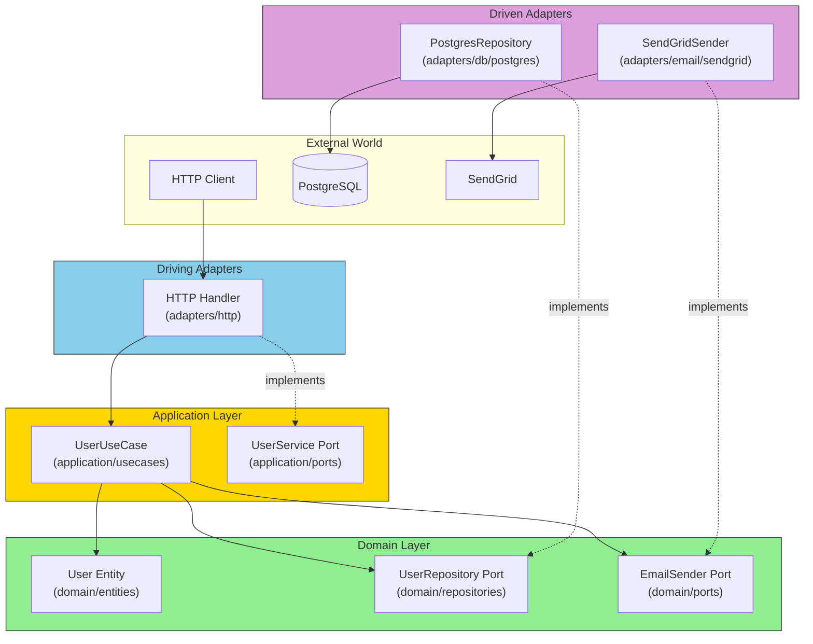

# The Complete Picture

Let's trace a complete request through a Hexagonal Architecture application to see how all the pieces work together.

## End-to-End Request Flow



## The Architecture Diagram



## Dependency Wiring (main.go)

```go
func main() {
    // 1. Load configuration
    cfg, err := config.Load()
    if err != nil {
        log.Fatal(err)
    }

    // 2. Create infrastructure
    db, err := pgxpool.New(context.Background(), cfg.Database.URL)
    if err != nil {
        log.Fatal(err)
    }
    defer db.Close()

    logger := slog.New(slog.NewJSONHandler(os.Stdout, nil))

    // 3. Create driven adapters (outbound)
    userRepo := postgres.NewUserRepository(db)
    emailSender := sendgrid.NewEmailSender(cfg.Email.APIKey, cfg.Email.From)

    // 4. Create domain services
    authService := services.NewAuthService(cfg.Auth.JWTSecret)

    // 5. Create use cases
    userUseCase := usecases.NewUserUseCase(userRepo, emailSender, logger)

    // 6. Create driving adapters (inbound)
    userHandler := http.NewUserHandler(userUseCase, authService)

    // 7. Create router and start server
    router := http.NewRouter(userHandler)

    log.Printf("Server starting on %s", cfg.Server.Addr())
    if err := router.ListenAndServe(cfg.Server.Addr()); err != nil {
        log.Fatal(err)
    }
}
```

## How Each Layer Communicates

| From | To | Via | Direction |
|------|-----|-----|-----------|
| HTTP Handler | Use Case | Driving Port interface | Inbound |
| Use Case | Entity | Direct import | Internal |
| Use Case | Repository | Driven Port interface | Outbound |
| Repository | Database | Database driver | External |

## The Key Insight

The domain and use cases have **no idea**:
- That HTTP is being used (could be CLI, GraphQL, gRPC)
- That PostgreSQL stores the data (could be MongoDB, SQLite)
- That SendGrid sends emails (could be SES, SMTP)

This ignorance is the source of the architecture's power.
