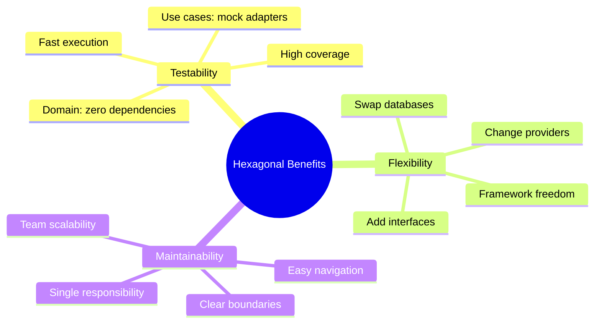
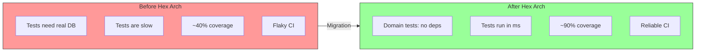
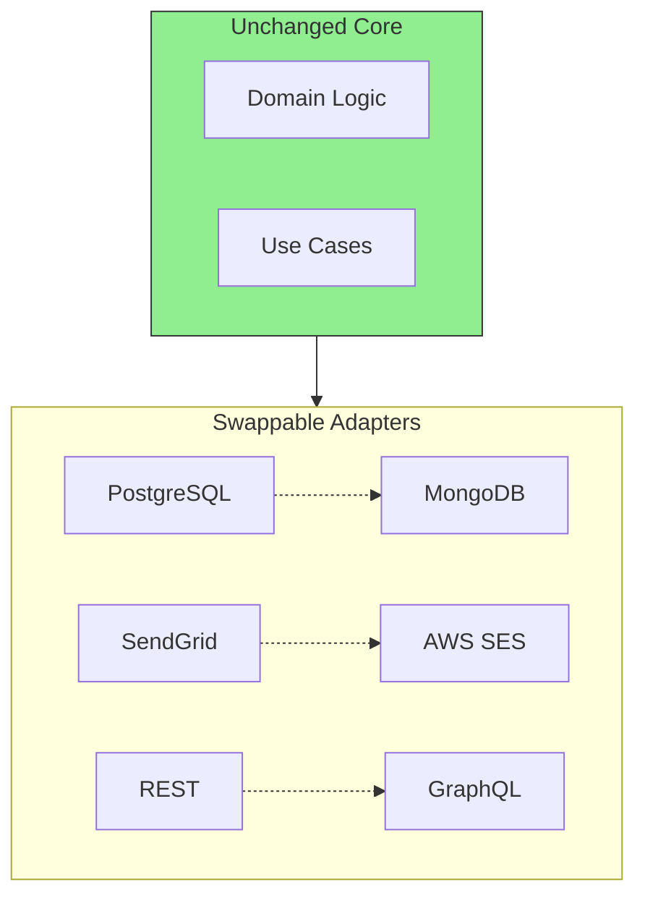
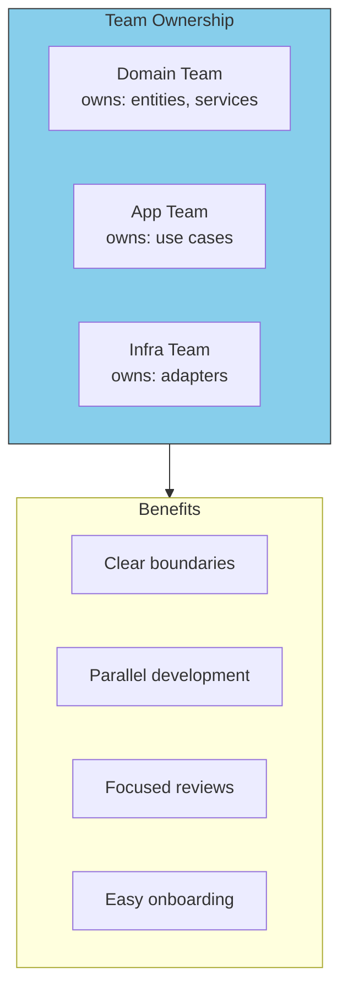
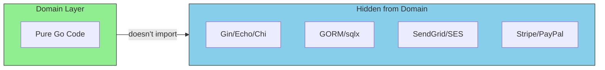

# Benefits Recap

Let's summarize the key benefits of Hexagonal Architecture and how they're achieved.

## The Core Benefits

## Testability: Before and After

| Metric | Traditional | Hexagonal |
|--------|-------------|-----------|
| Test execution time | 45 seconds | 0.5 seconds |
| Test coverage | 40% | 85-95% |
| Flaky tests | 15% | 0% |
| Tests requiring DB | 100% | 10% |

## Flexibility: Swap Without Fear

Real-world scenarios where flexibility saves time:

| Scenario | Without Hex Arch | With Hex Arch |
|----------|------------------|---------------|
| Switch DB | Weeks of refactoring | New adapter (~1 day) |
| Add CLI | Major restructuring | New driving adapter |
| Change email | Hunt through codebase | Swap adapter in main.go |

## Maintainability: Team Scalability

## Framework Independence

Your domain doesn't know about:

This means:
- Framework upgrades don't touch business logic
- Vendor lock-in is limited to adapters
- Domain is portable across projects

## Summary Table

| Benefit | How Hex Arch Achieves It |
|---------|--------------------------|
| **Testability** | Domain has no dependencies, use mocks for ports |
| **Flexibility** | Swap adapters without changing business logic |
| **Maintainability** | Clear layers, each with single responsibility |
| **Framework Independence** | Domain doesn't know about frameworks |
| **Delayed Decisions** | Start with in-memory, add real DB later |
| **Team Scalability** | Teams can own different layers |
| **Easy Onboarding** | Standard structure, clear navigation |
| **Confident Refactoring** | High test coverage enables changes |
