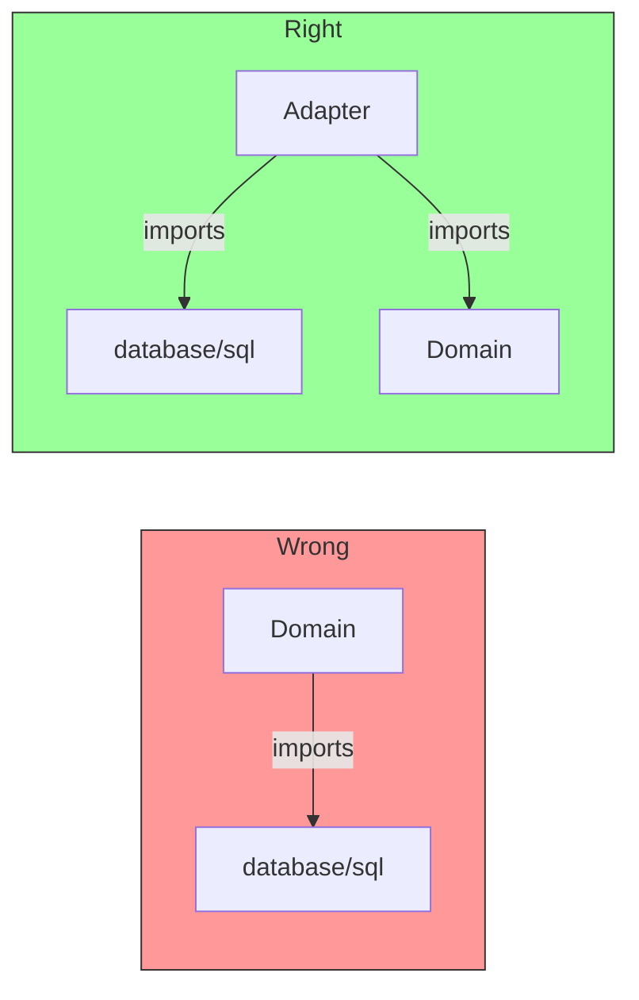
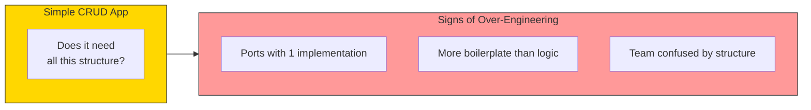

# Common Pitfalls

## Sam's Scenario

A few weeks into refactoring BookShelf, Sam hit a roadblock. His code was getting messy again - validation logic was creeping into his HTTP handlers, and his domain entities were importing database packages.

"I think I'm doing hexagonal architecture wrong," Sam admitted to Alex during a code review.

Alex pulled up Sam's code. "You've fallen into some common traps. Let me show you the most frequent pitfalls and how to avoid them."

## Common Mistakes

Even experienced developers make mistakes when implementing Hexagonal Architecture. Here are the most common pitfalls and how to avoid them.

## Pitfall 1: Domain Importing Infrastructure



```go
// ❌ WRONG: Domain knows about SQL
package entities

import "database/sql"

type User struct {
    db *sql.DB  // Infrastructure leak!
}

// ✅ RIGHT: Domain is pure
package entities

type User struct {
    ID    string
    Name  string
    Email string
}
```

## Pitfall 2: Business Logic in Adapters

```go
// ❌ WRONG: Business logic in HTTP handler
func (h *Handler) CreateUser(w http.ResponseWriter, r *http.Request) {
    // Business rule in adapter!
    if existingUser := h.db.FindByEmail(email); existingUser != nil {
        http.Error(w, "email taken", 400)
        return
    }

    // More business logic...
    if len(name) < 2 {
        http.Error(w, "name too short", 400)
        return
    }
}

// ✅ RIGHT: Adapter just translates
func (h *Handler) CreateUser(w http.ResponseWriter, r *http.Request) {
    var req CreateUserRequest
    json.NewDecoder(r.Body).Decode(&req)

    user, err := h.userService.CreateUser(ctx, ports.CreateUserInput{
        Name:  req.Name,
        Email: req.Email,
    })

    if err != nil {
        h.handleError(w, err)  // Translate error to HTTP
        return
    }

    w.WriteHeader(http.StatusCreated)
    json.NewEncoder(w).Encode(user)
}
```

## Pitfall 3: Over-Engineering Simple Apps



**Rule of thumb**: If your business logic fits in one file, you might not need full Hexagonal Architecture.

## Pitfall 4: Leaking Infrastructure Errors

```go
// ❌ WRONG: Infrastructure error leaks to domain
func (r *PostgresRepo) FindByID(ctx context.Context, id string) (*User, error) {
    var user User
    err := r.db.QueryRow(...).Scan(...)
    if err == sql.ErrNoRows {
        return nil, sql.ErrNoRows  // Infrastructure error!
    }
    return &user, err
}

// ✅ RIGHT: Translate to domain error
func (r *PostgresRepo) FindByID(ctx context.Context, id string) (*User, error) {
    var user User
    err := r.db.QueryRow(...).Scan(...)
    if err == sql.ErrNoRows {
        return nil, entities.ErrUserNotFound  // Domain error
    }
    return &user, err
}
```

## Pitfall 5: Anemic Domain Model

```go
// ❌ WRONG: Entity is just data
type User struct {
    ID    string
    Name  string
    Email string
}

// All logic in use case
func (uc *UseCase) CreateUser(name, email string) (*User, error) {
    if len(name) < 2 {
        return nil, ErrNameTooShort
    }
    // Validation belongs in entity!
}

// ✅ RIGHT: Entity has behavior
type User struct {
    ID    string
    name  string
    email string
}

func NewUser(name, email string) (*User, error) {
    if len(name) < 2 {
        return nil, ErrNameTooShort
    }
    if !isValidEmail(email) {
        return nil, ErrInvalidEmail
    }
    return &User{ID: uuid.New().String(), name: name, email: email}, nil
}

func (u *User) UpdateEmail(email string) error {
    if !isValidEmail(email) {
        return ErrInvalidEmail
    }
    u.email = email
    return nil
}
```

## Pitfall Summary

| Pitfall | Symptom | Fix |
|---------|---------|-----|
| **Infrastructure in domain** | Domain imports `database/sql`, `net/http` | Move to adapters |
| **Logic in adapters** | Handlers contain business rules | Move to use cases |
| **Over-engineering** | Simple app with complex structure | Start simpler |
| **Error leakage** | `sql.ErrNoRows` reaches use cases | Translate in adapter |
| **Anemic domain** | Entities are just structs | Add behavior |
| **Skip testing** | "I'll add tests later" | TDD from start |

## Sam's Recovery

After Alex's review, Sam refactored his problematic code. He moved the "user can borrow" validation from his HTTP handler into the User entity. He translated SQL errors to domain errors in his repository adapter. He added behavior to his Loan entity for calculating late fees.

"Much better," Alex said after the second review. "Your domain is pure again, your adapters are thin, and your business logic lives in the right place. These pitfalls are easy to fall into, but also easy to fix once you recognize them."

Sam nodded. "The key is constant vigilance. Every time I write code, I ask myself: 'Does this belong in the domain, use case, or adapter?' That simple question keeps me on track."
