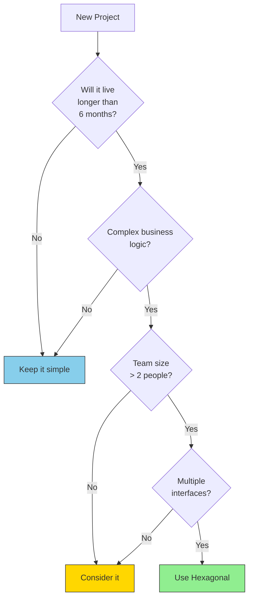
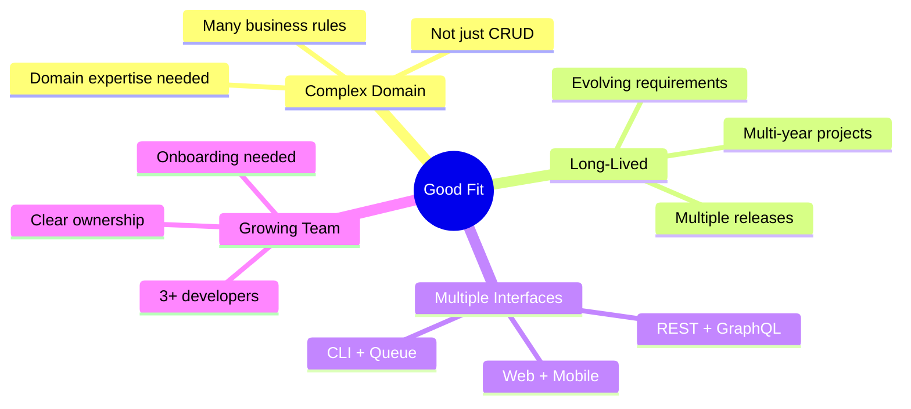
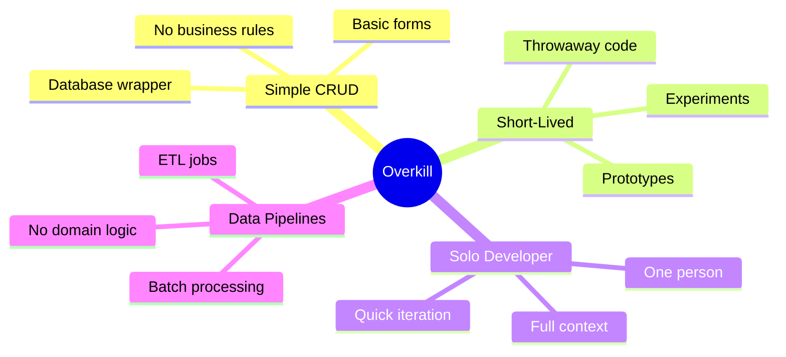
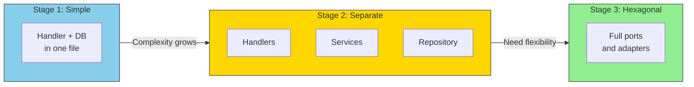

# When to Use Hexagonal Architecture

## Sam's Scenario

Sam's friend Riley was starting a new project and asked Sam for advice. "Should I use hexagonal architecture from day one like you did with BookShelf?"

Sam paused. "BookShelf is a complex system with multiple interfaces, evolving requirements, and needs to support different deployment models. But what are you building?"

"Just a simple internal tool for tracking office supplies," Riley replied. "It's basically CRUD operations on a few tables."

Sam shook his head. "Then no - hexagonal architecture would be overkill. Let me show you when it makes sense and when it doesn't."

## Making the Decision

Hexagonal Architecture is powerful but not always necessary. Here's a practical guide to help you decide.

## The Decision Matrix

## Good Fit: Use Hexagonal

**Examples:**
- E-commerce platforms with complex pricing rules
- Financial applications with regulatory requirements
- Healthcare systems with complex workflows
- Enterprise SaaS with multiple integration points

## Overkill: Keep It Simple

**Examples:**
- Landing page backends
- Simple REST wrappers
- Prototypes and MVPs
- One-off scripts
- Internal tools with basic needs

## The Gradual Approach

You don't have to commit upfront. Start simple and evolve:

## Questions to Ask

| Question | If Yes → Hexagonal | If No → Keep Simple |
|----------|-------------------|---------------------|
| Will this exist in 2+ years? | ✓ | |
| Multiple data sources? | ✓ | |
| Need high test coverage? | ✓ | |
| Team growing? | ✓ | |
| Complex business rules? | ✓ | |
| Multiple interfaces? | ✓ | |
| Replacing existing system? | ✓ | |

## Signs You Made the Wrong Choice

**Used Hexagonal when you shouldn't have:**
- Spending more time on structure than features
- Ports with single implementations that won't change
- Team confused by the layers

**Didn't use it when you should have:**
- Fear of refactoring
- Tests require full infrastructure
- New developers take months to onboard
- Simple changes break unrelated code

## The Bottom Line

> **When in doubt, start simpler.** It's easier to add structure than to remove it.

You can always refactor toward Hexagonal Architecture when:
- The codebase becomes hard to test
- You need to add a new interface (CLI, GraphQL)
- You want to swap a technology (new database)
- The team is growing and needs clearer boundaries

## Sam's Advice to Riley

"For your supply tracking tool, start with a simple handler-service-repository pattern," Sam advised. "Three layers, minimal ceremony. But if it grows - if you need a mobile app, if the business logic gets complex, if you're adding multiple integrations - then migrate to hexagonal architecture."

Riley nodded. "That makes sense. Use the right tool for the job."

"Exactly," Sam agreed. "Hexagonal architecture saved BookShelf. It let me add Maya's mobile requirements and Chen's enterprise features without rewriting everything. But for a simple internal tool? It would just slow you down."
