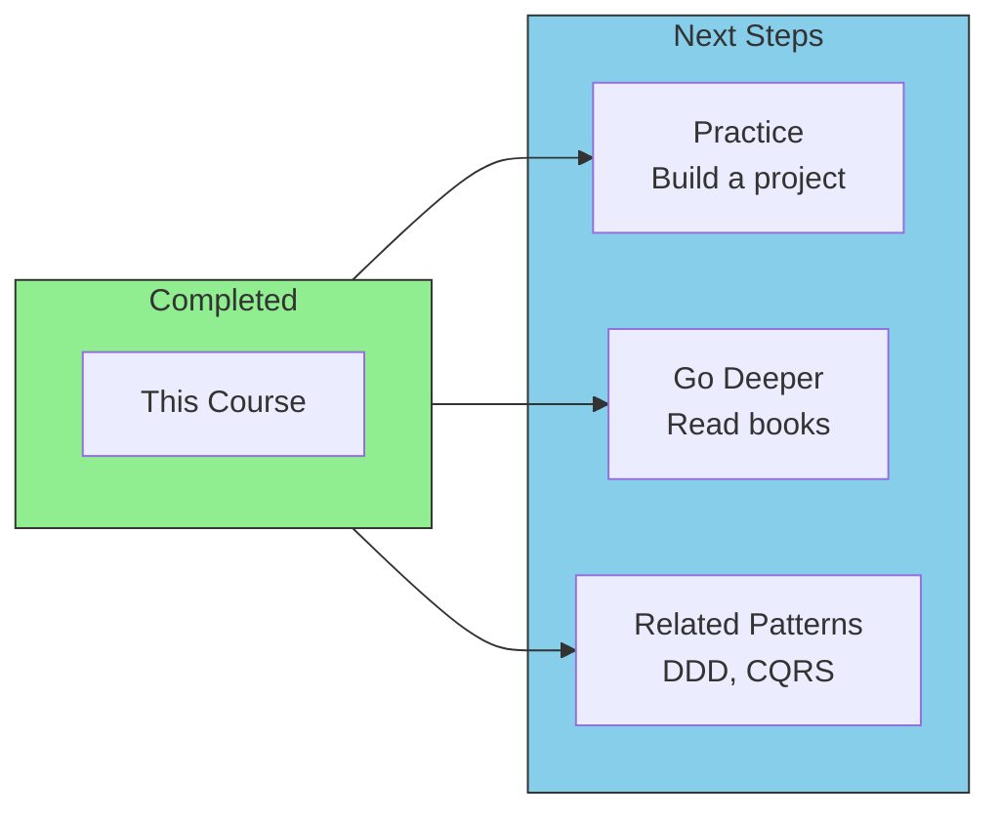
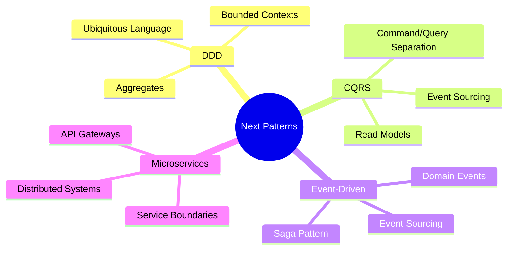
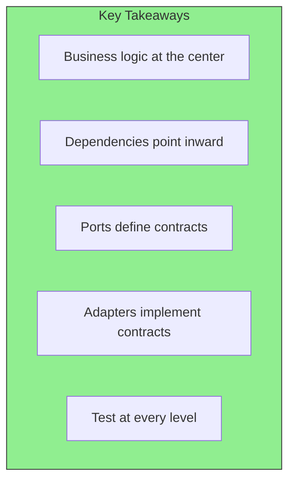

# Resources and Next Steps

## Sam's Scenario

Sam had come a long way with BookShelf. From a weekend hackathon project to a well-architected system serving real users. Alex met with Sam for one final session.

"You've mastered hexagonal architecture," Alex said. "BookShelf is clean, testable, and ready to scale. But this is just the beginning. What's next?"

Sam had been thinking about this. "I want to go deeper. Learn about domain-driven design, event sourcing, CQRS. BookShelf is growing, and I want to keep learning the best patterns."

Alex smiled. "That's the right mindset. Let me point you to resources that will take you to the next level."

## Continuing Your Journey

Congratulations on completing this course! Here's where to go next to deepen your understanding.

## Your Learning Journey

## Recommended Books

| Book | Author | Focus |
|------|--------|-------|
| **Clean Architecture** | Robert C. Martin | Dependency rule, enterprise patterns |
| **Domain-Driven Design** | Eric Evans | Strategic and tactical DDD |
| **Implementing DDD** | Vaughn Vernon | Practical DDD implementation |
| **Get Your Hands Dirty on Clean Architecture** | Tom Hombergs | Hands-on with Java examples |

## Key Articles

- **Original Hexagonal Architecture** - Alistair Cockburn's 2005 article
- **The Clean Architecture** - Uncle Bob's blog post
- **Onion Architecture** - Jeffrey Palermo's articles

## Related Patterns to Learn

## Practice Project Ideas

1. **Library Management System (like BookShelf)**
   - Entities: Book, User, Loan
   - Adapters: REST, GraphQL, PostgreSQL, Email
   - Features: Borrow, return, late fees, reservations

2. **Order Management System**
   - Entities: Order, Product, Customer
   - Adapters: REST, GraphQL, MongoDB, Stripe
   - Features: Cart, checkout, payment, notifications

3. **Content Management System**
   - Entities: Article, Category, Author
   - Adapters: REST, CLI, SQLite, S3
   - Features: CRUD, file uploads, search

## Checklist Before Building

Before your next project, ask yourself:

- [ ] Have I identified my core domain entities?
- [ ] Have I defined my driving ports (what the app does)?
- [ ] Have I defined my driven ports (what the app needs)?
- [ ] Is my domain free of infrastructure concerns?
- [ ] Can I test my use cases with mocks?
- [ ] Is my project structure clear and navigable?

## Communities

- **Go Discord** - #architecture channel
- **Reddit** - r/golang, r/softwarearchitecture
- **Dev.to** - Clean architecture tag
- **GitHub** - Search "hexagonal architecture go" for examples

## Final Thoughts

The best way to learn is by doing. Start with a small project, apply the patterns, make mistakes, and iterate.

**Happy architecting!**

## Sam's Final Thoughts

Six months after starting BookShelf, Sam reflected on his journey. The hexagonal architecture principles Alex taught him had transformed not just his code, but his entire approach to software design.

"I used to write code that worked today," Sam wrote in his blog. "Now I write code that can evolve tomorrow. BookShelf started as a weekend project and grew into a real product serving thousands of users. Without hexagonal architecture, I would have had to rewrite it from scratch. Instead, I just kept adding adapters and extending use cases."

He closed his laptop and smiled. The real journey was just beginning.
