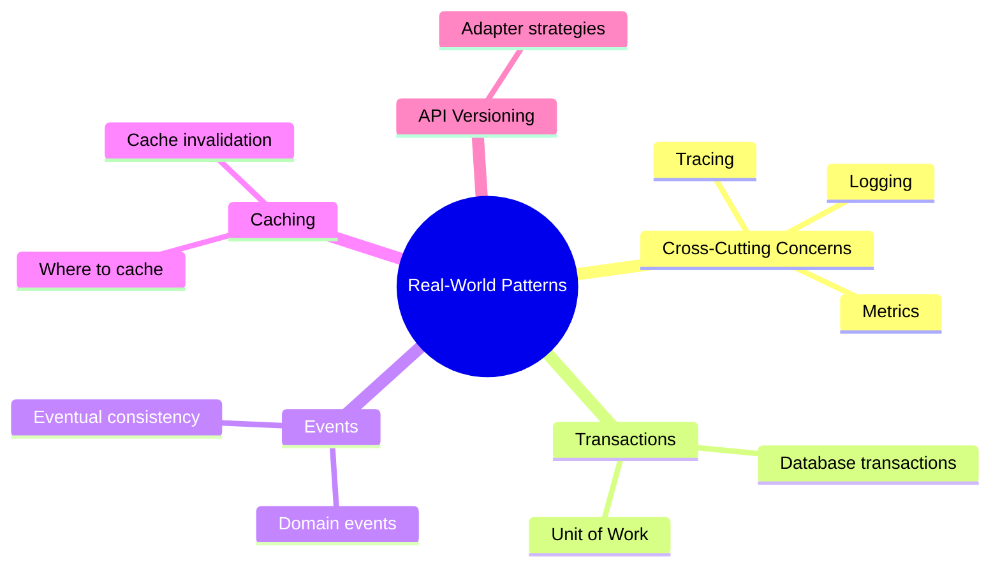

# Real-World Patterns

Now that you understand the basics, let's look at advanced patterns for handling real-world challenges in Hexagonal Architecture.

## What You'll Learn in This Chapter

## Chapter Overview

### 8.1 Cross-Cutting Concerns
Learn how to add logging, metrics, and tracing without polluting your domain.

### 8.2 Transaction Management
Handle database transactions that span multiple repository operations.

### 8.3 Event-Driven Patterns
Implement domain events for decoupled, scalable systems.

### 8.4 Caching Strategies
Understand where caching fits in the architecture and how to implement it cleanly.

### 8.5 API Versioning
Manage change in your driving adapters while keeping the domain stable.

## Why These Patterns Matter

Real applications need more than basic CRUD operations. These patterns help you:

- **Scale** your application as load increases
- **Debug** issues in production with proper observability
- **Evolve** your API without breaking clients
- **Maintain** performance with smart caching
- **Decouple** components with events

Let's dive in!
