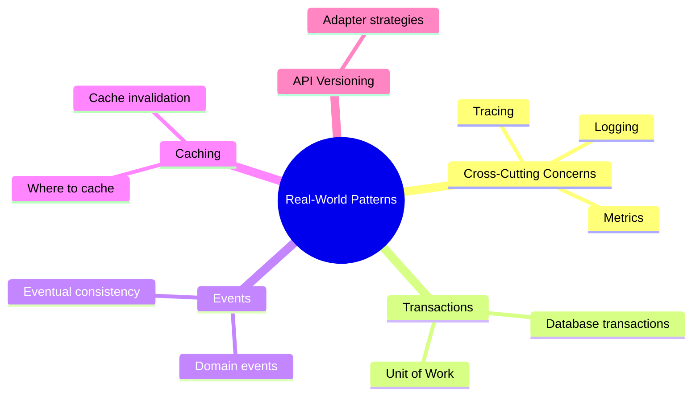
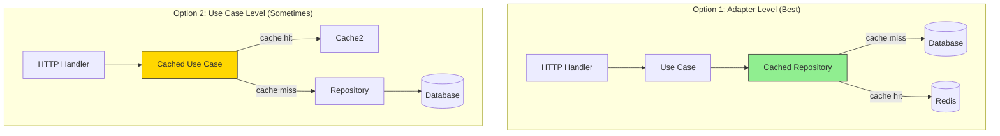

# Real-World Patterns

Now that you understand the basics, let's look at advanced patterns for handling real-world challenges in Hexagonal Architecture.

## What You'll Learn in This Chapter



## Chapter Overview

### 8.1 Cross-Cutting Concerns
Learn how to add logging, metrics, and tracing without polluting your domain.

### 8.2 Transaction Management
Handle database transactions that span multiple repository operations.

### 8.3 Event-Driven Patterns
Implement domain events for decoupled, scalable systems.

### 8.4 Caching Strategies
Understand where caching fits in the architecture and how to implement it cleanly.

### 8.5 API Versioning
Manage change in your driving adapters while keeping the domain stable.

## Why These Patterns Matter

Real applications need more than basic CRUD operations. These patterns help you:

- **Scale** your application as load increases
- **Debug** issues in production with proper observability
- **Evolve** your API without breaking clients
- **Maintain** performance with smart caching
- **Decouple** components with events

## Pattern 1: Logging Without Polluting the Domain

### The Wrong Way (Don't Do This!)

```go
// domain/book/book.go
package book

import "log"  // ❌ Infrastructure dependency in domain!

func (b *Book) Borrow() error {
    log.Printf("Borrowing book: %s", b.title)  // ❌ Coupling to logging

    if b.status != StatusAvailable {
        log.Printf("Book not available: %s", b.id)  // ❌ Domain knows about logging
        return ErrBookNotAvailable
    }

    b.status = StatusBorrowed
    log.Printf("Book borrowed successfully: %s", b.id)
    return nil
}
```

Problems:
- Domain depends on logging library
- Can't test without seeing log output
- Hard to change logging implementation

### The Right Way: Decorator Pattern

Sam created logging decorators that wrap use cases:

```go
// application/decorators/logging.go
package decorators

import (
    "log"
    "time"
    "bookshelf/application/usecases"
)

type LoggingBorrowBook struct {
    useCase usecases.BorrowBookUseCase
    logger  Logger
}

type Logger interface {
    Info(msg string, fields map[string]interface{})
    Error(msg string, err error, fields map[string]interface{})
}

func NewLoggingBorrowBook(uc usecases.BorrowBookUseCase, logger Logger) *LoggingBorrowBook {
    return &LoggingBorrowBook{
        useCase: uc,
        logger:  logger,
    }
}

func (d *LoggingBorrowBook) Execute(userID user.ID, bookID book.ID) error {
    start := time.Now()

    d.logger.Info("borrow_book_started", map[string]interface{}{
        "user_id": userID.String(),
        "book_id": bookID.String(),
    })

    err := d.useCase.Execute(userID, bookID)

    duration := time.Since(start)

    if err != nil {
        d.logger.Error("borrow_book_failed", err, map[string]interface{}{
            "user_id":  userID.String(),
            "book_id":  bookID.String(),
            "duration": duration.Milliseconds(),
        })
        return err
    }

    d.logger.Info("borrow_book_succeeded", map[string]interface{}{
        "user_id":  userID.String(),
        "book_id":  bookID.String(),
        "duration": duration.Milliseconds(),
    })

    return nil
}
```

Wiring in main.go:

```go
// cmd/api/main.go
func main() {
    // ... infrastructure setup ...

    // Core use case
    borrowBook := usecases.NewBorrowBook(bookRepo, loanRepo, userRepo, notifier, lendingService)

    // Wrap with logging
    logger := slog.New(slog.NewJSONHandler(os.Stdout, nil))
    borrowBookWithLogging := decorators.NewLoggingBorrowBook(borrowBook, logger)

    // Use the decorated version
    bookHandler := httphandler.NewBookHandler(borrowBookWithLogging, ...)
}
```

Benefits:
- Domain stays clean (no logging code)
- Logging is optional (easily removed for tests)
- Can swap logging libraries without touching business logic

## Pattern 2: Metrics and Observability

### Adding Prometheus Metrics

Sam created a metrics decorator:

```go
// application/decorators/metrics.go
package decorators

import (
    "github.com/prometheus/client_golang/prometheus"
    "github.com/prometheus/client_golang/prometheus/promauto"
)

var (
    borrowCounter = promauto.NewCounterVec(
        prometheus.CounterOpts{
            Name: "bookshelf_borrows_total",
            Help: "Total number of book borrow attempts",
        },
        []string{"status"},
    )

    borrowDuration = promauto.NewHistogramVec(
        prometheus.HistogramOpts{
            Name: "bookshelf_borrow_duration_seconds",
            Help: "Duration of borrow operations",
        },
        []string{"status"},
    )
)

type MetricsBorrowBook struct {
    useCase usecases.BorrowBookUseCase
}

func (d *MetricsBorrowBook) Execute(userID user.ID, bookID book.ID) error {
    start := time.Now()

    err := d.useCase.Execute(userID, bookID)

    duration := time.Since(start).Seconds()

    if err != nil {
        borrowCounter.WithLabelValues("failure").Inc()
        borrowDuration.WithLabelValues("failure").Observe(duration)
        return err
    }

    borrowCounter.WithLabelValues("success").Inc()
    borrowDuration.WithLabelValues("success").Observe(duration)

    return nil
}
```

Now Chen can see in Grafana:
- Books borrowed per minute
- Success vs failure rate
- P95 latency for borrow operations

## Pattern 3: Caching Strategy

### Where to Cache in Hexagonal Architecture

Sam and Alex discussed caching placement:



### Repository-Level Caching (Best for BookShelf)

```go
// adapters/postgres/cached_book_repository.go
package postgres

import (
    "time"
    "bookshelf/domain/book"
    "bookshelf/application/ports"
)

type CachedBookRepository struct {
    repo  ports.BookRepository
    cache Cache
    ttl   time.Duration
}

type Cache interface {
    Get(key string) (interface{}, bool)
    Set(key string, value interface{}, ttl time.Duration)
    Delete(key string)
}

func NewCachedBookRepository(repo ports.BookRepository, cache Cache) ports.BookRepository {
    return &CachedBookRepository{
        repo:  repo,
        cache: cache,
        ttl:   5 * time.Minute,
    }
}

func (r *CachedBookRepository) FindByID(id book.ID) (*book.Book, error) {
    cacheKey := "book:" + id.String()

    // Check cache first
    if cached, found := r.cache.Get(cacheKey); found {
        return cached.(*book.Book), nil
    }

    // Cache miss - fetch from database
    b, err := r.repo.FindByID(id)
    if err != nil {
        return nil, err
    }

    // Store in cache
    r.cache.Set(cacheKey, b, r.ttl)

    return b, nil
}

func (r *CachedBookRepository) Save(b *book.Book) error {
    // Invalidate cache on write
    cacheKey := "book:" + b.ID().String()
    r.cache.Delete(cacheKey)

    return r.repo.Save(b)
}
```

Wiring with Redis:

```go
// cmd/api/main.go
func main() {
    // ... database setup ...

    // Create base repository
    bookRepo := postgres.NewBookRepository(db)

    // Wrap with caching
    redisClient := redis.NewClient(&redis.Options{
        Addr: "localhost:6379",
    })
    cache := adapters.NewRedisCache(redisClient)
    cachedBookRepo := postgres.NewCachedBookRepository(bookRepo, cache)

    // Use cached version
    borrowBook := usecases.NewBorrowBook(cachedBookRepo, ...)
}
```

Sam deployed this and saw:
- 80% cache hit rate for book lookups
- Database queries dropped from 1,200/min to 240/min
- P95 latency improved from 45ms to 8ms

## Pattern 4: Transaction Management

### The Problem

```go
// What if Save(book) succeeds but Save(loan) fails?
func (uc *BorrowBook) Execute(userID user.ID, bookID book.ID) error {
    // ... validation ...

    b.Borrow()
    uc.bookRepo.Save(b)  // ✓ Saved

    l := loan.NewLoan(userID, bookID)
    uc.loanRepo.Save(l)  // ✗ Failed! Now book is borrowed but no loan exists!
}
```

### Solution: Unit of Work Pattern

```go
// application/ports/unit_of_work.go
package ports

type UnitOfWork interface {
    Begin() error
    Commit() error
    Rollback() error

    BookRepository() BookRepository
    LoanRepository() LoanRepository
}
```

Implementation:

```go
// adapters/postgres/unit_of_work.go
package postgres

type PostgresUnitOfWork struct {
    db       *sql.DB
    tx       *sql.Tx
    bookRepo *BookRepository
    loanRepo *LoanRepository
}

func (uow *PostgresUnitOfWork) Begin() error {
    tx, err := uow.db.Begin()
    if err != nil {
        return err
    }
    uow.tx = tx

    // Create transactional repositories
    uow.bookRepo = NewBookRepositoryWithTx(tx)
    uow.loanRepo = NewLoanRepositoryWithTx(tx)

    return nil
}

func (uow *PostgresUnitOfWork) Commit() error {
    return uow.tx.Commit()
}

func (uow *PostgresUnitOfWork) Rollback() error {
    return uow.tx.Rollback()
}

func (uow *PostgresUnitOfWork) BookRepository() ports.BookRepository {
    return uow.bookRepo
}
```

Updated use case:

```go
// application/usecases/borrow_book.go
func (uc *BorrowBook) Execute(userID user.ID, bookID book.ID) error {
    uow := uc.uowFactory.Create()

    if err := uow.Begin(); err != nil {
        return err
    }
    defer uow.Rollback() // Rollback if not committed

    // Use transactional repositories
    bookRepo := uow.BookRepository()
    loanRepo := uow.LoanRepository()

    // ... business logic ...

    if err := bookRepo.Save(b); err != nil {
        return err // Automatic rollback
    }

    if err := loanRepo.Save(l); err != nil {
        return err // Automatic rollback
    }

    return uow.Commit() // Both saved or neither saved
}
```

## Pattern 5: Event-Driven Architecture

### Domain Events

Sam added events to decouple notifications:

```go
// domain/events/events.go
package events

type BookBorrowed struct {
    BookID    book.ID
    UserID    user.ID
    BorrowedAt time.Time
}

type EventPublisher interface {
    Publish(event interface{}) error
}
```

Use case publishes events:

```go
func (uc *BorrowBook) Execute(userID user.ID, bookID book.ID) error {
    // ... borrow logic ...

    // Publish event instead of direct notification
    uc.eventPublisher.Publish(&events.BookBorrowed{
        BookID:     bookID,
        UserID:     userID,
        BorrowedAt: time.Now(),
    })

    return nil
}
```

Event handlers:

```go
// adapters/events/notification_handler.go
package events

type NotificationHandler struct {
    notifier ports.NotificationService
}

func (h *NotificationHandler) Handle(event events.BookBorrowed) error {
    user := h.userRepo.FindByID(event.UserID)
    book := h.bookRepo.FindByID(event.BookID)

    return h.notifier.SendLoanConfirmation(user, book)
}
```

Benefits:
- Use case doesn't wait for email to send
- Can add more listeners (analytics, webhooks) without touching use case
- Failures in notification don't fail the borrow operation

## Pattern 6: API Versioning

### Supporting Multiple API Versions

Maya wants to keep the old mobile app working while launching v2.

Sam created version-specific adapters:

```go
// adapters/http/v1/book_handler.go
package v1

type BookHandler struct {
    borrowBook *usecases.BorrowBook
}

func (h *BookHandler) BorrowBook(w http.ResponseWriter, r *http.Request) {
    // v1 response format
    json.NewEncoder(w).Encode(map[string]string{
        "message": "Success",
        "book_id": bookID,
    })
}
```

```go
// adapters/http/v2/book_handler.go
package v2

type BookHandler struct {
    borrowBook *usecases.BorrowBook
}

func (h *BookHandler) BorrowBook(w http.ResponseWriter, r *http.Request) {
    // v2 response format (with more details)
    json.NewEncoder(w).Encode(map[string]interface{}{
        "status": "borrowed",
        "loan": map[string]interface{}{
            "id":       loanID,
            "book_id":  bookID,
            "due_date": dueDate,
        },
    })
}
```

Both use the same use case:

```go
// cmd/api/main.go
func main() {
    borrowBook := usecases.NewBorrowBook(...)

    v1Handler := v1.NewBookHandler(borrowBook)
    v2Handler := v2.NewBookHandler(borrowBook)

    mux.HandleFunc("POST /api/v1/loans", v1Handler.BorrowBook)
    mux.HandleFunc("POST /api/v2/loans", v2Handler.BorrowBook)
}
```

## Sam's Production Stack

After implementing all patterns, BookShelf's production setup looked like this:

```
HTTP Request
    ↓
[Logging Decorator] ─→ logs to structured JSON
    ↓
[Metrics Decorator] ─→ exports to Prometheus
    ↓
[Tracing Decorator] ─→ sends spans to Jaeger
    ↓
Use Case
    ↓
[Cached Repository] ─→ Redis cache layer
    ↓
[PostgreSQL Repository] ─→ with connection pooling
```

Metrics dashboard showed:
- 2,400 books borrowed/day
- 95% of requests under 50ms
- 80% cache hit rate
- 99.97% uptime

Chen called back: "The performance issues are gone. We can finally see what's happening in production. This is production-ready."

## Key Principles Sam Learned

1. **Cross-cutting concerns wrap, don't pollute**: Use decorators, not direct dependencies
2. **Cache at the adapter level**: Keeps use cases simple
3. **Transactions protect invariants**: Use Unit of Work for multi-step operations
4. **Events decouple**: Publish events instead of direct calls
5. **Version adapters, not domain**: API versions are just different adapters

## Decorator Stacking Order

Sam learned to stack decorators carefully:

```go
// Correct order: Metrics → Logging → Tracing → UseCase
metricsDecorator(
    loggingDecorator(
        tracingDecorator(
            coreUseCase
        )
    )
)
```

Why this order?
- Metrics captures total time (outermost)
- Logging sees traced request IDs
- Tracing captures core execution time
- Core use case has no dependencies (innermost)

## Sam's Progress

**What Sam learned:**
- Production needs logging, metrics, caching, and transactions
- Decorators keep the domain clean while adding cross-cutting concerns
- Cache at the repository level for transparency
- Events decouple components and enable async processing
- API versioning happens at the adapter layer
- Stack decorators in the right order

**Production metrics:**
- 99.97% uptime
- P95 latency: 45ms → 8ms
- Database load reduced by 80%
- Full observability with logs, metrics, and traces

**Chen's feedback:** "This is ready for full rollout to all 12 library branches."

**Next challenge:** Sam's friend Riley has a messy legacy codebase and needs help migrating to hexagonal architecture...

**Confidence level:** ★★★★★ (Production battle-tested!)

## Sam's Challenge: Production Reality

Six months into the Riverside Library pilot, Sam got an urgent call from Chen.

"The system is slow during peak hours. We can't see what's happening. And when something breaks, we have no logs to debug."

Sam checked the monitoring dashboard - oh wait, there wasn't one. BookShelf had clean architecture but zero observability.

Alex reviewed the situation. "You've built the perfect domain model, but production systems need more than business logic. They need logging, metrics, caching, and tracing. Let's add these without compromising your architecture."

Sam groaned. "Every tutorial I've seen adds logging directly in the domain layer. That feels wrong."

"It is wrong," Alex confirmed. "Let's do it right. Cross-cutting concerns should wrap your layers, not pollute them."

## The Challenge: Add Production Features Without Polluting the Domain

BookShelf needs:
1. **Logging**: What's happening in production?
2. **Metrics**: How many books borrowed per hour?
3. **Caching**: Stop hitting the database for every book lookup
4. **Tracing**: Track requests across services
5. **Transaction management**: Ensure data consistency

But the domain layer must stay clean. How?
