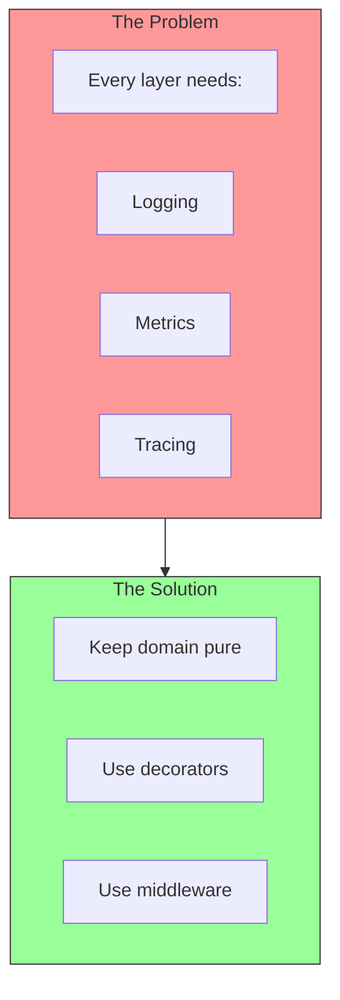
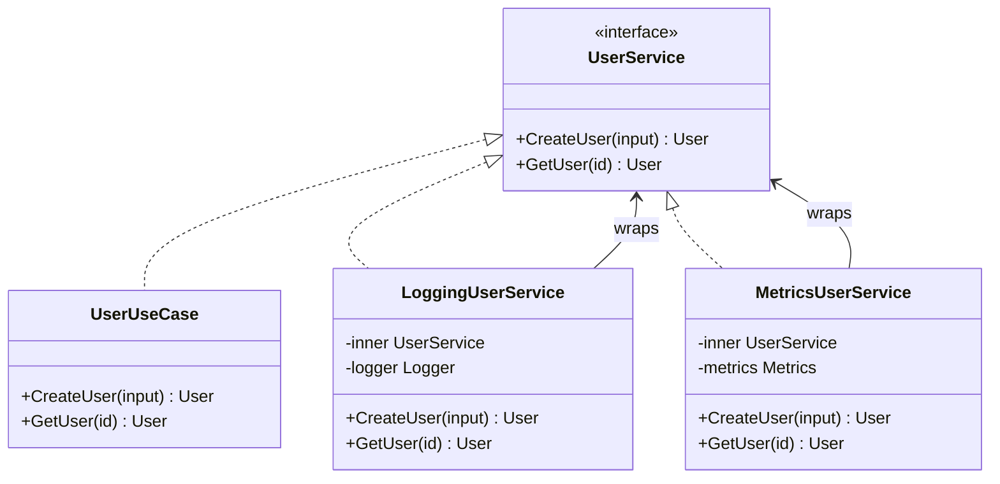

# Cross-Cutting Concerns

## Sam's Scenario

BookShelf was growing rapidly, and Sam needed to add observability. Maya wanted metrics on borrowing patterns. Chen needed detailed logs for compliance audits. But Sam didn't want to clutter his clean domain logic with logging and metrics calls.

"How do I add logging everywhere without putting logger.Info() calls in every method?" Sam asked Alex.

"Cross-cutting concerns," Alex explained. "You use decorators and middleware to wrap your services without changing them. Let me show you how to add logging, metrics, and tracing to BookShelf without touching your domain."

## Handling Cross-Cutting Concerns

Cross-cutting concerns like logging, metrics, and tracing touch every part of your application. In Hexagonal Architecture, we handle them without polluting the domain.

## The Challenge



## Where Cross-Cutting Concerns Live

| Concern | Where | How |
|---------|-------|-----|
| **Request logging** | Driving adapters | Middleware |
| **Business metrics** | Use cases | Decorator pattern |
| **DB query logging** | Driven adapters | Decorator pattern |
| **Tracing** | All layers | Context propagation |

## Middleware for HTTP Adapters

```go
// adapters/http/middleware/logging.go
func LoggingMiddleware(logger *slog.Logger) func(http.Handler) http.Handler {
    return func(next http.Handler) http.Handler {
        return http.HandlerFunc(func(w http.ResponseWriter, r *http.Request) {
            start := time.Now()

            // Wrap response writer to capture status
            wrapped := &responseWriter{ResponseWriter: w, status: 200}

            next.ServeHTTP(wrapped, r)

            logger.Info("request completed",
                "method", r.Method,
                "path", r.URL.Path,
                "status", wrapped.status,
                "duration", time.Since(start),
            )
        })
    }
}
```

## Decorator Pattern for Use Cases



```go
// Logging decorator
type LoggingUserService struct {
    inner  ports.UserService
    logger *slog.Logger
}

func (s *LoggingUserService) CreateUser(ctx context.Context, input ports.CreateUserInput) (*entities.User, error) {
    s.logger.Info("creating user", "email", input.Email)

    user, err := s.inner.CreateUser(ctx, input)

    if err != nil {
        s.logger.Error("failed to create user", "error", err)
    } else {
        s.logger.Info("user created", "id", user.ID)
    }

    return user, err
}

// Metrics decorator
type MetricsUserService struct {
    inner   ports.UserService
    metrics *prometheus.Registry
    counter *prometheus.CounterVec
}

func (s *MetricsUserService) CreateUser(ctx context.Context, input ports.CreateUserInput) (*entities.User, error) {
    timer := prometheus.NewTimer(s.histogram)
    defer timer.ObserveDuration()

    user, err := s.inner.CreateUser(ctx, input)

    if err != nil {
        s.counter.WithLabelValues("create_user", "error").Inc()
    } else {
        s.counter.WithLabelValues("create_user", "success").Inc()
    }

    return user, err
}
```

## Wiring Decorators in main.go

```go
func main() {
    // Create base use case
    userUseCase := usecases.NewUserUseCase(userRepo, emailSender, logger)

    // Wrap with logging
    var userService ports.UserService = userUseCase
    userService = NewLoggingUserService(userService, logger)
    userService = NewMetricsUserService(userService, metrics)

    // Use wrapped service in handlers
    userHandler := http.NewUserHandler(userService)
}
```

## Context Propagation for Tracing

```go
// Pass trace context through all layers
func (uc *UserUseCase) CreateUser(ctx context.Context, input ports.CreateUserInput) (*entities.User, error) {
    // Trace ID is in context
    span, ctx := tracer.StartSpan(ctx, "CreateUser")
    defer span.End()

    // Pass context to repository
    user, err := uc.userRepo.Save(ctx, user)
    // Trace continues through adapter
}
```

## Best Practices

| Practice | Description |
|----------|-------------|
| **Keep domain pure** | No logging imports in entities |
| **Use decorators** | Wrap services for cross-cutting concerns |
| **Use middleware** | For HTTP-specific concerns |
| **Propagate context** | Pass ctx through all layers for tracing |
| **Wire in main.go** | Composition root controls decoration |

## Sam's Implementation

Sam added logging and metrics decorators to BookShelf. His domain code stayed clean - no logger imports in Book, User, or Loan entities. His use cases remained focused on business logic. But in main.go, he wrapped his BorrowBookUseCase with LoggingDecorator and MetricsDecorator.

"Perfect," Maya said during a demo. "I can see exactly how many books are borrowed per hour, average processing time, and error rates. And you didn't have to change your business logic at all."

Sam smiled. "That's the decorator pattern. Cross-cutting concerns stay at the edges where they belong."
