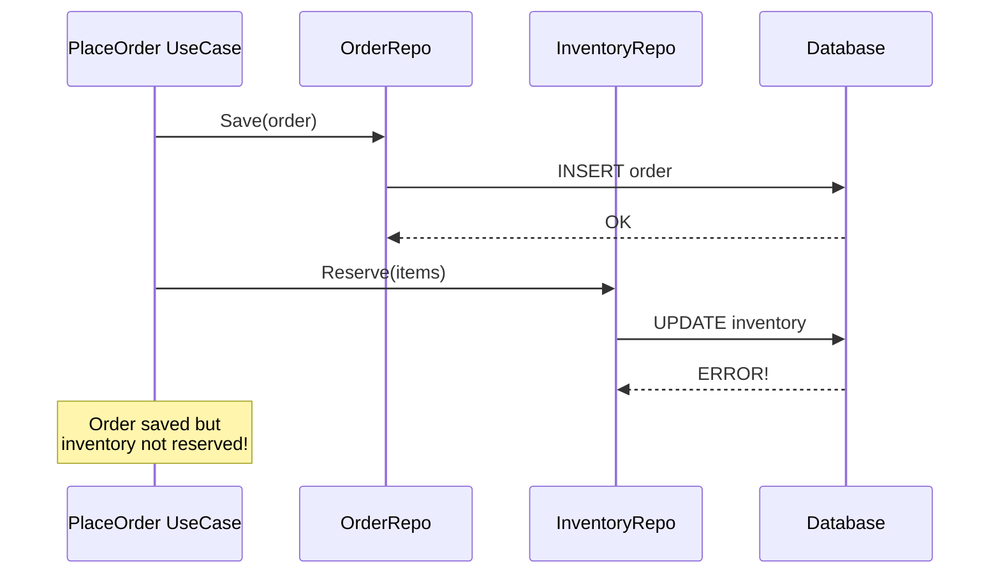
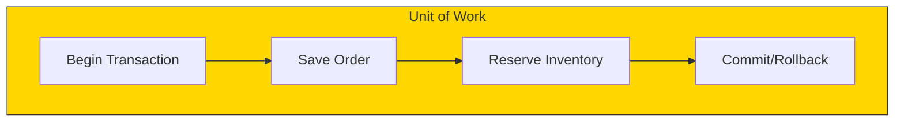

# Transaction Management

## Sam's Scenario

Sam discovered a critical bug in BookShelf: when a user borrowed a book, sometimes the loan was created but the book wasn't marked as unavailable. The operations weren't atomic, leading to race conditions where two users could borrow the same book.

"You need transactions," Alex explained. "When you borrow a book, you need to create the loan AND mark the book unavailable in a single atomic operation. If either fails, both should roll back. Let me show you how to implement the Unit of Work pattern in hexagonal architecture."

## The Transaction Problem

When a use case needs to save to multiple repositories atomically, you need transaction management. Here's how to do it in Hexagonal Architecture.

## The Problem



Without transactions, you can end up with inconsistent data.

## Solution: Unit of Work Pattern



## Transaction Port Interface

```go
// domain/ports/transaction.go
package ports

type TransactionManager interface {
    // Begin starts a new transaction and returns a context with it
    Begin(ctx context.Context) (context.Context, error)

    // Commit commits the transaction in the context
    Commit(ctx context.Context) error

    // Rollback rolls back the transaction in the context
    Rollback(ctx context.Context) error
}

// Helper for clean transaction handling
func WithTransaction(ctx context.Context, tm TransactionManager, fn func(ctx context.Context) error) error {
    ctx, err := tm.Begin(ctx)
    if err != nil {
        return err
    }

    if err := fn(ctx); err != nil {
        tm.Rollback(ctx)
        return err
    }

    return tm.Commit(ctx)
}
```

## Repository Aware of Transactions

```go
// Repositories can detect and use transactions from context
type OrderRepository interface {
    Save(ctx context.Context, order *Order) error
}

// adapters/db/postgres/order_repo.go
func (r *OrderRepository) Save(ctx context.Context, order *entities.Order) error {
    // Get transaction from context, or use pool directly
    executor := r.getExecutor(ctx)

    query := `INSERT INTO orders (id, customer_id, total) VALUES ($1, $2, $3)`
    _, err := executor.Exec(ctx, query, order.ID, order.CustomerID, order.Total)
    return err
}

func (r *OrderRepository) getExecutor(ctx context.Context) Executor {
    if tx := postgres.TxFromContext(ctx); tx != nil {
        return tx  // Use transaction
    }
    return r.pool  // Use connection pool
}
```

## Use Case with Transaction

```go
func (uc *OrderUseCase) PlaceOrder(ctx context.Context, input ports.PlaceOrderInput) (*entities.Order, error) {
    var order *entities.Order

    err := ports.WithTransaction(ctx, uc.txManager, func(ctx context.Context) error {
        // All operations use the same transaction

        // 1. Create order
        var err error
        order, err = entities.NewOrder(input.CustomerID, input.Items)
        if err != nil {
            return err
        }

        // 2. Reserve inventory
        for _, item := range order.Items {
            if err := uc.inventoryRepo.Reserve(ctx, item.ProductID, item.Quantity); err != nil {
                return err  // Triggers rollback
            }
        }

        // 3. Save order
        if err := uc.orderRepo.Save(ctx, order); err != nil {
            return err  // Triggers rollback
        }

        return nil  // Triggers commit
    })

    if err != nil {
        return nil, err
    }

    // Side effects after successful transaction
    uc.eventPublisher.Publish(ctx, events.OrderPlaced{OrderID: order.ID})

    return order, nil
}
```

## PostgreSQL Transaction Adapter

```go
// adapters/db/postgres/transaction.go
type TransactionManager struct {
    pool *pgxpool.Pool
}

type txKey struct{}

func (tm *TransactionManager) Begin(ctx context.Context) (context.Context, error) {
    tx, err := tm.pool.Begin(ctx)
    if err != nil {
        return nil, err
    }
    return context.WithValue(ctx, txKey{}, tx), nil
}

func (tm *TransactionManager) Commit(ctx context.Context) error {
    tx := TxFromContext(ctx)
    if tx == nil {
        return errors.New("no transaction in context")
    }
    return tx.Commit(ctx)
}

func (tm *TransactionManager) Rollback(ctx context.Context) error {
    tx := TxFromContext(ctx)
    if tx == nil {
        return nil
    }
    return tx.Rollback(ctx)
}

func TxFromContext(ctx context.Context) pgx.Tx {
    tx, _ := ctx.Value(txKey{}).(pgx.Tx)
    return tx
}
```

## Transaction Best Practices

| Practice | Description |
|----------|-------------|
| **Keep transactions short** | Don't include external API calls |
| **Rollback on error** | Always handle cleanup |
| **Side effects after commit** | Send emails/events after success |
| **Test rollback scenarios** | Verify consistency on failures |

## Sam's Fix

After implementing transactions for BorrowBook, Sam tested the race condition scenario again. Two users trying to borrow the same book simultaneously? The second transaction failed with a proper error. Creating a loan but failing to mark the book unavailable? The entire transaction rolled back, leaving the database consistent.

"Transactions are tricky," Sam told Alex. "But the Unit of Work pattern made them manageable. Now BookShelf's critical operations are atomic, and I can sleep better knowing the database stays consistent even under concurrent load."
