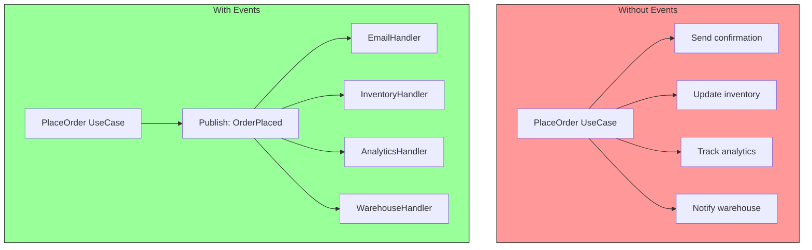
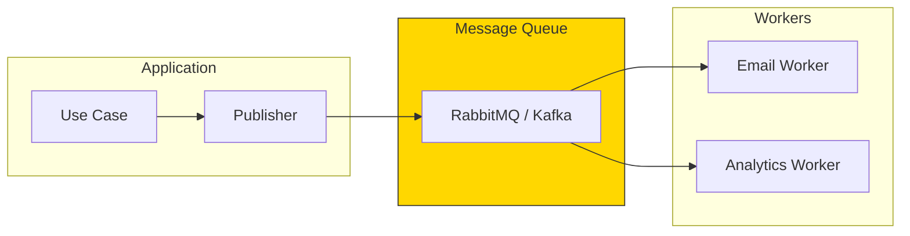

# Event-Driven Patterns

Domain events enable loose coupling between parts of your system. When something significant happens in your domain, publish an event.

## Why Domain Events?



With events:
- Use cases stay focused on core logic
- New handlers can be added without modifying use cases
- Handlers can be processed asynchronously

## Domain Event Structure

```go
// domain/events/events.go
package events

import "time"

// Base event interface
type Event interface {
    EventName() string
    OccurredAt() time.Time
}

// Base event struct
type BaseEvent struct {
    occurredAt time.Time
}

func (e BaseEvent) OccurredAt() time.Time {
    return e.occurredAt
}

// Specific domain events
type OrderPlaced struct {
    BaseEvent
    OrderID    string
    CustomerID string
    Total      int64
}

func (e OrderPlaced) EventName() string { return "order.placed" }

type UserRegistered struct {
    BaseEvent
    UserID string
    Email  string
}

func (e UserRegistered) EventName() string { return "user.registered" }
```

## Event Publisher Port

```go
// domain/ports/events.go
package ports

type EventPublisher interface {
    Publish(ctx context.Context, event events.Event) error
}

type EventSubscriber interface {
    Subscribe(eventName string, handler EventHandler)
}

type EventHandler func(ctx context.Context, event events.Event) error
```

## Publishing Events from Use Cases

```go
func (uc *OrderUseCase) PlaceOrder(ctx context.Context, input ports.PlaceOrderInput) (*entities.Order, error) {
    order, err := entities.NewOrder(input.CustomerID, input.Items)
    if err != nil {
        return nil, err
    }

    if err := uc.orderRepo.Save(ctx, order); err != nil {
        return nil, err
    }

    // Publish domain event
    event := events.OrderPlaced{
        BaseEvent:  events.NewBaseEvent(),
        OrderID:    order.ID,
        CustomerID: order.CustomerID,
        Total:      order.Total,
    }

    if err := uc.eventPublisher.Publish(ctx, event); err != nil {
        uc.logger.Warn("failed to publish event", "error", err)
        // Don't fail the operation for event publishing failure
    }

    return order, nil
}
```

## Event Handler Example

```go
// application/handlers/email_on_order.go
type EmailOnOrderHandler struct {
    emailSender ports.EmailSender
    orderRepo   repositories.OrderRepository
    logger      *slog.Logger
}

func (h *EmailOnOrderHandler) Handle(ctx context.Context, e events.Event) error {
    event, ok := e.(events.OrderPlaced)
    if !ok {
        return errors.New("invalid event type")
    }

    order, err := h.orderRepo.FindByID(ctx, event.OrderID)
    if err != nil {
        return err
    }

    return h.emailSender.SendOrderConfirmation(ctx, order.CustomerEmail, order)
}
```

## In-Memory Event Bus Adapter

```go
// adapters/events/memory/bus.go
type InMemoryEventBus struct {
    handlers map[string][]ports.EventHandler
    mu       sync.RWMutex
}

func (b *InMemoryEventBus) Subscribe(eventName string, handler ports.EventHandler) {
    b.mu.Lock()
    defer b.mu.Unlock()
    b.handlers[eventName] = append(b.handlers[eventName], handler)
}

func (b *InMemoryEventBus) Publish(ctx context.Context, event events.Event) error {
    b.mu.RLock()
    handlers := b.handlers[event.EventName()]
    b.mu.RUnlock()

    for _, handler := range handlers {
        // Could be async with goroutines
        if err := handler(ctx, event); err != nil {
            return err
        }
    }
    return nil
}
```

## Async Processing with Message Queue



## Event Pattern Best Practices

| Practice | Description |
|----------|-------------|
| **Immutable events** | Events are facts, don't change them |
| **Past tense naming** | `OrderPlaced`, not `PlaceOrder` |
| **Include all data** | Handlers shouldn't need to fetch more |
| **Handle failures gracefully** | Event failures shouldn't break core logic |
| **Consider ordering** | Some events may need ordered processing |
